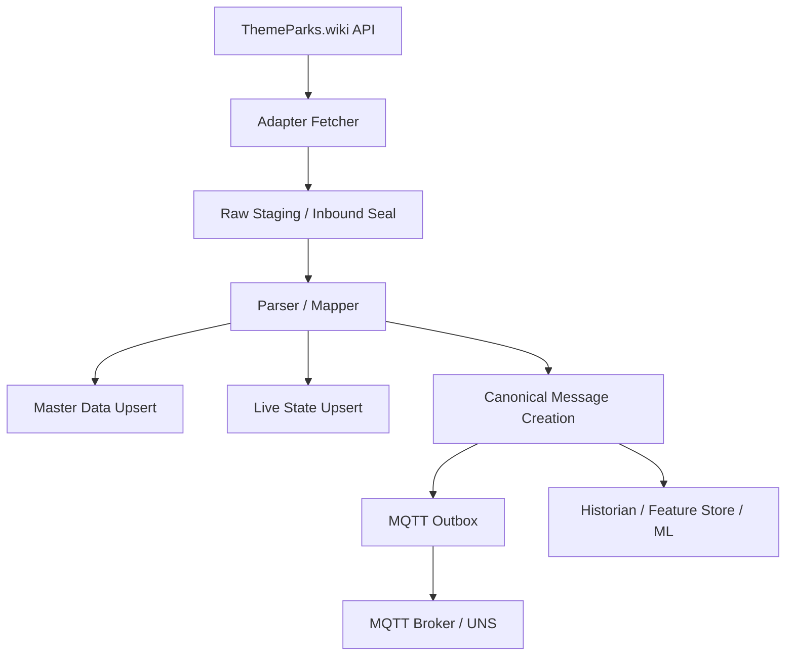

# Adapter Analyse: ThemeParks.wiki in Smart Park OS

Stand: 2026-04-28  
Scope: API-JSON, Raw/Ingest, Canonical, Platform Master Data, Live State, MQTT, DB-Empfehlungen

---

## 9) THEMEPARKS.WIKI API JSON STRUKTUR

### 9.1 Endpoints (im Code verwendet)

- `GET /v1/destinations`
- `GET /v1/entity/{id}`
- `GET /v1/entity/{id}/children`
- `GET /v1/entity/{id}/live`
- `GET /v1/entity/{id}/schedule`
- optional monatlich: `GET /v1/entity/{id}/schedule/{year}/{month}`

Code-Referenzen:  
`src/integrations/adapter-packages/themeparks_wiki/client.js`,  
`src/modules/adapters/themeparks/themeparks-sync.service.js`

### 9.2 Park-/Entity-Struktur (erwartet)

Der Adapter akzeptiert sowohl direkte Arrays als auch Wrapper (`data`, `items`, `children`, `liveData`, `schedule`) und normalisiert über `toArray()`.

Beispiel (Entity):

```json
{
  "id": "639738d3-9574-4f60-ab5b-4c392901320b",
  "name": "Europa-Park",
  "entityType": "PARK",
  "parentId": null,
  "destinationId": "dest-uuid",
  "parkId": null,
  "timezone": "Europe/Berlin",
  "slug": "europa-park",
  "tags": [],
  "location": {
    "latitude": 48.266,
    "longitude": 7.720
  }
}
```

Kinder werden typischerweise als flache Liste geliefert (nicht zwingend verschachteltes `children` innerhalb derselben Entity-Antwort).

### 9.3 Live-Struktur (Queue/Status)

Beispiel:

```json
{
  "id": "ride-uuid",
  "name": "Euro-Mir",
  "entityType": "ATTRACTION",
  "status": "OPERATING",
  "queue": {
    "STANDBY": {
      "waitTime": 25
    }
  },
  "parentId": "park-uuid",
  "parkId": "park-uuid",
  "destinationId": "dest-uuid",
  "slug": "euro-mir",
  "lastUpdated": "2026-04-28T08:00:00.000Z"
}
```

Wichtige Punkte:

- Wartezeit wird aktuell nur aus `queue.STANDBY.waitTime` gelesen.
- Weitere Queue-Typen (falls vorhanden) werden nicht aktiv gemappt, bleiben aber im Raw Payload.
- Status wird immer als Event verarbeitet (`ENTITY_STATUS_UPDATED`).
- Shows/Restaurants laufen über denselben Live-Kanal; ohne `STANDBY.waitTime` entsteht nur Status-Event.
- Viele Felder sind optional (`slug`, `location`, `parentId`, `timezone`, `queue`, `lastUpdated`).

---

## 10) RAW STAGING / INBOUND SEAL

### Ist-Zustand

Es gibt **keine** separate Tabelle `themeparks_wiki_raw_messages`.

Stattdessen:

- Rohdaten pro Message werden in `canonical_inbound_messages.raw_payload` gespeichert.
- Normalisierte Daten landen parallel in `canonical_inbound_messages.payload`.

### Bewertung

- Auditierbarkeit: teilweise vorhanden (Raw in Canonical).
- Replay: vorhanden über `CanonicalInboundMessageService.reprocess(id)`.
- Idempotenz via Hash/Source-ID: aktuell nicht stringent umgesetzt (kein dedizierter `payload_hash`-Flow im ThemeParks-Pfad).

### Empfehlung

Enterprise-Ausbau mit eigener Inbound-Seal-Tabelle:

`themeparks_wiki_raw_messages`

- `id`
- `provider`
- `park_id`
- `park_name`
- `endpoint`
- `message_type`
- `received_at`
- `source_timestamp`
- `payload_hash`
- `raw_payload_json`
- `processing_status`
- `processing_error`
- `created_at`
- `updated_at`

---

## 11) STAMMDATENMODELL / MASTER DATA

### Aktuell in Smart Park OS (Platform)

- `parks`
- `park_zones`
- `park_assets`
- `ride_master_data`
- `show_master_data`
- `restaurant_master_data`
- `shop_master_data`
- `asset_targets`
- `asset_runtime_overrides`

### Mapping-Logik

- `entityType` -> interner Asset-Type (`RIDE`, `SHOW`, `RESTAURANT`, ...)
- Park als Root wird in `parks` geführt.
- Entities gehen in `park_assets` mit:
  - `external_entity_id`
  - `external_parent_id`
  - `parent_asset_id` (2nd pass link)
  - `name`, `slug`, `latitude`, `longitude`, `description`, `short_name`, `zone_label`

### Differenz zur vorgeschlagenen Struktur

- Entspricht funktional `park_entities`, heißt aktuell aber `park_assets`.
- `entity_type_templates` generisch existiert noch nicht; aktuell v. a. `ride_templates`.

---

## 12) LIVE DATA MODELL / OPERATIONAL STATE

### Aktuell

- Time-Series: `asset_observations`
  - `metric_code`: z. B. `QUEUE_TIME_MIN`, `STATUS`
  - `metric_value`, `timestamp`, `source`
- Aktueller Zustand:
  - `park_assets.status`
  - `park_assets.opening_flag`

### Bewertung gegen `entity_live_states`

- Es gibt keine separate Snapshot-Tabelle `entity_live_states`.
- Historie ist vorhanden (Observations als Events).
- Restaurants/Shows ohne Queue werden korrekt als Status-Events behandelt.
- Showtimes aus Live sind aktuell nicht als dediziertes Observation-Schema umgesetzt.

---

## 13) CANONICAL MESSAGE MODEL DB / JSON

### Vorhanden

Tabelle: `canonical_inbound_messages`

Kernfelder:

- `message_type`
- `provider`
- `external_destination_id`
- `external_park_id`
- `external_entity_id`
- `entity_type`
- `occurred_at`
- `received_at`
- `payload` (JSONB)
- `raw_payload` (JSONB)
- `status`
- `error_message`

### Message-Typen (u. a.)

- `DESTINATION_SYNCED`
- `PARK_SYNCED`
- `PARK_ENTITY_SYNCED`
- `WAIT_TIME_UPDATED`
- `ENTITY_STATUS_UPDATED`
- `PARK_OPERATING_HOURS_UPDATED`

### Bewertung

- Canonical-Tabelle vorhanden.
- `raw_message_id`-Referenz auf separate Raw-Tabelle fehlt.
- MQTT Publish-Status wird hier nicht persistiert.

---

## 14) MQTT OUTBOX / RELIABLE PUBLISHING

### Aktueller Zustand

Publish erfolgt direkt in:

- `src/modules/adapters/themeparks/asset-mqtt.publisher.js`
- über `publishMqtt(...)`

Topics:

- `smartpark/{park}/assets/{asset}/queue_time`
- `smartpark/{park}/assets/{asset}/status`
- optional health-topic je Metric-Route

### Risiko

- Bei Publish-Fehlern kein persistenter Retry-Mechanismus.
- Kein Outbox-Status je Message.

### Empfehlung

`mqtt_outbox` einführen:

- `id`
- `canonical_message_id`
- `topic`
- `payload_json`
- `qos`
- `retain`
- `publish_status`
- `retry_count`
- `last_attempt_at`
- `published_at`
- `error_message`
- `created_at`

---

## 15) END-TO-END DATA LINEAGE (Feld-Mapping)

| ThemeParks API Feld | Raw JSON | Master Data | Live State | Canonical | MQTT | Zieltabellen |
|---|---|---|---|---|---|---|
| `id` | `raw_payload.id` | `park_assets.external_entity_id` | via asset relation | `external_entity_id`, `payload.id` | in payload indirekt über asset slug | `park_assets`, `canonical_inbound_messages`, `asset_observations` |
| `name` | `raw_payload.name` | `park_assets.name` | - | `payload.name` | optional im consumer | `park_assets`, `canonical_inbound_messages` |
| `entityType` | `raw_payload.entityType` | `asset_types.code` (gemappt) | - | `entity_type`, `payload.entityType` | metric routing indirekt | `asset_types`, `park_assets`, `canonical_inbound_messages` |
| `parentId` | `raw_payload.parentId` | `external_parent_id` -> `parent_asset_id` | - | `payload.parentId` | - | `park_assets`, `canonical_inbound_messages` |
| `externalId` | `raw_payload.externalId` | optional in payload/raw, primär extern id = `id` | - | `payload.externalId` | - | `canonical_inbound_messages` |
| `slug` | `raw_payload.slug` | `park_assets.slug` (oder slugify fallback) | - | `payload.slug` | Topic-Baustein aus internem slug | `park_assets`, `canonical_inbound_messages` |
| `timezone` | `raw_payload.timezone` | `parks.timezone` (park) | - | `payload.timezone` | - | `parks`, `canonical_inbound_messages` |
| `location.latitude` | `raw_payload.location.latitude` | `park_assets.latitude` | - | `payload.location.latitude` | - | `park_assets`, `canonical_inbound_messages` |
| `location.longitude` | `raw_payload.location.longitude` | `park_assets.longitude` | - | `payload.location.longitude` | - | `park_assets`, `canonical_inbound_messages` |
| `status` | `raw_payload.status` | `park_assets.status`, `opening_flag` | `asset_observations(metric=STATUS)` | `ENTITY_STATUS_UPDATED` | `/status` | `park_assets`, `asset_observations`, `canonical_inbound_messages` |
| `queue.STANDBY.waitTime` | `raw_payload.queue.STANDBY.waitTime` | - | `asset_observations(metric=QUEUE_TIME_MIN)` | `WAIT_TIME_UPDATED` | `/queue_time` | `asset_observations`, `canonical_inbound_messages` |
| `lastUpdated` | `raw_payload.lastUpdated` | - | indirekt via ingest timestamp | häufig `sampledAt` serverseitig gesetzt | `ts` im payload | `canonical_inbound_messages`, `asset_observations` |

---

## 16) ZIELARCHITEKTUR DATENFLUSS (Mermaid)



Hinweis: Aktuell ist `Raw Staging` und `MQTT Outbox` nur teilweise bzw. noch nicht voll dediziert umgesetzt.

---

## 17) BEISPIEL OUTPUTS

### A) Eingehendes API JSON (PARK + Children, logisch)

```json
{
  "id": "park-uuid",
  "name": "Europa-Park",
  "entityType": "PARK",
  "timezone": "Europe/Berlin",
  "children": [
    {
      "id": "ride-uuid",
      "name": "Euro-Mir",
      "entityType": "ATTRACTION",
      "parentId": "park-uuid",
      "externalId": "ride_123",
      "slug": "euro-mir",
      "location": { "latitude": 48.266, "longitude": 7.720 }
    }
  ]
}
```

### B) Eingehendes Live JSON

```json
{
  "id": "ride-uuid",
  "name": "Euro-Mir",
  "entityType": "ATTRACTION",
  "status": "OPERATING",
  "queue": { "STANDBY": { "waitTime": 25 } },
  "lastUpdated": "2026-04-28T08:00:00.000Z"
}
```

### C) Raw Message DB Record (heute innerhalb Canonical)

```json
{
  "message_type": "WAIT_TIME_UPDATED",
  "provider": "themeparks_wiki",
  "external_park_id": "park-uuid",
  "external_entity_id": "ride-uuid",
  "payload": {
    "id": "ride-uuid",
    "name": "Euro-Mir",
    "waitTime": 25,
    "status": "OPERATING",
    "sampledAt": "2026-04-28T08:00:01.000Z"
  },
  "raw_payload": {
    "id": "ride-uuid",
    "queue": { "STANDBY": { "waitTime": 25 } },
    "status": "OPERATING"
  },
  "status": "APPLIED"
}
```

### D) `park_assets` Record (Ride)

```json
{
  "asset_id": "internal-uuid",
  "park_id": "internal-park-uuid",
  "external_entity_id": "ride-uuid",
  "external_parent_id": "park-uuid",
  "asset_type_id": "ride-type-uuid",
  "name": "Euro-Mir",
  "slug": "euro-mir",
  "latitude": 48.266,
  "longitude": 7.72,
  "status": "OPEN"
}
```

### E) `asset_observations` Record

```json
{
  "id": "obs-uuid",
  "asset_id": "internal-uuid",
  "metric_code": "QUEUE_TIME_MIN",
  "metric_value": "25",
  "unit": "min",
  "timestamp": "2026-04-28T08:00:02.000Z",
  "source": "THEMEPARKS_WIKI"
}
```

### F) Canonical Payload

```json
{
  "messageType": "ENTITY_STATUS_UPDATED",
  "provider": "themeparks_wiki",
  "externalParkId": "park-uuid",
  "externalEntityId": "ride-uuid",
  "entityType": "ATTRACTION",
  "payload": {
    "id": "ride-uuid",
    "status": "OPERATING",
    "isOpen": true
  }
}
```

### G) MQTT Topic + Payload

Topic:

```text
smartpark/europa-park/assets/euro-mir/queue_time
```

Payload:

```json
{
  "value": "25",
  "unit": "min",
  "ts": "2026-04-28T08:00:02.000Z"
}
```

---

## 18) DB DESIGN EMPFEHLUNG

### 18.1 `themeparks_wiki_raw_messages`

- Zweck: unveränderte Inbound-Antworten, Audit/Replay
- Pflichtfelder: provider, endpoint, received_at, raw_payload_json
- Indizes: `(provider, received_at)`, `(provider, payload_hash)`
- Unique: optional `(provider, payload_hash, endpoint)`
- Retention: z. B. 30-180 Tage
- Priorität: Enterprise-Ausbau

### 18.2 `parks`

- Zweck: Park-Metadaten
- Pflichtfelder: external_park_id, provider, name, slug
- Indizes: provider + external_park_id
- Unique: provider + external_park_id
- Retention: dauerhaft
- Priorität: MVP (vorhanden)

### 18.3 `park_entities` (oder `park_assets`)

- Zweck: alle Asset-Entities mit Parent/Type/Geo
- Pflichtfelder: provider, external_entity_id, park_id, entity_type, name
- Indizes: park_id, entity_type, parent_entity_id
- Unique: provider + external_entity_id
- Retention: dauerhaft
- Priorität: MVP (als `park_assets` vorhanden)

### 18.4 `entity_type_templates`

- Zweck: defaults je Entity Type
- Pflichtfelder: entity_type, default_metrics
- Indizes: entity_type
- Unique: entity_type + category
- Retention: dauerhaft
- Priorität: Enterprise-Ausbau (teilweise über ride_templates vorhanden)

### 18.5 `entity_live_states`

- Zweck: letzter Zustand je Entity (Snapshot)
- Pflichtfelder: entity_id, observed_at, status/raw_status
- Indizes: `(entity_id, observed_at desc)`
- Unique: optional `(entity_id)` bei "current only"
- Retention: abhängig (current-only oder kurze Historie)
- Priorität: optional (heute: observations + asset status)

### 18.6 `canonical_messages` (heute `canonical_inbound_messages`)

- Zweck: standardisierte Inbound Events
- Pflichtfelder: message_type, provider, occurred_at, payload, raw_payload
- Indizes: provider/type/status, external entity keys
- Unique: optional provider_message_id
- Retention: mittel/lang + Archivierung
- Priorität: MVP (vorhanden)

### 18.7 `mqtt_outbox`

- Zweck: reliable publish + retry
- Pflichtfelder: topic, payload_json, publish_status
- Indizes: publish_status, retry_count, created_at
- Unique: optional canonical_message_id + topic
- Retention: bis published + technische Aufbewahrung
- Priorität: Enterprise-Ausbau

---

## 19) FINALER REVIEW-FOKUS

1) Was bekommt der Adapter von der API?

- Park-/Entity-, Live- und Schedule-JSON von ThemeParks.wiki Endpoints.

2) Was macht der Adapter daraus?

- Normalisiert zu Canonical Messages und triggert Platform-Sync (Master + Live).

3) Wo wird was gespeichert?

- Canonical + Raw: `canonical_inbound_messages`
- Master: `parks`, `park_assets`, `*_master_data`, `asset_targets`, `asset_runtime_overrides`
- Live: `asset_observations` + `park_assets.status/opening_flag`

4) Was wird nach MQTT gesendet?

- Asset-bezogene queue/status/health Payloads auf `smartpark/{park}/assets/{asset}/...`.

5) Was landet im Canonical Message Model?

- Events wie `PARK_ENTITY_SYNCED`, `WAIT_TIME_UPDATED`, `ENTITY_STATUS_UPDATED`, inklusive payload/raw_payload/status.

6) Welche Tabellen fehlen heute wahrscheinlich?

- Dedizierte `themeparks_wiki_raw_messages`, `mqtt_outbox`, optional `entity_live_states`, ggf. generische `entity_type_templates`.

7) Sauberste Zielstruktur für Smart Park OS?

- API -> Raw Inbound Seal -> Canonical -> Master Upsert -> Live State/Time Series -> MQTT Outbox -> MQTT/UNS -> Historian/Feature Store/ML.

---

## Relevante Code-Referenzen

- Adapter/API Normalisierung:  
  `src/integrations/adapter-packages/themeparks_wiki/client.js`
- Platform Sync (Master + Live + MQTT):  
  `src/modules/adapters/themeparks/themeparks-sync.service.js`  
  `src/modules/adapters/themeparks/themeparks-mapper.js`  
  `src/modules/adapters/themeparks/asset-mqtt.publisher.js`
- Canonical Pipeline:  
  `src/services/integration-orchestrator.service.js`  
  `src/services/canonical-inbound-message.service.js`  
  `src/services/canonical-message-apply.service.js`
- Modelle/Migrationen:  
  `src/models/canonical-inbound-message.model.js`  
  `src/modules/assets/platform.models.js`  
  `src/migrations/20260227140001-canonical-provider-adapter-architecture.js`  
  `src/migrations/20260428150000-park-master-data-platform.js`  
  `src/migrations/20260429120000-enterprise-platform-master-data.js`

