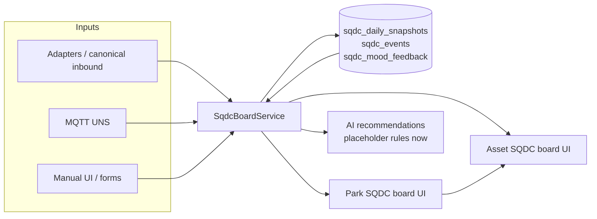
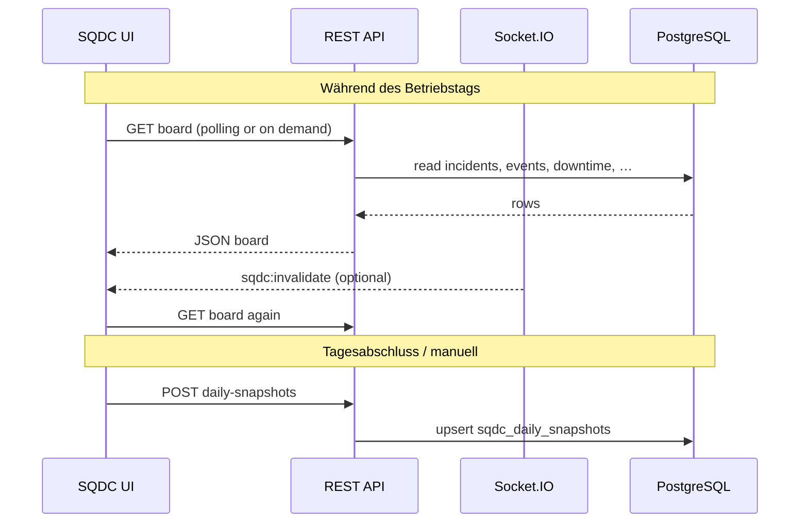

# SQDC board architecture (Smart Park OS)

## Concept

**SQDC** operationalizes daily performance as four pillars:

| Letter | Meaning | Typical signals |
|--------|---------|-----------------|
| **S** | Safety | Incidents, safety-class SQDC events, severity |
| **Q** | Quality / guest experience | Quality events, incidents, complaints (when available) |
| **D** | Delivery / throughput / availability | OEE, uptime, queue time, delivery events |
| **C** | Customer / satisfaction / revenue impact | Queue, mood, customer-class events |

Optional extensions (**P** People, **M** Maintenance, **E** Environment) are modeled on events via `event_type` values `PEOPLE` and `MAINTENANCE`; environment can reuse `QUALITY` or gain a dedicated enum in a future migration.

## Park vs asset hierarchy

- **Park board** aggregates park-wide incidents, all `sqdc_events` for the day, park-level mood (`sqdc_mood_feedback` with `asset_id` null), and optional **ASSET** `sqdc_daily_snapshots` for roll-up metrics (`worstAssets`, average delivery from snapshots).
- **Asset board** scopes incidents to the linked park asset, events for that asset (or global park events for the day — service currently includes park-wide OR asset-scoped rows for context), per-asset mood, and the **ASSET** daily snapshot when present. **Stored snapshot** scores override computed scores when a row exists for that day.

`X-Park-Id` must equal the `parkId` path parameter; otherwise the API returns **403** (`PARK_SCOPE_MISMATCH`).

## Liefer / OEE Datenquellen

- **Klassisches SQDC** speichert OEE unter `sqdc_board_snapshots.delivery_oee_5m` (Kalendertag = `business_date`, pro Asset).
- **Hierarchisches SQDC** kann OEE in `sqdc_daily_snapshots.delivery_json.oee01` halten.
- Der **SqdcBoardService** nutzt für Anzeige und Park-Roll-up **zuerst** `oee01` aus dem täglichen JSON, sonst **`delivery_oee_5m`** aus der klassischen Tabelle — gleicher Tag, gleiches Asset. So erscheinen im hierarchischen Board die Werte, die Sie bereits über „Snapshot speichern“ im klassischen Board erfasst haben.
- **Schichtübergabe** (`shift_handover_entries`): Park-Board listet alle Einträge mit Fenster-Schnittmenge zum gewählten UTC-Tag; Asset-Board zusätzlich parkweite Übergaben (`linked_entity_id` leer) plus assetgebundene (`PARK_ASSET` + `asset_id`). Enthaltenes `downtime_snapshot` JSON wird mitgeliefert.
- **Stillstände** (`asset_downtime_events`): Park-Board zeigt die jüngsten betrieblichen Meldungen aller Assets des Tages; Asset-Board filtert auf `asset_id` — geplant/ungeplant, Grundcode, offen/geschlossen. In der **UI** liegen OEE-/Queue-Kennzahlen, Schichtübergaben und Stillstände unter dem Block **„D — Delivery“** (Lieferleistung), damit geplante und ungeplante Störungen klar der Säule **D** zugeordnet sind.

## KPI matrix (MVP)

| KPI | Park | Asset | Primary source |
|-----|------|-------|------------------|
| Safety score | Computed / snapshot | Computed / snapshot | Incidents + SAFETY events |
| Quality score | Computed / snapshot | Computed / snapshot | QUALITY events + incidents (implicit) |
| Delivery score | Snapshots roll-up / computed | OEE in snapshot JSON + DELIVERY events | `delivery_json.oee01`, events |
| Customer score | Mood + events | Queue in `customer_json`, mood, CUSTOMER events | Mood feedback, `customer_json.queueMinutes` |

## API (v1, under `/api/v1/sqdc`)

Legacy endpoints (`/board`, `/history`, `/mood`, `/safety-events`, `/snapshots`) are unchanged.

| Method | Path | Purpose |
|--------|------|---------|
| GET | `/parks/:parkId/board?date=YYYY-MM-DD` | Park hierarchical board |
| GET | `/parks/:parkId/assets/:assetId/board?date=YYYY-MM-DD` | Asset board |
| POST | `/events` | Create `sqdc_events` row (manual or future MQTT) |
| POST | `/mood-feedback` | Numeric mood 1–5 (`sqdc_mood_feedback`) |
| POST | `/daily-snapshots` | Upsert `sqdc_daily_snapshots` (PARK or ASSET) |

> Note: `POST /mood` and `POST /snapshots` remain the **legacy** emoji mood and ride snapshot APIs.

## Data model

- **`sqdc_daily_snapshots`** — one row per (park, date, level) for PARK, or (park, asset, date) for ASSET; scores + JSON blobs + `ai_recommendations_json`.
- **`sqdc_events`** — unified SAFETY | QUALITY | DELIVERY | CUSTOMER | PEOPLE | MAINTENANCE with severity, status, source, `metadata_json`.
- **`sqdc_mood_feedback`** — `mood_score` 1–5, optional `asset_id`, `feedback_date`.

Migration: `src/migrations/20260504120000-sqdc-hierarchical-board.js`.

## Flow (Mermaid)

## MQTT / UNS integration (extension points)

No additional MQTT subscribers were added in this MVP. The asset board response includes **`integrationHooks`** with example topics:

- `smartpark/{parkId}/asset/{assetId}/sqdc/event`
- `smartpark/{parkId}/asset/{assetId}/mood`
- `smartpark/{parkId}/asset/{assetId}/delivery/oee`

A future worker can map payloads to `createSqdcEvent` / `createMoodFeedback` / JSON fields inside `saveDailySnapshot` (`delivery_json`, `customer_json`).

## Live operations vs. historical persistence (WebSocket + DB)

**Ist-Zustand:** Das hierarchische SQDC-Board ist **REST-first** (GET liefert den berechneten Tagesstand). Ereignisse, die ohnehin in der DB landen (z. B. **Schichtübergabe** beim Speichern, **Stillstände**, **Incidents**, `POST /daily-snapshots`), sind damit **automatisch historisch** — ein WebSocket ist dafür nicht nötig.

**Zielbild „wie ein WebSocket während des Tages“:**

| Schicht | Rolle | Umsetzung |
|--------|--------|-----------|
| **Live / Tag** | Aktuelle Kennzahlen ohne ständiges Polling | Optional **Socket.IO** (bereits im Stack: `src/sockets/index.js`, Dashboard-Client) mit **kleinen** Events, z. B. `sqdc:invalidate` `{ parkId, date?, assetId? }` — das Dashboard macht dann **einen** erneuten GET auf `/api/v1/sqdc/.../board`. So bleibt die **DB die Quelle der Wahrheit**, der Socket nur ein „bitte neu laden“. |
| **Historie / Abschluss** | Fester Tagesstand nach Schicht oder Kalendertag | **`POST /api/v1/sqdc/daily-snapshots`** (bereits vorhanden) schreibt `sqdc_daily_snapshots` (PARK/ASSET). Zusätzlich: **Cron / Job** kurz nach **UTC-Mitternacht** pro Park (oder pro konfigurierter Park-Zeitzone), der für `gestern` einmalig `saveDailySnapshot` aus dem berechneten Board füllt, falls noch kein Eintrag existiert. |

**Schichtübergabe → Historie:** Beim **Erstellen** einer Schichtübergabe ist der Datensatz **sofort** in `shift_handover_entries` persistiert (inkl. optionalem `downtime_snapshot`). Das **ist** bereits Historie. Optional kann ein **Hook** nach `ShiftHandoverService.create` dieselben Kennzahlen in **`sqdc_daily_snapshots`** spiegeln (redundant, aber praktisch für reine SQDC-Auswertungen).

**SSE statt WebSocket:** Für rein lesende Clients reicht oft **Server-Sent Events** mit einem schmalen Event-Strom; Socket.IO ist aber bereits etabliert.

## AI roadmap

Today, **`buildAiRecommendations`** returns deterministic objects:

`{ recommendationId, category, severity, message, suggestedAction, confidence }`.

Planned: swap or augment with GPT / park policy engine, persisting suggestions into `ai_recommendations_json` on snapshots.

## MVP rollout

1. Run DB migration (`npm run db:migrate`).
2. Ship backend + admin-dashboard routes.
3. Train operators on **classic** vs **hierarchical** boards (both available).
4. Backfill optional ASSET snapshots from operations spreadsheets or MQTT-derived OEE/queue.
5. Add MQTT consumer in a follow-up PR.

## Related files

| Area | Files |
|------|--------|
| Service | `src/services/sqdc-board.service.js` |
| Routes | `src/routes/v1/sqdc.routes.js` |
| Controller | `src/controllers/sqdc.controller.js` |
| Validation | `src/validators/sqdc-board.schemas.js` |
| UI | `admin-dashboard/src/views/sqdc/*.vue`, `admin-dashboard/src/api/client.ts` |
