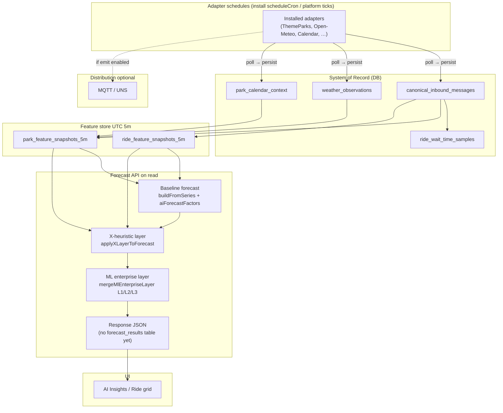
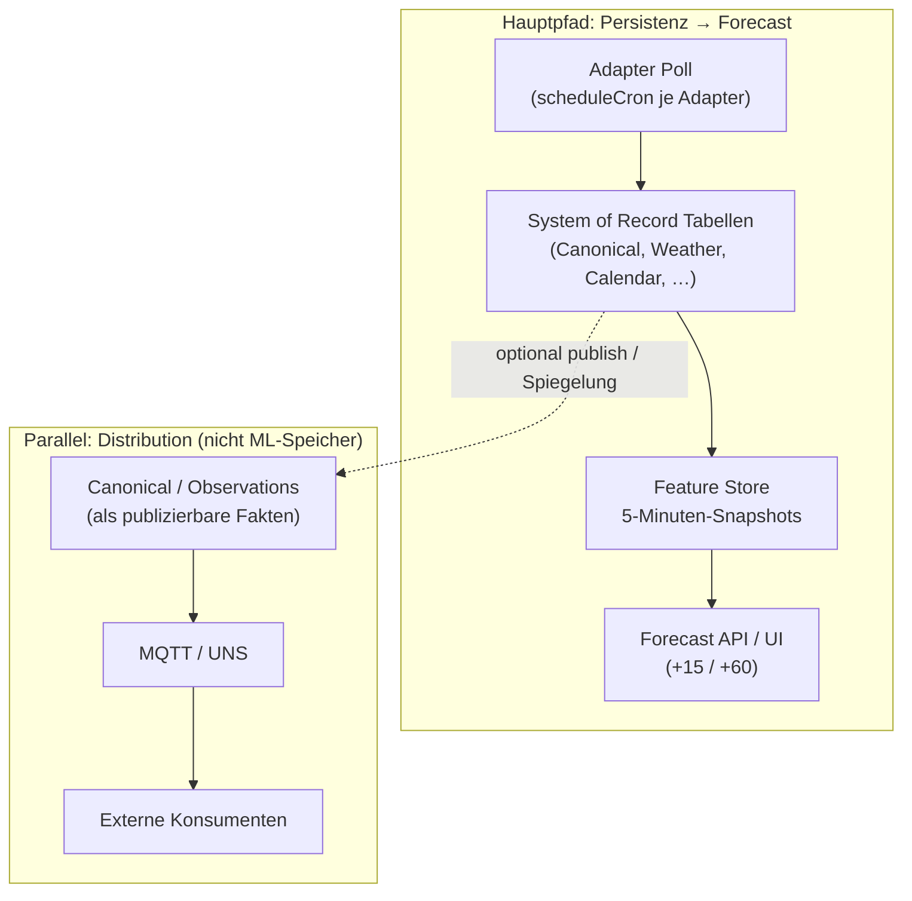

# ADR 0001: Smart Park OS — Forecast & ML Feature Architecture

- **Status:** Accepted  
- **Date:** 2026-05-01  
- **Context:** Crowd and wait-time forecasts must stay consistent across ingest, storage, API, and UI. Multiple teams touch the same surfaces; this ADR is the single binding description to prevent parallel architectures.

---

## Decision

Smart Park OS uses **one linear forecast pipeline**: persisted **5-minute ML feature snapshots** feed a **numeric baseline**, then an **X-snapshot heuristic layer**, then an **optional enterprise ML (L1/L2/L3) layer**. Forecasts are **computed on read** via the Forecast API unless/until an optional `forecast_results` persistence is introduced.

---

## 1. Datenfluss (verbindlich)

### Takte und Datenpfade

**Takte** sind die zeitlichen Rhythmen je Schicht. Sie sind absichtlich **getrennt**: `scheduleCron` und Adapter-Intervalle steuern **nur**, wie oft externe Quellen **abgefragt** und in die Datenbank geschrieben werden — nicht den Feature-Store-Takt (fest **5 Minuten**, UTC-Buckets) und nicht den Forecast-Takt (**on read** beim API-Aufruf bzw. optionaler Pipeline-/Cache-Refresh).

**Datenpfade** lassen sich so zusammenfassen:

| Pfad | Zweck | „Wahrheit“ für ML/Forecast |
|------|--------|----------------------------|
| **Persistenz / Forecast** | Adapter → SoR-Tabellen → 5m-Snapshots → Forecast (+ UI über API) | Ja — diese Kette ist verbindlich. |
| **MQTT / UNS** | Auslieferung an Betrieb, Partner, digitale Zwillinge | Nein — **Distribution**, kein Ersatz für SoR oder Snapshots. |

Der **AI Feature Store** liest ausschließlich aus **persistierten** Quellen (u. a. Canonical, Wetter, Kalender, **Staffing**, Master Data) und materialisiert daraus die 5-Minuten-Zeilen. **Forecast** konsumiert diese Snapshots und liefert die Horizonte **+15** und **+60** Minuten (`forecast15Minutes`, `forecast60Minutes`).

---

**Adapter-Takt (`scheduleCron` / Platform-Intervalle):** Jeder installierte Adapter **pollt** externe Quellen nach seinem Cron und schreibt zuerst in die **DB (SoR)**. **MQTT/UNS** ist optional (**Distribution**), wenn `emit`/Profiles das vorsehen — Forecast/ML verwenden den Bus **nicht** als alleinige Wahrheitsquelle.

```text
Installierte Adapter (scheduleCron je Paket, z. B. Weather */10, ThemeParks häufiger)
  → Persistenz (SoR)
      canonical_inbound_messages     ← z. B. ThemeParks / wait payloads
      weather_observations           ← Open-Meteo-Adapter / eingebauter WEATHER_OPEN_METEO_*-Scheduler
      park_calendar_context          ← Kalender-Adapter / Schulferien
  ⇢ optional: MQTT / UNS publish    (gleicher Lauf, aber nicht SoR für Forecast-Zahlen)

Zeitreihe / Analytics
  → ride_wait_time_samples         (Wartezeit-Historie pro Entität/Zeit; ergänzend zu Snapshots)

Feature Store Job (5m Buckets, UTC)
  → liest Canonical + weather_observations + park_calendar_context (+ Masterdaten)
  → park_feature_snapshots_5m
  → ride_feature_snapshots_5m      (inkl. von Park-X geerbte Signale wo vorgesehen)

Forecast API (on read)
  → Baseline Forecast               (Trend + Integration „aiForecastFactors“)
  → X-Heuristik                     (applyXLayerToForecast aus letzten Snapshots)
  → ML Enterprise Layer             (mergeMlEnterpriseLayer: L1/L2/L3)
  → JSON Response                   (forecast15Minutes, forecast60Minutes, Quelle, Faktoren, …)

AI Insights UI
  → liest nur Forecast- / Monitor-APIs; keine eigene Prognose-Logik
```

**Mermaid — Adapter → SoR → optional Bus; Feature Store; Forecast layers (binding order)**



---

## 2. Adapter Polling vs. Feature Store vs. Forecast

Diese Schichten haben **unterschiedliche Rollen und Takte** — sie verwechseln zu führen ist die häufigste Ursache für „falsche“ Erwartungen an Latenz und Datenfrische.

- **`scheduleCron` steuert nur Adapter-Polling.** Es definiert, wann ein installierter Adapter seine externe Quelle abfragt und das Ergebnis **persistiert**. Es startet weder den Feature-Store-Job noch die Forecast-Berechnung.
- **Adapter schreiben Daten in System-of-Record-Tabellen** (Canonical, Wetter, Kalender, ggf. weitere Domänen-Tabellen). Das ist die **einzige** zuverlässige Grundlage für Nachvollziehbarkeit, Audit und ML-Features in diesem ADR.
- **MQTT/UNS ist Distribution, nicht primärer ML-Speicher.** Publish kann parallel zum Persistieren erfolgen; Forecast und Feature Store **lesen** für ihre Zahlen aus der DB/Snapshot-Schicht, nicht aus dem Bus als alleiniger Quelle.
- **AI Feature Store** baut **5-Minuten-Snapshots** aus **Canonical**, **Weather**, **Calendar**, **Staffing** und **Master Data** (plus weiteren, im Code dokumentierten Joins). Das ist eine **materialisierte** ML-Feature-Zeile pro Bucket, keine Live-Poll-Schicht.
- **Forecast** liest diese Snapshots (und Konfiguration wie ML-Profile) und berechnet **+15 / +60** — typischerweise **on read** bei API-Aufruf; eine spätere persistierte `forecast_results`-Schicht wäre ein **Refresh-/Cache-Takt**, kein Adapter-Takt.

**Statische / langsame Signale vs. dynamische Signale**

- **Langsam oder selten ändernd:** Feiertage, Schulferien, gebuchte Events, viele Master-Data-Felder — sinnvolle Adapter- oder Batch-Takte sind **täglich** oder **stündlich**; der Feature Store **snapshottet** sie trotzdem im **5m-Raster** (Wert kann sich zwischen Buckets wenig ändern).
- **Dynamisch / operativ:** Warteschlangen, aktuelle Wartezeiten, kurzfristiges Wetter — hier sind **kürzere** Poll-Intervalle üblich; der Feature Store fasst sie weiterhin in **5m-Buckets** zusammen.

**Beispiele typischer Takte (Orientierung, keine harte Produktgarantie pro Installation)**

| Signal / Schicht | Typischer Takt | Anmerkung |
|------------------|----------------|-----------|
| ThemeParks / Queue-artige Quellen | ca. **5 min** | Kurzlebig; muss in SoR landen, bevor der nächste Snapshot sie zuverlässig trägt. |
| Weather | **5–15 min** | Je nach Adapter/Konfiguration; Snapshot join’t nächstliegende Beobachtung zum Bucket. |
| Holidays / Calendar | **täglich** oder **stündlich** | Kontext pro `context_date`; ändert sich nicht minütlich. |
| Feature Store | **5 min** (UTC) | Fester Build-Raster für `*_feature_snapshots_5m`. |
| Forecast | **on read** oder **Pipeline refresh** | Berechnung beim API-Call; optional späteres Caching/Audit mit eigenem Refresh-Takt. |

**Mermaid — Hauptpfad vs. parallele Distribution**



---

## 3. System of Record

| Concern | System of record | Notes |
|--------|-------------------|--------|
| Raw / canonical event stream | `canonical_inbound_messages` | Semantic truth for adapter messages; includes `payload` + optional `raw_payload`. |
| Current weather facts for X / snapshots | `weather_observations` | Filled by weather adapters and/or `WEATHER_OPEN_METEO_*` scheduler; joined in `buildParkXLayer`. |
| Calendar / holiday context | `park_calendar_context` | Per park + local `context_date`; school/public flags für Snapshot-Zeile. |
| Wait-time history (analytics, charts) | `ride_wait_time_samples` | Append-friendly samples; may align with canonical ingest jobs. |
| ML / X features at 5m resolution | `park_feature_snapshots_5m`, `ride_feature_snapshots_5m` | Built in UTC buckets; park vs ride roles documented in code comments. |
| Forecast numbers exposed to clients | **API-calculated** response from the pipeline above | Optional future: `forecast_results` (or similar) for caching/audit — not required for correctness today. |
| ML configuration (enterprise) | `ml_global_factors`, `ml_park_factors`, `ml_profiles`, `asset_ml_profile_assignments`, `asset_ml_overrides` | L1 global, L2 per park, L3 profile + assignment + overrides. |

**Distribution (nicht SoR für Forecast-Zahlen):** MQTT / UNS **dürfen** berechnete oder gemessene Werte ausliefern, ersetzen aber **nicht** die obige Persistenz- und API-Kette als Wahrheitsquelle für Training/Audit, solange dieses ADR gilt.

**Asset-Identität:** `park_assets` / Master Data führt interne `asset_id` und Mapping zu `external_entity_id`; Feature Store und Forecast nutzen diese Zuordnung — keine parallelen „Ride“-Haupttabellen für dieselbe Domäne.

**Langfristig:** Einzelne Ride-ML-Spalten in Legacy-Masterdaten werden durch **ML Profiles + Overrides** ersetzt (bestehende Spalten bleiben bis zur Migration lesbar/deprecated).

---

## 4. Regeln

1. **DB timestamps:** Immer **UTC** in der Datenbank (`TIMESTAMPTZ` / gespeicherte UTC-Instants). Keine „lokalen“ DB-Zeiten ohne explizite Spalten (`local_date`, `local_hour` am Snapshot sind erlaubt als abgeleitete Felder, nicht als Ersatz für UTC-Primärschlüssel).
2. **UI:** Anzeige in **Nutzerzeitzone** (Client/Regional-Format); Server liefert UTC oder ISO-8601 mit `Z` wo unklar.
3. **Feature Store:** Immer **5-Minuten-Buckets** (`bucket5m`); `snapshot_at` = Bucket-Start in UTC.
4. **Canonical:** **Semantische Wahrheit** für eingehende Provider-Nachrichten; Downstream normalisiert, überschreibt Canonical nicht „still“.
5. **MQTT/UNS:** **Distribution**, nicht zwingend Persistenzquelle für denselben Fakt wie die DB — siehe §3.
6. **Master Data:** **Führend** für Asset-Identität und externe IDs.
7. **ML Profiles:** **Soll** langfristig granular pro-Ride-ML-Felder ersetzen; bis dahin Overrides + Legacy-Fallback gemäß Produktcode.

---

## 5. Risiken & Guardrails

| Risk | Guardrail |
|------|-----------|
| Double counting (z. B. Feiertag in X-Heuristik **und** `HOLIDAY_PRESSURE` in ML) | Änderungen an Kalender/Rain/Staffing **entweder** in X **oder** in L1/L2 dokumentieren und abstimmen; keine dritte Schicht ohne ADR-Update. MACRO-style Faktoren dürfen nicht dauerhaft „always on“ bei Default-Parametern sein (siehe Implementierung: neutral `value*weight ≈ 1` → kein Zuschlag). |
| UI rechnet eigene Forecasts | **Verboten.** UI ruft nur APIs auf. |
| Parallele Ride-Tabellen | **Verboten** für denselben Anwendungsfall wie `park_assets` + bestehende Samples/Snapshots. |
| Harte lokale Zeitformate in API ohne TZ | **Vermeiden**; ISO-8601 mit Offset/`Z` oder getrennte `local_*` Felder mit dokumentierter Semantik. |
| Viele manuelle ML-Felder pro Ride | **Nicht erweitern**; nur **Profile + Overrides** pflegen (Legacy-Felder read-only bis Entfernung). |

---

## 6. Konsequenzen

- Neue Features am Forecast **müssen** an einer Stelle der Kette eingehängt werden (und im ADR/README verlinkt werden).
- Breaking changes an Tabellen oder Layer-Reihenfolge **benötigen** ADR-Revision oder neues ADR mit Supersedes-Hinweis.
- Code-Reviews prüfen: keine zweite „Quick forecast“ aus dem Frontend, keine zweite Feature-Tabelle für Rides.

---

## 7. UI / Produkt-Oberflächen (Smart Park OS)

| # | Thema | Wo im Admin-Dashboard | Backend / Hinweis |
|---|--------|------------------------|-------------------|
| 1 | **Forecast accuracy** | `/ai-insights/accuracy` — Zone-MAE, Horizonte | `GET /api/v1/ai/forecast-accuracy/zone-crowd` |
| 2 | **Feature store monitor** | `/ai-insights/feature-store-monitor` — Freshness, Lücken, Profil-Abdeckung | `GET /api/v1/ai/feature-store/monitor` |
| 3 | **ML profiles (L3)** | `/ai-insights/ml-profiles` (+ Zuweisung im Master-Data-Wizard) | `ml_profiles`, `PUT .../assets/:id/ml-profile` |
| 4 | **Data quality für ML-Features** | Monitor + Ride-Grid-Detail (`featureDataQuality`, `snapshotContext`) | Antwortfelder der Forecast-API; keine zweite „Quality“-Pipeline |
| 5 | **Recommendations engine** | AI Insights unten (`#recommendations-engine`) + Operations-Start | `AiRecommendationScoringService`, `/ai/recommendations/...` |

Die **AI-Insights-Startseite** führt diese Punkte als Hub zusammen (i18n `aiHub.*`).

---

## 8. Referenzen (Code)

| Layer | Hauptdateien |
|-------|----------------|
| Feature store build | `src/services/ai-feature-store.service.js`, `src/services/ai-snapshot-x-context.service.js` |
| Baseline + enrich | `src/services/ai-park-forecast.service.js` |
| X-heuristic | `src/services/ai-forecast-x-adjustments.service.js` |
| ML enterprise | `src/services/ml-forecast-layer.service.js`, `src/services/ml-effective-config.service.js` |
| ML config API | `src/controllers/ml-ai.controller.js`, `src/routes/v1/ai.routes.js` |

Siehe auch Projekt-README Abschnitt **Architecture decisions (ADRs)** und Admin-Dashboard-README (Verweis auf dieses ADR).

---

## 9. Forecast `featureDataQuality` — operative Diagnose (Europa-Park / beliebig)

Die Einträge in `featureDataQuality` (Warnungen) und `featureDataQualityNotes` (rein informativ) kommen aus `featureDataQualityHints()` in `ai-forecast-x-adjustments.service.js`. Kontext ist immer der **letzte** `park_feature_snapshots_5m`-Row (plus Ride-Snapshot) aus `AiParkForecastService.enrichSummaryWithFeatureSnapshots`. Traffic und fehlender Kalender-Eintrag stehen nur unter **Notes** und setzen kein `forecastDataQualityStatus: WARNING`.

| Hinweis | Typische Ursache | Pipeline |
|--------|-------------------|----------|
| **Weather features missing** | Im Park-Snapshot sind `temperature_c`, `precipitation_mm` und `rain_probability_percent` alle leer — entweder keine passende Zeile in `weather_observations` für `(internal_park_id \| park_id)` im **aktuellen 5m-Bucket** (`observed_at` innerhalb des Bucket-Fensters; siehe `latestWeatherNearBucket`), oder Werte nie ingestiert. | Ingest → `weather_observations` → `buildParkXLayer` (`latestWeatherNearBucket`) → Snapshot-Spalten |
| **Traffic data not configured** | `x_features_extras.traffic` ist in `buildParkXLayer` fest `not_configured` — es gibt noch keine Traffic-Quelle. Erscheint in der Liste zu Transparenz; **beeinflusst `forecastDataQualityStatus` nicht** (kein künstliches WARNING nur deswegen). | —
| **Event calendar not configured** | Keine Zeile in `park_calendar_context` für **`park_id` = interne Park-UUID** und **`context_date` = lokales Datum des Buckets** (Park-Timezone). `calendarRowPresent` bleibt false. | API/UI Kalenderpflege → `park_calendar_context` |
| **completeness 0.75** (typisch) | Formel in `buildParkXLayer`: vier Booleans (Temp, Niederschlag/Regen-Wahrscheinlichkeit, `park.id`, lokales Datum) → `fieldsPresent/4` plus optional `+0.25` wenn `ridesReporting > 0`. Ohne Wetterzahlen sind oft nur **2/4** erfüllt → **0.5 + 0.25 = 0.75**. | Siehe `completeness_score` auf dem Park-Snapshot |

**SQL (Betrieb):** siehe Nutzeranfrage — `weather_observations` / `park_calendar_context` / `park_feature_snapshots_5m` mit `internal_park_id = '<Park-UUID>'`.
