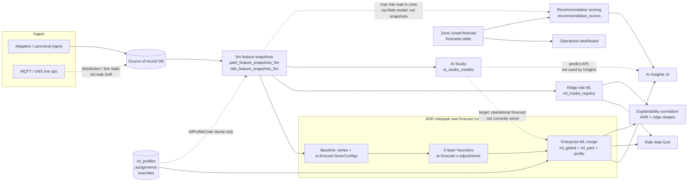

# Smart Park OS — AI Insights, AI Studio, Forecasting, ML Profiles & Signal Capabilities

**Role:** Principal AI Platform Architect (analysis and validation only)  
**Date:** 2026-05-11  
**Scope:** Current behavior as implemented in repository; **no refactors, route removals, schema changes, or new ML engines** in this document.

**Related:** `docs/architecture/current-ai-ml-forecast-assessment.md`, `docs/adr/0001-forecast-architecture.md`, `docs/architecture/ai-explainability-mvp.md`.

---

## 1. Executive Summary

Smart Park OS runs **several parallel prediction paths** that share **some** inputs (especially `ride_feature_snapshots_5m` / `park_feature_snapshots_5m`) but **do not share a single model server**:

| Path | Primary output | Persistence | Consumed by “AI Insights” hub? |
|------|----------------|-------------|--------------------------------|
| **ADR park/entity wait forecast** (`AiParkForecastService`) | `forecast15Minutes`, `forecast60Minutes`, quality fields | **Computed on read** from snapshot series + layers | **Yes** (forecast preview + explainability) |
| **Zone crowd forecast** (`AiForecastService`) | `predictedValue` for zones | **`forecasts` table** | **Indirectly** — `GET /ai/insights/summary` and recommendation scoring use **persisted zone** forecasts, not the ADR ride-wait API |
| **Ridge ride wait ML** (`ml/ride-prediction.service.js`) | Per-horizon minutes | Models in **`ml_model_registry`**; response ephemeral | **No** on `AiInsightsView.vue`; **yes** on **Ride Wait Grid** (side-by-side with ADR) |
| **AI Studio** (`AiStudioService`) | Catalog train/predict | **`ai_studio_models`** | **Not wired** into ADR forecast or Insights main cards; separate **Studio** view and APIs |
| **Recommendation scoring** | Heuristic score + explanation | **`recommendation_scores`** | **Yes** — `RecommendationAiSection` on AI Insights |

**Enterprise ML configuration** (`ml_global_factors`, `ml_park_factors`, `ml_profiles`, assignments, overrides) feeds **`mergeMlEnterpriseLayer`** on the **ADR forecast path only** (after baseline + X-layer). It does **not** alter ridge weights or AI Studio model payloads.

**Ride signal capability flags:** **`useForForecast`** participates in **readiness** (`signal-availability-resolver` / Ride Signal Capabilities UI — live signal freshness when a row opts into forecast). **`useForMl`** additionally drives **ride ridge ML inputs**: explicit `useForMl: false` on catalog codes mapped in `src/services/ml/ride-ml-feature-mask.service.js` **zeros** the corresponding entries in `predictRideWaitTimes` and `buildRideDataset` (same ridge vector length; baseline heuristics unchanged). **`useForForecast` is not** a column selector for ADR park/entity forecast math yet — that would require a scoped ADR / snapshot contract change.

**Consistency risks:** duplicate `/ml/*` vs `/ai/ml/*` mounts, “factor” terminology covering **three** different mechanisms (integration baseline factors, X-layer code, enterprise ML factors), and hub copy that historically labeled ML catalog screens as “X” parameters (addressed in admin i18n).

---

## 2. Current AI/ML Landscape

- **Ingest / SoR:** Canonical and operational data land in relational models (e.g. `canonical_inbound_messages`, rides, weather, calendar). **MQTT/UNS** is real-time distribution and ops UX; ADR treats it as **not** the sole SoR for forecast numbers.
- **5-minute feature store:** `AiFeatureStoreService` builds `park_feature_snapshots_5m` and `ride_feature_snapshots_5m` (orchestrator / schedulers call `buildSnapshots`, `buildLabels`).
- **ADR wait forecast:** `AiParkForecastService` — series → **baseline** (`applyFactorAdjustments` with `ai.forecast.factorConfigs`) → **X-layer** (`applyXLayerToForecast`) → **enterprise ML** (`mergeMlEnterpriseLayer`).
- **Zone crowd:** `AiForecastService.refreshZoneCrowdForecasts` — persists **`forecasts`** for `subjectType` **ZONE**, `targetMetric` **CROWD_LEVEL**.
- **Ridge:** Training `POST /ai/ml/train/...`; predict `GET /ai/ml/predict/rides/:rideId` (alias under `/ml`).
- **AI Studio:** `GET/POST /api/v1/ai/studio/*` — catalog, stats, train, activate, predict; `FEATURE_STORE` training uses mapped snapshot columns via `ai-studio-dataset.service.js`.
- **UI hub:** `admin-dashboard/src/router/domains/ai.routes.ts` — Insights, Ride Wait Grid, Timeseries, Accuracy, ML factors/profiles, Feature Store monitor, DQ, Studio.

---

## 3. AI Insights Data Flow

### 3.1 What the “AI Insights” **page** shows (`AiInsightsView.vue`)

- **External park operational preview:** `getParkForecastSummary`, `getIntegrationSettings` (and fallback external park id from canonical messages), live rows from `getCanonicalMessages` / ThemeParks-style context — **ADR on-read** wait/crowd style summary for the **selected external park**.
- **Per-entity explainability:** `getEntityForecastExplanation` → `explainability` object from **`buildAdrForecastExplainability`** (normalized MVP shape).
- **“AI factors” editor:** Either **`getMlGlobalFactors` + `getMlParkFactors`** (when dynamic park mode + park context) **or** `getIntegrationSettings` / `getAiFactorConfigs` + **`patchIntegrationSettings`** / **`patchMlParkFactors`** — two different persistence backends for **similar-looking** factor rows (see §9).
- **Recommendations:** `RecommendationAiSection` → `getRecommendationScoringSummary`, `postScoreAllRecommendations` — **heuristic** scores, not ADR or Studio.

### 3.2 Zone hotspot summary — `GET /api/v1/ai/insights/summary`

- **Product name:** zone hotspot summary (persisted **zone** crowd ranking), not the same surface as the AI Insights page’s on-read ride wait card.
- Implemented in `AiForecastService.getInsightsSummary()` — **latest persisted zone crowd forecasts** (60m horizon, baseline model version), **not** ADR entity wait forecasts.
- Used by **`useAiInsights`** in `OperationsDashboard.vue` (socket `ai:forecast:updated`), **not** imported by `AiInsightsView.vue`.

### 3.3 Does AI Insights use persisted forecasts, on-read, ridge, Studio, or scores?

| Source | Used on AI Insights view? |
|--------|----------------------------|
| Persisted **zone** `forecasts` | **No** (only via `useAiInsights` on Operations dashboard) |
| ADR **on-read** park/entity summary | **Yes** |
| Ridge ML | **No** |
| AI Studio predictions | **No** |
| Recommendation scores | **Yes** |

### 3.4 Parameters influencing displayed KPIs

- **ADR card:** Snapshot series (park and ride `*_feature_snapshots_5m`), `provider`, `externalParkId` / entity id, **`ai.forecast.factorConfigs`** (baseline), **X-layer** inputs on latest snapshots, **`mergeMlEnterpriseLayer`** (global/park ML factors + effective profile).
- **Factors table on page:** Integration JSON **or** DB ML factors depending on mode (§9).
- **Explainability card:** Merged summary + legacy adjustment list; normalized in `prediction-explanation-normalizer.service.js` (`finalizeExplainabilityMvpEnvelope` / `finalizeContributionSources` on `featureContributions`; canonical `source` values match OpenAPI **`AiExplainabilityContributionSource`** — see `docs/architecture/ai-explainability-mvp.md`).

### 3.5 Where explainability appears

- **On AI Insights:** `RideAiExplainabilityCard` fed from **`getEntityForecastExplanation`** (ADR track).
- **Ride Wait Grid:** separate ADR + ridge explainability cards (`getEntityForecastExplanation`, ridge `explain=1`).
- **Recommendations:** `GET /ai/recommendations/:id/explanation` — different shape (stored score explanation).

---

## 4. AI Studio Data Flow

### 4.1 Purpose today

- **Experimentation / catalog models** per park: train lightweight models (ridge OLS implementation in-service), activate one model per “slot”, run **manual** or **`latest_snapshot`** inference for **demo and evaluation** — **not** plugged into `AiParkForecastService` or recommendation scoring.

### 4.2 What it can train

- **Entity types / targets:** Declared in `ai-studio.service.js` (`ENTITY_TYPES`, `TARGETS_BY_ENTITY`).
- **Algorithms (manual):** `linear_regression`, `random_forest`, `gradient_boosting`, `neural_network` (training path selects ridge-style linear for real numeric fit per implementation).
- **Datasets:** `SANDBOX` (synthetic / seeded), **`FEATURE_STORE`** (rows from `ride_feature_snapshots_5m` + matching park row via `ai-studio-dataset.service.js`).

### 4.3 FEATURE_STORE feature columns

Allowed codes: `weather`, `holiday`, `school_break`, `time_of_day`, `day_of_week`, `staffing`, `capacity`, `historical_demand` — **`traffic` and `neighbor_wait_times` explicitly excluded** (validator and service comments).

### 4.4 Where models are stored

- Table **`ai_studio_models`** (`AiStudioModel`): payload, features JSON, metrics, `activeFlag`, scope (`park` / `category` / `entity`).

### 4.5 Connection to AI Insights and operational forecast

- **Not connected:** Insights does not call `POST /ai/studio/predict`. Operational ADR forecast does not read `ai_studio_models`.
- **`buildAiStudioExplainabilityPlaceholder`** exists in `prediction-explanation-normalizer.service.js` for a **future** unified panel — **no evidence** it is returned from park/entity forecast controllers today.

### 4.6 Predict inputs

- **`featureSource: 'latest_snapshot'`:** Resolves **`mapSnapshotRowToStudioFeatures`** from latest `ride_feature_snapshots_5m` (+ park row) — same abstract feature map as training, **independent** of AI Studio “feature drafts” for signal keys (drafts are persisted `app_settings` for future use; training does not grep draft keys in Phase 1).

---

## 5. Forecasting Data Flow

### 5.1 Chain (ADR ride/park wait)

1. **Adapters → SoR** (messages, rides, weather, calendar, etc.).
2. **`AiFeatureStoreService`** → **5m snapshots** (+ optional `forecast_training_labels`).
3. **`AiParkForecastService.getEntitySummary` / `getSummary`:** loads series from **`RideFeatureSnapshot`** / **`ParkFeatureSnapshot`** (≥ `MIN_SERIES_POINTS` = 4).
4. **`buildFromSeries`:** trend + **`applyFactorAdjustments`** using **`getFactorConfigs()`** (`AppSetting` `ai.forecast.factorConfigs` or defaults) — **baseline**.
5. **`enrichSummaryWithFeatureSnapshots`:** **`applyXLayerToForecast`** then **`mergeMlEnterpriseLayer`**.

### 5.2 What is persisted vs on-read

| Artifact | Persisted? | Service |
|----------|------------|---------|
| Zone **crowd** forecast | **Yes** — `forecasts` | `AiForecastService` |
| Park/entity **wait** forecast API | **No** — JSON response | `AiParkForecastService` |
| Ridge predictions | **No** | `ride-prediction.service.js` |
| Explanations | **No** | Built in controller path |

### 5.3 Baseline vs X-layer vs enterprise ML

- **Baseline:** Linear trend on recent bucketed waits + **integration factorConfigs** (normalized value × weight → adjustment). Model metadata `baseline-park-feature` / `v2-factors`.
- **X-layer:** **`ai-forecast-x-adjustments.service.js`** — fixed heuristics using latest **park/ride snapshot** fields (weather, staffing, capacity signals, etc.). **Not** a DB weight table; changing behavior = code or snapshot inputs.
- **Enterprise ML layer:** **`ml-forecast-layer.service.js`** — sums minute “bumps” from active **`ml_global_factors`**, park **`ml_park_factors`**, **`MlFactorCurrentResolverService`** (dynamic currents), and **L3 profile** fields (e.g. queue elasticity, rain sensitivity). Produces **`topInfluencingFactors`** and **`mlFactorCurrents`** on the summary.

### 5.4 Zone crowd vs ride wait

- **Zone crowd:** Own refresh pipeline, **persisted** `forecasts`, used by **`getInsightsSummary`**, **forecast accuracy** API, and **recommendation** `findLatestZoneCrowd60m`.
- **Ride wait (ADR):** **On-read** from **ride** (and park) snapshots; may **fallback** to entity-type aggregate or park series (`basis`: `ENTITY` | `ENTITY_TYPE` | `PARK` | `NONE`).

---

## 6. ML Profile and Factor Flow

### 6.1 Tables / concepts

| Concept | Role |
|---------|------|
| **`ml_profiles`** | Catalog of L3 defaults (elasticity, rain impact, etc.). |
| **`asset_ml_profile_assignments`** | Time-bounded assignment of profile to `asset_id`. |
| **`asset_ml_overrides`** | Per-asset JSON overrides merged into effective config. |
| **`ml_global_factors`** | L1 enterprise factor definitions (code, weight, default/current, `active_flag`). |
| **`ml_park_factors`** | L2 per-park overrides (`weight_override`, `current_value`). |
| **Effective config | `resolveEffectiveMlConfig`** | Assignment → else default by **`AssetType`** (`DEFAULT_PROFILE_CODE`). |

### 6.2 Who consumes them

- **`mergeMlEnterpriseLayer`** (ADR forecast only). Also **rain** bump uses profile `rainImpactScore`.
- **Feature store** stamps **`mlProfileCode`** on ride snapshots via `loadActiveProfileCodesByAssetIds` for **traceability**, not for re-resolving forecast math inside the snapshot job beyond that column.

### 6.3 UI maintenance

- **Global / park factors:** `AiMlGlobalFactorsView.vue`, `AiMlParkFactorsView.vue` (and AI Insights hub links).
- **Profiles / assignments:** `AiMlProfilesView.vue`, Master Data wizard (`MasterDataWizard.vue` profile picker), **`PUT /ai/assets/:assetId/ml-profile`**, **`PATCH .../ml-overrides`**, **`GET .../effective-ml-config`**.

### 6.4 Effect on ridge / Studio / recommendations

- **Ridge:** Uses **`ml_model_registry`** payload only — **no** `mergeMlEnterpriseLayer`.
- **AI Studio:** **No** profile merge in `predictWithModel`.
- **Recommendations:** Zone **persisted** forecast + live ride max wait + weather + staff — **no** ML profile table join.

### 6.5 Naming clarity

- **“ML profiles”** affect **heuristic enterprise minutes** on ADR forecasts, not necessarily “machine learning” in the model-training sense.
- **“Global factors”** in UI correspond to **`ml_global_factors`**, while **another** “global” concept is **`ai.forecast.factorConfigs`** in App Settings — **different tables and math**.

---

## 7. Ride Signal Capability Flow

### 7.1 UI (`RideSignalCapabilitiesPanel.vue`)

- Loads/saves capabilities via **`getRideSignalCapabilities` / `putRideSignalCapabilities`**.
- **Operations:** `signalSource`, UNS/Sparkplug previews, **`resolveSignalAvailability`**, MQTT live buffer — **readiness**.
- **ML / Forecast toggles:** `useForMl`, `useForForecast` stored in **`capability_json`**.

### 7.2 Backend persistence (`ride-signal-capability.service.js`)

- Normalizes flags; defaults: **`useForForecast`** follows **`useForMl`** if omitted; default **`useForMl`** from `signalSource === 'ML'`.

### 7.3 Downstream use

- **`useForForecast`:** consumed by **`signal-availability-resolver`** (`computeReadiness`) and the Ride Signal Capabilities UI — **forecast readiness** (live/stale expectations), not ADR column selection.
- **`useForMl`:** **`ride-ml-feature-mask.service.js`** loads `ride_signal_capabilities` + `signal_catalog` for the ride and applies **explicit** `useForMl: false` (boolean in `capability_json` only) to **zero** mapped ridge features in **`predictRideWaitTimes`** and **`buildRideDataset`** (`applyMlFeatureMask` in `ride-feature-vector.util.js`). Baseline / hybrid fallback paths in `ride-prediction.service.js` still use raw snapshot heuristics where applicable.
- **Feature store / ADR:** snapshot columns and **`AiParkForecastService`** are **not** driven by these toggles yet.

### 7.4 AI Studio feature drafts

- **`/ai/studio/feature-drafts`** persists **`selectedSignalKeys`** for future dataset wiring — **training FEATURE_STORE** uses **fixed** `mapSnapshotRowToStudioFeatures`, **not** this draft list (**target concept; not fully wired**).

---

## 8. Parameter Mapping Matrix

Interpretation: **Feature store column** = appears on `ride`/`park` snapshot models as built today. **ADR** = park/entity forecast path. **Ridge** = `ride-feature-vector` / training dataset. **Studio** = `FEATURE_STORE` mapped features only.

| Parameter / signal | Source | Stored where | Feature store? | ADR forecast? | Ridge ML? | AI Studio FEATURE_STORE? | Recommendations? | UI |
|---------------------|--------|--------------|------------------|---------------|-----------|----------------------------|------------------|-----|
| Wait / queue time | Adapters, samples | Rides, snapshots (`waitTime`, `currentWaitTimeMin`, rolling avgs) | Yes | Yes (series baseline) | Yes | `historical_demand` | Yes (`Ride.max` wait) | Ride grid, Insights |
| Status / open | Canonical / rides | SoR + snapshot | Yes (`status`, `isOpen`) | Indirect (X / quality) | Partial | No direct | No | Ops |
| Throughput | Master / telemetry | Asset attrs / calc | If in snapshot | Indirect | If in vector | `throughput` target only for Studio | No | Studio target |
| Weather composite | Weather + park row | `weather_observations`, snapshot temps/precip | Yes | Yes (X + ML resolver) | Yes | `weather` | Yes (condition risk) | Insights context |
| Holiday / school flags | Calendar service | `park_calendar_context`, snapshots | Yes | Yes (X + bumps) | Partial | `holiday`, `school_break` | No | DQ, snapshots |
| Crowd density | Derived | `parkCrowdIndex`, zone entities | Yes | Yes | Partial | Via demand proxies | Yes (zone ratio) | Dashboard |
| Staffing gap | Heuristic / HR | Snapshot `staffingGapNormal` | Yes | Yes (X) | Yes | `staffing` | Yes (staff count) | Capabilities panel |
| Service / capacity | Master data | `theoreticalCapacityPph` | Yes | Yes (X) | Yes | `capacity` | No | Grid snapshot context |
| Dispatch interval | **target concept** | Not first-class in mapping doc | No | No | No | No | No | — |
| `mlProfileCode` | Effective profile at snapshot time | `ride_feature_snapshots_5m` | Stamped | Shown on summary; **merge** uses live `resolveEffectiveMlConfig` | No | No | No | Ride grid |
| Global ML factor | Admin UI / seed | `ml_global_factors` | No | Yes (enterprise) | No | No | No | ML Global Factors |
| Park ML factor | Admin UI | `ml_park_factors` | No | Yes (enterprise) | No | No | No | ML Park Factors |
| Asset override | Admin UI | `asset_ml_overrides` | No | Yes (L3) | No | No | No | Effective config API |
| Baseline integration factor | Integrations / AppSetting | `ai.forecast.factorConfigs` | No | Yes (**baseline** only) | No | No | No | AI Insights save |
| `useForMl` / `useForForecast` | Master Data UI | `ride_signal_capabilities.capability_json` | No | No | **Yes** — `useForMl: false` masks mapped ridge inputs | No | **Readiness** — `useForForecast` in availability resolver | Capabilities |

---

## 9. Consistency Findings

1. **Three “factor” systems:** `ai.forecast.factorConfigs` (baseline), coded **X-layer**, **`ml_*` enterprise** — all called “factors” or “X” in places; easy to misconfigure.
2. **Duplicate ML HTTP surface:** `/api/v1/ml/*` and `/api/v1/ai/ml/*` — documented as intentional legacy (**do not remove** per task).
3. **AI Insights vs insights summary:** Page name suggests one product; **`/ai/insights/summary`** is **zone-only** and used elsewhere.
4. **Explainability source tags:** ADR `summary.factors` rows now use **`baseline_integration`** in the normalizer; legacy heuristic rows use **`x_layer_heuristic`** (see `CONTRIBUTION_SOURCE` in `prediction-explanation-normalizer.service.js`).
5. **Hub navigation copy:** Links to ML Global/Profiles as **“X-Katalog”** while ADR doc defines X as **snapshot heuristic layer** — **misaligned naming**.
6. **Signal capability toggles:** `useForMl` now **masks ridge ML features** (explicit `false` only); `useForForecast` gates **readiness** only — ADR forecast still ignores `useForForecast` for feature columns.
7. **AI Studio feature drafts:** Persisted but **not** driving `FEATURE_STORE` column selection — **partially implemented**.
8. **Ridge vs ADR:** Same snapshots, **different** post-processing (no enterprise merge on ridge) — comparing them on Ride Grid is **intentional** but must be **explained** to users.
9. **L1/L2 i18n** (`en.json` help) matches code (**global** then **park** override for weights/values) — **consistent**.

---

## 10. Test Plan

### A. Feature store

1. Seed canonical messages or run adapter smoke so messages exist for a park.
2. Run full pipeline or feature store build (`AiOrchestratorService.runFullPipeline` or equivalent scheduler path).
3. Query **`park_feature_snapshots_5m`** / **`ride_feature_snapshots_5m`** for latest `snapshot_at`, non-null keys (`completeness_score`, `wait_time`).
4. Assert **`forecast_training_labels`** rows if `buildLabels` ran.

### B. Forecasting (ADR)

1. `GET /api/v1/ai/parks/:externalParkId/forecast/summary?provider=themeparks_wiki`
2. `GET /api/v1/ai/entities/:externalEntityId/forecast/summary?externalParkId=...`
3. `GET .../forecast/explanation` and **entity** explanation — assert `explainability.track === 'ADR_FORECAST'`, presence of `mlFactorCurrents` when factors seeded.

### C. Ridge ML

1. `POST /api/v1/ai/ml/train/wait-time/global` with `ai.refresh` + `X-Park-Id`.
2. `POST .../train/wait-time/rides/:rideId`.
3. `GET .../predict/rides/:rideId?horizon=15,30,60&explain=1` — assert `explanation` block and `predictions[].source`.

### D. AI Studio

1. `GET /api/v1/ai/studio/catalog`
2. `GET /api/v1/ai/studio/dataset-stats?entityType=RIDE&entityId=...&dataset=FEATURE_STORE`
3. `POST /api/v1/ai/studio/models/train` (FEATURE_STORE, allowed features)
4. `PATCH .../models/:id/activate`
5. `POST /api/v1/ai/studio/predict` with `featureSource: latest_snapshot` — compare **numerically** to ADR **only as a manual experiment**; no automatic consistency requirement.

### E. ML profiles

1. `PUT /ai/assets/:assetId/ml-profile` with profile id.
2. `PATCH .../ml-overrides`.
3. `GET .../effective-ml-config`.
4. Re-call **entity forecast summary**; assert **`topInfluencingFactors`** / queue elasticity-related changes when profile weights non-default.

### F. Signal capabilities

1. `PUT` capabilities toggling `useForMl` / `useForForecast`.
2. Re-run snapshot build; **diff snapshot SQL** — expect **no structural change** from toggles alone today.
3. Document as **regression guard** if wiring is added later.

### G. UI smoke

- Navigate: AI Insights, Studio, Ride Wait Grid, Forecast Accuracy, Feature Store Monitor, ML Profiles, Master Data → Ride signals panel.
- Verify permissions: `ai.read` / `ai.refresh`, `integrations.manage` for factor save on Insights.

---

## 11. Test Commands

Replace `BASE`, `TOKEN`, `PARK_ID`, `EXT_PARK`, `EXT_ENTITY`, `RIDE_ID` with your environment values. Default dev credentials appear in `scripts/smoke-euromir-e2e.js` (use only on safe dev instances).

### curl (forecast + explanation)

```bash
curl -sS -H "Authorization: Bearer TOKEN" -H "X-Park-Id: PARK_ID" \
  "BASE/api/v1/ai/parks/EXT_PARK/forecast/summary?provider=themeparks_wiki"

curl -sS -H "Authorization: Bearer TOKEN" -H "X-Park-Id: PARK_ID" \
  "BASE/api/v1/ai/entities/EXT_ENTITY/forecast/explanation?externalParkId=EXT_PARK&provider=themeparks_wiki&horizon=60"
```

### curl (ridge with explain)

```bash
curl -sS -H "Authorization: Bearer TOKEN" -H "X-Park-Id: PARK_ID" \
  "BASE/api/v1/ai/ml/predict/rides/RIDE_ID?horizon=15,30,60&explain=1"
```

Chain smoke (ADR entity explanation + ridge with/without `explain` + optional Studio predict): `npm run smoke:ai-ml-chain` from repo root (`scripts/ai-ml-chain-smoke.mjs`).

### curl (AI Studio)

```bash
curl -sS -H "Authorization: Bearer TOKEN" -H "X-Park-Id: PARK_ID" "BASE/api/v1/ai/studio/catalog"

curl -sS -H "Authorization: Bearer TOKEN" -H "X-Park-Id: PARK_ID" \
  "BASE/api/v1/ai/studio/dataset-stats?entityType=RIDE&entityId=RIDE_ID&dataset=FEATURE_STORE"
```

### npm / node

```bash
npm test
node scripts/smoke-euromir-e2e.js
# DB + API checks; see script header for API_URL, SKIP_WAIT, etc.
```

### SQL (Postgres-style verification)

```sql
SELECT snapshot_at, wait_time, ml_profile_code, completeness_score
FROM ride_feature_snapshots_5m
WHERE internal_park_id = 'PARK_UUID'
ORDER BY snapshot_at DESC
LIMIT 5;

SELECT produced_at, subject_type, target_metric, predicted_value
FROM forecasts
WHERE subject_type = 'ZONE' AND horizon_minutes = 60
ORDER BY produced_at DESC
LIMIT 5;
```

### Expected snippets

- ADR summary: `success: true`, `data.forecast60Minutes`, `data.mlFactorCurrents` (object), `data.forecastDataQualityStatus` when populated.
- Ridge explain: `data.explanation.featureContributions` array.
- Zone insights summary: `data.topHotspotZones` (from **`/ai/insights/summary`**).

---

## 12. Recommended Safe Improvements

| Action | Type | Notes |
|--------|------|-------|
| Keep ADR + snapshot architecture | Keep | Already binding in ADR. |
| Keep dual `/ml` mount until major version | Keep | Document migration in OpenAPI only. |
| Rename hub strings: “X-Katalog” → “Enterprise ML catalog” or similar | Doc/UI copy | Avoid conflating with X-layer. |
| Fix explainability `source` for baseline factors | Small code fix | Separate PR; presentation-only. |
| Document **`/ai/insights/summary`** as “zone hotspots” | Docs | Reduce confusion with Insights page. |
| Optional: wire **`useForForecast`** into ADR / snapshot feature weighting (product + ADR review) | Code | `useForMl` ridge masking is implemented; forecast path still separate. |
| Wire **feature drafts** to FEATURE_STORE training **or** hide Studio draft UI | Code | Separate PR. |
| Optional: single “Forecast factors” admin that links **both** AppSetting baseline and `ml_*` with clear sections | UX | Documentation-first acceptable. |

---

## 13. Mermaid End-to-End Diagram

Solid arrows are **implemented**. Dotted / annotated edges are **not wired** or **indirect**.



**Legend**

- **Studio → Insights / ADR:** **Not currently wired** (separate product surface).
- **MQTT → SoR:** **Indirect** — ops truth paths vary; ADR text disclaims MQTT as sole SoR.
- **Signal capability toggles → FS / ADR / Ridge / Studio:** **Not wired** (metadata only today).
- **Profiles → FS:** **Partial** — profile code denormalized on ride snapshot; merge uses **live** `resolveEffectiveMlConfig` at forecast time.

---

*End of assessment.*
