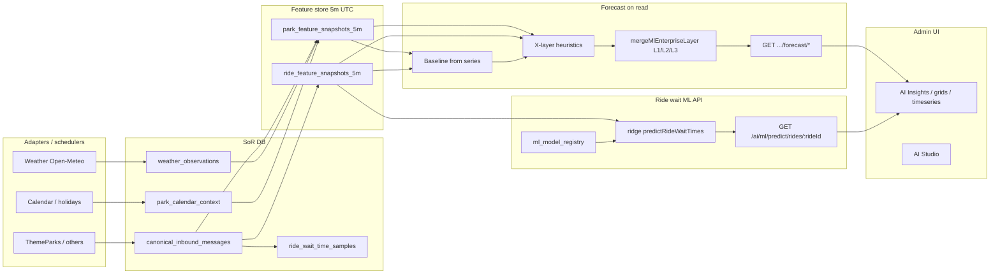

# Smart Park OS — Current AI / ML / Forecast Assessment

**Role:** Principal AI Platform Architect (read-only review)  
**Date:** 2026-05-11  
**Scope:** Existing codebase only — no refactors, deletions, or new architecture in this document.

---

## Executive summary

Smart Park OS already has a **documented, binding forecast pipeline** (ADR `docs/adr/0001-forecast-architecture.md`): **adapters → SoR (DB) → 5-minute feature snapshots → forecast computed on read** (baseline → X-layer heuristics → optional enterprise ML factor layer). **MQTT/UNS** is explicitly **distribution**, not the sole SoR for forecast numbers.

Parallel to that, a **ridge-regression ride wait predictor** reads **`ride_feature_snapshots_5m`**, uses **`ml_model_registry`** / **`ml_model_versions`**, and falls back to **deterministic baselines**. **AI Studio** adds a **catalog-based** train/predict path (separate from the ADR park/ride forecast API).

**Recommendation scoring** and parts of **insights** are **rule/heuristic** with optional links to forecasts and ML metadata — not a single unified “model server.”

Adding an **explainable forecast engine** later should **extend** the existing layers (especially **after** `applyXLayerToForecast` / **alongside** `mergeMlEnterpriseLayer` and explanation endpoints) rather than replacing ingest or snapshot tables without a migration plan.

---

## 1. Existing AI / ML routes

### 1.1 Primary registration

- **File:** `src/routes/v1/ai.routes.js` — `registerProtectedAiRoutes(v1Router)` mounts almost all authenticated AI routes on **`/api/v1/ai/...`** (RBAC `ai.read` / `ai.refresh`, park context where noted).
- **Public:** `src/routes/v1/index.js` — `GET /api/v1/ai/health` (no auth).

### 1.2 Root-level POST aliases (`src/app.js`)

Mounted **before** the main `/api/v1` router so POST matches reliably in Docker/proxy setups:

| Method | Path | Purpose |
|--------|------|---------|
| POST | `/api/v1/ai/forecasts/refresh` | Zone crowd baseline refresh (`aiController.refreshForecasts`) |
| POST | `/api/v1/ai/feature-store/park-snapshots/bulk-delete` | Bulk delete park snapshots |
| POST | `/api/v1/ai/feature-store/park-snapshots/purge` | Purge park snapshots in range |

### 1.3 `/ai` surface (representative)

| Area | Examples |
|------|----------|
| Health / pipeline | `GET /ai/pipeline-health`, `GET /ai/pipeline-runs` |
| Forecasts (persisted rows) | `GET /ai/forecasts` |
| Insights | `GET /ai/insights/summary` |
| AI Studio | `GET/POST /ai/studio/*` (catalog, dataset-stats, models, train, predict, feature-drafts) |
| Accuracy / timeseries | `GET /ai/forecast-accuracy/zone-crowd`, `GET /ai/timeseries/*`, `GET /ai/training-dataset`, `POST /ai/timeseries/calendar` |
| Park / entity forecast (read) | `GET /ai/parks/:externalParkId/forecast/{summary,series,explanation}`, `GET /ai/entities/:externalEntityId/forecast/summary`, `GET /ai/parks/:externalParkId/entities/forecast/summary` |
| Factors / ML profiles | `GET/POST/PATCH/DELETE /ai/global-factors`, `GET/PATCH /ai/parks/:parkId/factors`, CRUD `/ai/ml-profiles`, asset `PUT /ai/assets/:assetId/ml-profile`, `PATCH .../ml-overrides`, `GET .../effective-ml-config` |
| Feature store | `GET /ai/feature-store/monitor`, `GET /ai/feature-data-quality`, `DELETE /ai/feature-store/park-snapshots/:id` (+ bulk/purge above) |
| Recommendations | `GET /ai/recommendations/scored`, `GET .../scoring-summary`, `POST .../score`, `POST .../:id/score`, `GET .../:id/explanation` |

### 1.4 `/ml` vs `/ai/ml` (duplicate mount)

Same handlers registered twice (legacy + canonical):

- **`/api/v1/ml/...`** — deprecated; admin-dashboard may still call it.
- **`/api/v1/ai/ml/...`** — canonical (Phase B5).

Paths: `GET .../predict/rides/:rideId`, `GET .../predict/park-summary`, `GET .../dataset/rides`, `POST .../train/wait-time/global`, `POST .../train/wait-time/rides/:rideId`.

### 1.5 Other “forecast / prediction” routes (non-`/ai` hub)

- **Visit planning:** `src/routes/v1/visit-plan.routes.js` — e.g. `/:id/forecast` → `visitPlanController.forecastVisitPlan`.
- **Platform geo:** `src/modules/platform/platform.routes.js` — `/:parkSlug/geo/pressure/forecast` (geo pressure engine; ties into `AiParkForecastService` per grep).

---

## 2. Existing services (grouped)

### 2.1 Core forecast & snapshots (ADR-aligned)

| Service | Role |
|---------|------|
| `ai-feature-store.service.js` | Builds **5m UTC** `park_feature_snapshots_5m` / `ride_feature_snapshots_5m` from canonical + context; references ADR |
| `ai-snapshot-x-context.service.js` | **X context**: weather, calendar, traffic mock, staffing, samples, master data signals for a bucket |
| `ai-park-forecast.service.js` | Park/entity wait forecasts: **series → baseline → X-layer → `mergeMlEnterpriseLayer`** |
| `ai-forecast-x-adjustments.service.js` | X-layer heuristics on summaries (imported by park forecast) |
| `ai-forecast.service.js` | **Zone crowd** baseline (SMA + trend), **persists** `forecasts` rows for `CROWD_LEVEL` / `ZONE` |
| `ml-forecast-layer.service.js` | **L1/L2/L3** enterprise heuristic minutes from global/park factors + effective ML config |
| `ml-effective-config.service.js` | Resolves catalog ML profile + overrides per asset |
| `ml-factor-current-resolver.service.js` | Month/region-scoped factor values for ML layer |
| `forecast-accuracy.service.js` | Zone crowd forecast accuracy API backing |

### 2.2 Ride wait ML (ridge + registry)

| Service | Role |
|---------|------|
| `ml/ride-prediction.service.js` | **Ridge** predict from latest snapshot; ride-specific → global → **baseline** |
| `ml/ride-model-training.service.js` | Train global / ride ridge models into registry |
| `ml/ride-dataset.service.js` | Dataset build for training |
| `ml/ml-model-registry.service.js` | Active model lookup / insert / deactivate |
| `ml/ride-baseline-forecast.service.js` | Non-ML fallback from snapshot fields |
| `ml/ride-feature-vector.util.js`, `ml/ride-ridge.util.js`, `ml/feature-importance.util.js` | Vectorization, ridge math, “top factors” from weights |
| `ml/addon-board-ml-bridge.service.js` | Bridge for operations / addon board consumption |
| `ml/ml-training-scheduler.service.js` | Scheduled training hookups (bootstrap registration) |

### 2.3 AI Studio (catalog models)

| Service | Role |
|---------|------|
| `ai-studio.service.js` | Catalog, dataset stats, list/get models, train, activate, **predict** |
| `ai-studio-dataset.service.js` | Training feature column contracts |
| `ai-studio-feature-draft.service.js` | Feature drafts CRUD |

### 2.4 Recommendations & insights

| Service | Role |
|---------|------|
| `ai-recommendation-scoring.service.js` | **Heuristic** scoring + weather risk + impact; persists `recommendation_scores`, uses forecasts/ML repo |
| `ai-orchestrator.service.js` | Pipeline / orchestration (controller-facing) |
| `ai-training-dataset.service.js` | Ride queue training dataset for export/API |
| `timeseries.service.js` | Ride wait timeseries for UI/API |

### 2.5 Adjacent

| Service | Role |
|---------|------|
| `geo-pressure-engine.service.js` | Uses `AiParkForecastService` for pressure-related behaviour |
| `registry-publisher.service.js` | Imports `predictRideWaitTimes` for publish path integration |
| `operational-context.service.js` | Uses snapshot X context helpers for calendar parts |

---

## 3. Database models / tables (AI-relevant)

| Model file | Table / notes |
|------------|----------------|
| `park-feature-snapshot.model.js` | `park_feature_snapshots_5m` |
| `ride-feature-snapshot.model.js` | `ride_feature_snapshots_5m` (includes `mlProfileCode`, `xFeaturesExtras`, etc.) |
| `forecast.model.js` | `forecasts` — `subjectType` PARK/ZONE/RIDE, `targetMetric` CROWD_LEVEL / WAIT_TIME / STAFF_DEMAND, horizons, JSON `features` |
| `forecast-training-label.model.js` | `forecast_training_labels` |
| `ml-model-version.model.js` | Versioned ML payloads (used with baseline + studio) |
| `ml-model-registry.model.js` | Registry for ride wait ridge scopes |
| `ml-profile.model.js` | `ml_profiles` |
| `ml-global-factor.model.js` / `ml-park-factor.model.js` | Enterprise factor definitions |
| `asset-ml-profile-assignment.model.js` / `asset-ml-override.model.js` | Per-asset catalog assignment + overrides |
| `recommendation.model.js` / `recommendation-score.model.js` | Recommendations + scored outputs |
| `ai-pipeline-run.model.js` | `ai_pipeline_runs` |
| `ai-studio-model.model.js` | `ai_studio_models` |
| `model-metrics-daily.model.js` | Daily metrics rollup |
| `ride-wait-time-sample.model.js` | Historical samples (ADR path) |
| `park-calendar-context.model.js` | Calendar / holiday context |
| `weather-observation.model.js` | Weather SoR for X layer |
| `canonical-inbound-message.model.js` | Primary ingest SoR for snapshots |
| `zone-crowd-sample.model.js` | Zone crowd series for baseline refresh |
| `sqdc-daily-snapshot.model.js` | `ai_recommendations_json` (SQDC board AI hints) |

---

## 4. Existing frontend views (admin-dashboard)

**Router:** `admin-dashboard/src/router/domains/ai.routes.ts`

| Route path | View | Notes |
|------------|------|-------|
| `ai-insights` | `AiInsightsView.vue` | Hub |
| `ai-insights/accuracy` | `AiForecastAccuracyView.vue` | Zone crowd accuracy |
| `ai-insights/timeseries` | `AiRideTimeseriesView.vue` | Ride wait timeseries |
| `ai-insights/ride-waits` | `AiRideWaitGridView.vue` | Ride wait grid |
| `ai-insights/ml-global-factors` | `AiMlGlobalFactorsView.vue` | L2 factors |
| `ai-insights/ml-park-factors` | `AiMlParkFactorsView.vue` | L1 factors |
| `ai-insights/ml-profiles` | `AiMlProfilesView.vue` | Catalog profiles |
| `ai-insights/feature-store-monitor` | `AiFeatureStoreMonitorView.vue` | Snapshot monitor |
| `ai-insights/data-quality` | `AiFeatureDataQualityView.vue` | Feature DQ dashboard |
| `ai-insights/studio` | `AiStudioView.vue` | Studio train/predict |

**Short aliases:** `/ai`, `/ai/forecasts`, `/ai/queue`, `/ai/recommendations`, `/ai/studio` → redirects to the above.

**Related (not under `ai.routes.ts` only):** Master Data ride wizard embeds **signal capabilities** (ML/Forecast checkboxes) — `RideSignalCapabilitiesPanel.vue` (uses `putRideSignalCapabilities`, separate from AI Studio).

---

## 5. Existing X feature pipeline (how features are formed)

Per **ADR 0001** and `ai-feature-store.service.js` / `ai-snapshot-x-context.service.js`:

| Source | How it enters X |
|--------|------------------|
| **ThemeParks / adapters** | Persisted **`canonical_inbound_messages`** (and related SoR); feature store job reads these |
| **Weather** | **`weather_observations`** (+ scheduler); `latestWeatherNearBucket` in X context |
| **Holiday / calendar** | **`park_calendar_context`** resolved per local park date |
| **MQTT / UNS** | **Not** the forecast SoR; optional distribution from same runs; live ops use UNS/MQTT separately |
| **Staffing / master data** | Pulled into snapshot builders from **`Staff`**, **`ParkAsset`**, **`RideMasterData`**, prior snapshots, **`RideWaitTimeSample`**, etc. (see `ai-snapshot-x-context.service.js` imports) |
| **Manual configuration** | **`ml_profiles`**, asset assignments, park/global factors, `AppSetting` keys such as `ai.forecast.factorConfigs` — consumed in **forecast merge** and ML layer |

**Output artifacts:** `park_feature_snapshots_5m`, `ride_feature_snapshots_5m`, optional **`forecast_training_labels`** upserts from feature store service.

---

## 6. Existing Y outputs (what is predicted / calculated today)

| Output | Mechanism | Persistence |
|--------|-------------|-------------|
| **Zone crowd forecast** (+15/+60/+180 style horizons in service) | SMA + linear trend in `AiForecastService.refreshZoneCrowdForecasts` | **`forecasts`** rows |
| **Park / ride wait forecast API** (`forecast15Minutes`, `forecast60Minutes`, explanations) | **On read** from snapshot series + baseline + X-layer + ML enterprise merge | Response JSON (ADR: optional `forecast_results` table **not** required path) |
| **Ride wait ML API** (`/ml` / `/ai/ml/predict/...`) | Ridge on feature vector from latest **`ride_feature_snapshots_5m`** | Ephemeral response; models in **`ml_model_registry`** |
| **AI Studio predict** | Separate catalog model inference | `ai_studio_models` |
| **Recommendation scores** | Heuristic scoring service | **`recommendation_scores`** |
| **Training dataset export** | `buildRideQueueTrainingDataset` | API payload |
| **OEE / simulator** | `attraction-oee-simulator.service.js` | MQTT tags `quality: SIMULATED` — **ops telemetry**, not the ADR forecast SoR path |
| **PdM** | `park_asset_pdm_*` models / services | Condition evaluation logs (parallel vertical) |

---

## 7. Existing model logic (rule vs ML)

| Area | Dominant logic |
|------|----------------|
| Zone crowd refresh | **Statistical** (SMA + trend), persisted |
| Park/ride forecast API | **Baseline + heuristics** (`applyXLayerToForecast`) + **config-driven enterprise adjustments** (`mergeMlEnterpriseLayer`) — not a single global neural net in this path |
| Ride wait `/ai/ml/predict` | **Real ML** in the narrow sense: **ridge regression** with stored weights; fallback **deterministic baseline** |
| AI Studio | **Catalog-defined** models — implementation depends on studio service (treat as **ML path** with separate lifecycle from ADR snapshots) |
| Recommendation scoring | **Rule / heuristic** with confidence tuning |
| Smoke / health | **Config + optional JSON file** (`ai-smoke-status` per controller comments) |

---

## 8. Data flow diagram (binding ADR view)

**MQTT/UNS** (distribution) is intentionally omitted from the **forecast truth** chain in ADR — it still matters for **live ops** and **signal capabilities** UI.

---

## 9. Risk assessment

| Category | Observation |
|----------|-------------|
| **Working / do not break lightly** | ADR pipeline order; `ai-feature-store` snapshot writers; `AiParkForecastService` layering; `forecasts` refresh for zones; RBAC on `/ai/*`; admin routes under `ai-insights/*` |
| **Duplication** | **`/ml` and `/ai/ml`** duplicate surface; two “ML” stories (**ridge ride wait** vs **AI Studio catalog**) |
| **Dead / unused** | Not exhaustively proven without coverage metrics — some smoke paths optional (`ai-smoke-status.json`) |
| **Fragile** | On-read forecast depends on **snapshot density** (`MIN_SERIES_POINTS` etc.); timezones / UTC buckets; dual external vs internal IDs in snapshot queries |
| **Naming** | “Forecast” used for **persisted `forecasts` rows**, **on-read API JSON**, and **visit-plan forecast** — same word, different semantics |
| **Tests** | Targeted tests exist for **ML layer**, **addon-board bridge**, **studio drafts**, **ride prediction** — **not** full end-to-end API coverage for all `/ai/*` routes |
| **OpenAPI** | `src/openapi/_src/paths/ai.yaml` is substantial; **deprecated `/ml`** documented in routes — verify every new client uses `/ai/ml` |

---

## 10. Gap analysis vs target (X → vector → Y → explain → recommend)

| Target step | Current state |
|-------------|----------------|
| **Realtime signals X** | Partially: **snapshots** aggregate SoR + context; **live MQTT** is **not** the forecast SoR per ADR |
| **Feature selection** | Implicit in snapshot schema + studio dataset constants; **no unified user-driven feature selector** for the ADR forecast API |
| **Feature vector** | Explicit for **ride ridge** (`ride-feature-vector.util.js`); park/ride forecast uses **series + snapshot fields** more than a single exported vector type |
| **Prediction engine** | **Split**: baseline+X+enterprise for wait **forecasts**; **ridge registry** for `/ai/ml`; **studio** separately |
| **Y prediction** | **Yes** for waits/crowd/recommendations scores; shapes differ by endpoint |
| **Explainability** | **MVP (normalized envelope)**: `GET .../forecast/explanation` includes `explainability`; ride ML supports `?explain=1` → `data.explanation`. Canonical `featureContributions[].source` values and OpenAPI enum **`AiExplainabilityContributionSource`** — see **`docs/architecture/ai-explainability-mvp.md`** and **`src/services/ai/prediction-explanation-normalizer.service.js`**. Still **not** a single SHAP-style layer across all tracks. |
| **Recommendation** | **Heuristic scoring** + persistence; not fully tied to a single predictive model |

---

## 11. Deliverables checklist

- [x] Executive summary  
- [x] Current ML architecture map (Mermaid + ADR reference)  
- [x] Existing routes table (§1)  
- [x] Existing services table (§2)  
- [x] Existing DB models/tables (§3)  
- [x] Existing frontend views (§4)  
- [x] Current X feature inventory (§5)  
- [x] Current Y output inventory (§6)  
- [x] Rule-based vs real ML (§7)  
- [x] Risks before refactoring (§9)  
- [x] Gap analysis (§10)  

### Recommended safe next steps (no code in this task)

1. **Treat ADR 0001 as canonical** for any explainable forecast work — extend **on-read** layers or add **explicit persistence** only with a reviewed ADR update.  
2. **Explainability envelope (done for MVP)** — park/ride **`/forecast/explanation`** and **`/ai/ml/predict/rides/:id?explain=1`** share the normalizer shape; extend with richer attributions before changing snapshot schema.  
3. **Consolidate clients** onto **`/api/v1/ai/ml/*`** to retire **`/ml/*`** later under a major version.  
4. **Add integration tests** for the highest-value chains: snapshot job → latest snapshot → `GET .../forecast/summary` → `GET .../forecast/explanation`.  
5. **Name internal docs** for the three tracks: **(A)** ADR forecast, **(B)** ridge ride wait, **(C)** AI Studio — reduces cross-team confusion.

---

## References (key files)

- `docs/architecture/ai-explainability-mvp.md`  
- `src/services/ai/prediction-explanation-normalizer.service.js`  
- `docs/adr/0001-forecast-architecture.md`  
- `src/routes/v1/ai.routes.js`  
- `src/app.js` (POST aliases)  
- `src/services/ai-feature-store.service.js`  
- `src/services/ai-snapshot-x-context.service.js`  
- `src/services/ai-park-forecast.service.js`  
- `src/services/ml-forecast-layer.service.js`  
- `src/services/ml/ride-prediction.service.js`  
- `src/controllers/ai.controller.js`  
- `admin-dashboard/src/router/domains/ai.routes.ts`

---

*Original assessment: analysis-only. Subsequent explainability MVP (normalizer + OpenAPI enum) is documented in `ai-explainability-mvp.md`.*
