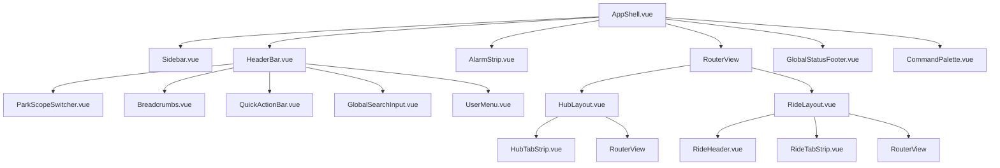
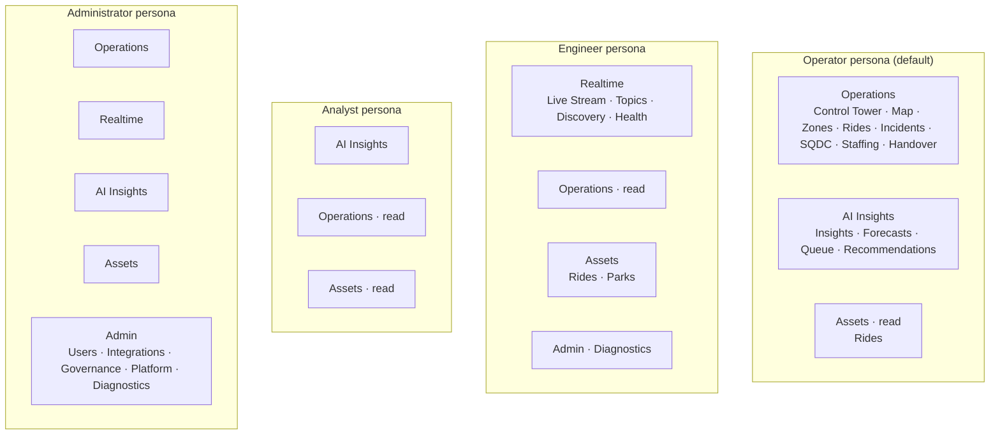

# Smart Park OS — IA Redesign · MVP Cut (F2-MVP)

> **Status.** Supersedes [`frontend-ia-redesign.md`](frontend-ia-redesign.md)
> **for the MVP shipping window**. The 7-domain F2 plan stays valid as the
> post-MVP / enterprise plan; this document is the **simpler, ruthless cut**
> we ship first.
>
> **Hard scope rule.** No new top-level domains. Five domains. Period.
> Anything that doesn't fit one of the five **either merges into one of
> them or moves to `Admin → Diagnostics`** — it does *not* become a sixth
> section.
>
> **Audience.** Platform engineering, UX, product, the partner-park
> operations stakeholders who will run the MVP.
>
> **Stack.** Vue 3 (Composition API), Vue Router 4, Pinia, Tailwind,
> vue-i18n (en/de/fr/es), Socket.IO, MQTT/Sparkplug B,
> RBAC mirrored from `shared/rbac.json`.

---

## Table of contents

1. [MVP UX assessment](#1-mvp-ux-assessment)
2. [Current complexity analysis](#2-current-complexity-analysis)
3. [Simplified 5-domain architecture](#3-simplified-5-domain-architecture)
4. [New sidebar structure](#4-new-sidebar-structure)
5. [Ride-centric UX model](#5-ride-centric-ux-model)
6. [Realtime UX concept](#6-realtime-ux-concept)
7. [Admin simplification strategy](#7-admin-simplification-strategy)
8. [Vue Router refactor proposal](#8-vue-router-refactor-proposal)
9. [Suggested component architecture](#9-suggested-component-architecture)
10. [Migration strategy](#10-migration-strategy)
11. [MVP scope protection](#11-mvp-scope-protection)

---

## 1. MVP UX assessment

The previous F2 design proposed a 7-domain enterprise navigation
(Operations · Realtime · AI · Assets · Integrations · Governance ·
Platform). It was right *for what Smart Park OS will be in 18 months*.
It is **wrong for what we ship in the next 8 weeks**.

The MVP is one product, with one job:

> **A realtime operational control platform for theme park operations.**

It is *not* an MQTT governance platform, an integration suite, or a
Sparkplug administration console — even though all of those things are
implemented in the codebase. They are the **engine room**. An operator
should never see the engine room unless they choose to walk down to it.

The current sidebar exposes the engine room as **first-class top-level
nav**: "UNS Explorer", "MQTT topics", "Adapter marketplace", "Registry
Mirror", "Sparkplug Live", "Governance Console" all sit at the same
visual weight as "Park Live" and "Incidents". An operator opening the
app at 07:30 on a busy Saturday has to **mentally filter** five
engineering nouns before reaching the one they need.

The MVP cut is therefore not a feature reduction — **almost nothing in
the codebase is deleted**. It is a **visibility reduction**: we collapse
the navigation surface from ~28 sidebar items across 9 sections to **~14
items across 5 sections**, and we make the operations and ride
experiences carry the product.

> **One-line recommendation.** Ship five domains — *Operations · Realtime
> · AI Insights · Assets · Admin* — with a strictly operations-first home
> screen, a strictly ride-centric asset model, and every engineering
> concept (UNS, MQTT, Sparkplug, Registry, Governance, Integrations)
> demoted under either *Realtime* (when an operator might watch it) or
> *Admin → Diagnostics* (when only an engineer touches it).

---

## 2. Current complexity analysis

The codebase today (per `frontend-ia-audit.md`):

| Metric | Today | F2 plan | **MVP cut** |
|---|---|---|---|
| Top-level sidebar sections | 9 (incl. injected `Personal`) | 7 | **5** |
| Visible top-level items, full-perms user | 28 | ~40 | **~14** |
| Sections with ≤2 items | 5 | 0 | 0 |
| Engineering nouns at top level (`MQTT`, `UNS`, `Sparkplug`, `Registry`, `Governance`, `Integrations`) | 6 | 2 (`Realtime · UNS`, `Integrations`) | **0** |
| First-class "support" domains in nav | 3 (Integrations, Governance, Platform) | 3 | **0** *(all collapsed under `Admin`)* |
| Ride-centric drilldown URL | none (3 separate stacks) | partial | **`/assets/rides/:id/{overview,live,queue,oee,maintenance,ai,diagnostics}`** |

### 2.1 What hurts an operator today

Anchored to evidence in the F0 audit and the live RBAC manifest:

1. **The 9 sections look equal.** "Executive · Operations · Engineering ·
   AI · Platform · IT-OT · Governance · Personal" — an operator has no
   pre-attentive cue which two sections matter for their shift.
2. **Engineering nouns dominate.** Six of the nine sections contain at
   least one MQTT/UNS/Sparkplug/Registry/Governance term.
3. **The same ride lives in three places.** `/admin/master-data/rides/:id`
   (MDM canonical), `/platform/rides/:assetId` (master editor),
   `/mdm/rides/:id` (legacy). Operators don't know which is "the ride".
4. **No operations home.** `/` renders the dashboard, but there is no
   *Control Tower* identity — no single screen that says *"this is your
   shift, right now"*.
5. **No ride identity.** Clicking a ride in any list takes you to a
   different layout depending on which list you came from.

### 2.2 What we keep, what we hide, what we delete

| Today | MVP fate |
|---|---|
| Park Live dashboard (`/`) | **Keep** as `/ops` Control Tower (rebrand) |
| Incidents · Agent Inbox · Agent Runs | **Merge** into `Operations · Incident Center` (agent runs become a tab) |
| Staff allocation | **Keep** as `Operations · Staffing` |
| Live Queue · Add-on Board · OEE · Hotel Guests · Visitor Flow | **Merge** into `Operations · Live Map` (sub-tabs) and the per-ride drilldown |
| Predictive maintenance | **Keep** — but lives **inside the ride**, not as a sidebar entry |
| SQDC classic + hierarchical | **Merge** — one entry under `Operations · SQDC` with park/asset modes |
| AI Insights + 8 sub-pages | **Keep** under `AI Insights` with one sub-tab strip |
| AI Studio | **Keep** under `AI Insights · Studio` |
| Master Data (parks, rides, shows, restaurants, zones, shops, templates) | **Keep** under `Assets`, **all entry points unified** |
| Platform Park Explorer · Asset Map · Templates · Visitor Flow (sim) | **Merge** into `Assets · Parks` (Park Explorer) and `Operations · Live Map` |
| UNS Tree, UNS Topics, UNS Live, OEE Cockpit, UNS Signal View | **Merge** into `Realtime · Live Stream` and `Realtime · Topic Explorer` |
| UNS Spy Inbox | **Keep** as `Realtime · Discovery Inbox` |
| UNS Registry Mirror | **Move** to `Admin · Diagnostics` |
| UNS Governance Console | **Move** to `Admin · Governance` |
| Sparkplug Edge Nodes | **Move** to `Admin · Diagnostics · Infrastructure` |
| Adapter marketplace · Devices & Services · Adapter pipeline log · Integrations | **Merge** under `Admin · Integrations` (single hub) |
| Audit Log | **Move** to `Admin · Governance` |
| Platform Settings | **Move** to `Admin · Platform` |
| Wave-2 Live · Simulator · Data Quality | **Move** to `Admin · Diagnostics` |
| Import / Export | **Move** to `Admin · Platform` |
| Help / Settings | **Move** to header user menu / locale switcher (off the sidebar) |
| Legacy `/mdm/*` | **Delete** (already F3-flagged) |
| `AdapterPackagesView`, `PlatformAssetExplorerView` | **Delete** (orphan) |

Net effect: **no operator-facing feature is lost**. Every screen is
still routable. ~22 of them simply move from the sidebar to a
contextual tab, an in-ride drilldown, or `Admin → Diagnostics`.

---

## 3. Simplified 5-domain architecture

### 3.1 The five domains

```mermaid
graph TD
  A[Smart Park OS · MVP]
  A --> Ops[1. Operations]
  A --> RT[2. Realtime]
  A --> AI[3. AI Insights]
  A --> AS[4. Assets]
  A --> AD[5. Admin]

  Ops --> Ops1[Control Tower]
  Ops --> Ops2[Live Map]
  Ops --> Ops3[Zone Operations]
  Ops --> Ops4[Ride Operations]
  Ops --> Ops5[Incident Center]
  Ops --> Ops6[SQDC / SWDEC]
  Ops --> Ops7[Staffing]
  Ops --> Ops8[Shift Handover]

  RT --> RT1[Live Stream]
  RT --> RT2[Topic Explorer]
  RT --> RT3[Discovery Inbox]
  RT --> RT4[Signal Health]

  AI --> AI1[AI Insights]
  AI --> AI2[Forecasts]
  AI --> AI3[Queue Predictions]
  AI --> AI4[Recommendations]

  AS --> AS1[Parks]
  AS --> AS2[Zones]
  AS --> AS3[Rides]
  AS --> AS4[Restaurants]
  AS --> AS5[Shows]
  AS --> AS6[Ride Configurations]
  AS --> AS7[Signal Configuration]

  AD --> AD1[Users & Roles]
  AD --> AD2[Integrations]
  AD --> AD3[Governance]
  AD --> AD4[Platform]
  AD --> AD5[Diagnostics]
```



### 3.2 Domain identity in one sentence each

| # | Domain | One-sentence identity |
|---|---|---|
| 1 | **Operations** | *"How is the park running right now, and what needs my decision in the next 15 minutes?"* |
| 2 | **Realtime** | *"Are signals arriving, and which ones are stale or wrong?"* — **engine-room view, not engineering view** |
| 3 | **AI Insights** | *"What does the model expect in the next four hours, and what should I do about it?"* |
| 4 | **Assets** | *"What is the canonical truth about each park, zone, ride, restaurant, show?"* — **and ride-centric drilldown lives here** |
| 5 | **Admin** | *"Who is in the system, what did they do, and is the platform healthy?"* — **a single bucket for every support system** |

### 3.3 What each domain explicitly does NOT do

This is as important as what they do.

- **Operations does NOT** expose MQTT topics, Sparkplug nodes, adapter
  status, registry state, or any engineering noun. If an operator needs
  one, the link is contextual ("Why is this signal stale? → Realtime ·
  Signal Health").
- **Realtime does NOT** show governance, registry policy, namespace
  migration, or edge-node infrastructure. Those are Admin · Diagnostics.
  Realtime is the **operator-grade** view of the data plane.
- **AI Insights does NOT** show feature-store internals, model training
  pipelines, or feature data quality drilldowns at the top level. Those
  live behind tabs inside *AI Insights*, plus a "Model Health" admin
  surface.
- **Assets does NOT** have an "Asset List" landing — it lands on
  **Rides** by default, because rides are where 80% of the work happens.
- **Admin does NOT** expose itself to non-admin personas at all. The
  domain header simply isn't rendered for them.

### 3.4 Persona model (MVP — only 4 personas)

The 7-persona model from F2 is collapsed to **4 MVP personas**.
Sub-roles like Zone Supervisor and Ride Operator stay as *role codes*
in `shared/rbac.json` but **share the Operator persona shell**.

| MVP persona | Shell | Lands on | Sees domains |
|---|---|---|---|
| **Operator** *(Park Mgr, Zone Supervisor, Ride Op, Security)* | desktop + mobile | `/ops` Control Tower | Operations · AI Insights · Assets *(read)* |
| **Engineer** *(IT/OT, Maintenance)* | desktop | `/realtime` Live Stream | Operations *(read)* · Realtime · Assets · Admin *(scoped)* |
| **Analyst** | desktop | `/ai` | AI Insights · Operations *(read)* · Assets *(read)* |
| **Administrator** | desktop | `/admin/users` | All five |

Why fewer personas: in MVP we have one customer, one shift model, and
no portfolio scope. The granular Zone Supervisor / Ride Operator /
Security distinctions are **in the data** (assigned zone, assigned
ride) — they don't need their own persona shell yet.

---

## 4. New sidebar structure

### 4.1 Visible items — Administrator (full view)

```text
SMART PARK OS                                              Europa-Park ▾
─────────────────────────────────────────────────────────────────────
OPERATIONS
  ⊙ Control Tower                              /ops
  ◯ Live Map                                   /ops/map
  ▦ Zones                                      /ops/zones
  ⛯ Rides                                      /ops/rides
  ! Incidents                                  /ops/incidents
  ▣ SQDC                                        /ops/sqdc
  👥 Staffing                                   /ops/staffing
  ↻ Handover                                   /ops/handover

REALTIME
  ⏵ Live Stream                                /realtime
  ≡ Topic Explorer                             /realtime/topics
  ⌕ Discovery Inbox                            /realtime/discovery
  ✓ Signal Health                              /realtime/health

AI INSIGHTS
  ✦ Insights                                   /ai
  ▴ Forecasts                                  /ai/forecasts
  ⏱ Queue Predictions                           /ai/queue
  ☑ Recommendations                             /ai/recommendations

ASSETS
  ⛯ Rides                                      /assets/rides       ← default
  ⌂ Parks                                      /assets/parks
  ▭ Zones                                      /assets/zones
  ⌥ Restaurants                                /assets/restaurants
  ★ Shows                                      /assets/shows

ADMIN
  ⚷ Users & Roles                              /admin/users
  ⊞ Integrations                               /admin/integrations
  ⚖ Governance                                 /admin/governance
  ❍ Platform                                   /admin/platform
  ⌬ Diagnostics                                /admin/diagnostics
─────────────────────────────────────────────────────────────────────
[ pinned ]                                  ⌘K  ·  ?  ·  👤▾  ·  ⏻
```

5 sections, 25 items max — and that's only what the **Administrator**
sees. An Operator sees ~12, an Engineer ~10, an Analyst ~7.

### 4.2 Visible items per persona

```text
OPERATOR (12 items)            ENGINEER (10 items)            ANALYST (7 items)
─────────────────────          ─────────────────────          ─────────────────
OPERATIONS                     OPERATIONS (read)              AI INSIGHTS
  Control Tower                  Control Tower                  Insights
  Live Map                     REALTIME                         Forecasts
  Zones                          Live Stream                    Queue Predictions
  Rides                          Topic Explorer                 Recommendations
  Incidents                      Discovery Inbox              OPERATIONS (read)
  SQDC                           Signal Health                  Control Tower
  Staffing                     ASSETS                           SQDC
  Handover                       Rides                        ASSETS (read)
AI INSIGHTS                      Parks                          Rides
  Insights                     ADMIN
  Forecasts                      Diagnostics
  Recommendations                (scoped)
ASSETS (read)
  Rides
```

The MVP does **not** add a "Maintenance" persona shell. Maintenance
work lives inside the *ride drilldown* (`Ride · Maintenance` tab) — see
§5.

### 4.3 Mobile shell

The mobile shell is **one** layout, persona-aware:

```text
┌────────────────────────────┐
│ Europa-Park ▾    ⚠ 3   ⌘K │
├────────────────────────────┤
│                            │
│  (current page)            │
│                            │
│                            │
├────────────────────────────┤
│ [Tower][Map][Rides][Inc][👤]│
└────────────────────────────┘
```

- 5-tab bottom bar.
- **Operator** mobile: `Tower · Map · Rides · Incidents · Profile`.
- **Engineer** mobile: `Tower · Live Stream · Rides · Incidents · Profile`.
- No `Realtime` or `Admin` deep-tree on mobile in MVP. If an engineer
  needs it, they open desktop.
- No swipe-from-edge drawer (gesture conflict on rides). Drawer opens
  only via a tap on the brand name.

### 4.4 Breadcrumb rule (always exactly 2 levels in MVP)

```
Operations  ›  Live Map
Assets      ›  Silver Star            ← ride name resolved from :id
Admin       ›  Integrations
```

Two levels keeps mobile honest. Hub tabs handle the third level
visually (a tab strip), they don't extend the breadcrumb.

### 4.5 Quick-action bar (operations pages only)

Anchored top-right, ≤4 buttons:

```
[ + Incident ]  [ ⤴ Hand over ]  [ ⏸ Pause ride ]  [ ⌘K ]
```

`Pause ride` only appears when the page has a ride scope (e.g.
`/ops/rides/:id` or `/assets/rides/:id`). Quick-actions are **not**
shown on Realtime / AI / Assets-list / Admin pages.

### 4.6 Pinned & recents

- **Recents** — last 5 visited pages, auto-populated, in-memory.
- **Pinned** — up to 6 user-chosen items, persisted to
  `users.settings.pinnedNav`.
- Both render in a single "★ Pinned · ⏱ Recent" group at the top of
  the sidebar; collapsed by default.

### 4.7 ⌘K command palette

Same contract as the F2 plan, but **only three result groups in MVP**:

```
   ⌕ silver star
   ──────────────────────────────────────────
   RIDES
     ▸ Silver Star · Horror zone · OPEN
   PAGES
     ▸ Silver Star · Live
     ▸ Silver Star · Maintenance
     ▸ Silver Star · AI
   ACTIONS
     ▸ Pause Silver Star (confirm)
     ▸ Raise incident on Silver Star
```

No `Signals` group, no `Topics` group, no `Adapters` group at MVP
launch — those live one ⌘K-result-click deeper, inside the ride or
inside Realtime. We add them in F4 only after operator usage shows
they're searched for.

---

## 5. Ride-centric UX model

The MVP's most valuable structural change: **the ride is the unit of
work**. Every ride has *one* canonical URL with *one* canonical layout,
and every operator and engineer surface that touches a ride **deep-links
into a tab on that URL**.

### 5.1 The ride drilldown

```
/assets/rides/:rideId
  ├── overview      ← landing
  ├── live          ← realtime telemetry, queue, throughput, status
  ├── queue         ← live queue, virtual queue, capacity vs forecast
  ├── oee           ← OEE board, downtime codes, MTBF/MTTR
  ├── maintenance   ← PdM scores, work-orders, inspection schedule
  ├── ai            ← per-ride forecast, drift, recommendations
  └── diagnostics   ← engineer-only: signals, adapter health, sparkplug
```

Same ride object is also reachable from **Operations · Rides** (which
is just a filtered list view that links to the same drilldown URL):

```mermaid
graph LR
  A[/ops/rides/] -->|click ride| D[/assets/rides/:id/overview]
  B[/assets/rides/] -->|click ride| D
  C[/ops/map · ride pin] -->|click| D
  D -->|tab| E[/assets/rides/:id/live]
  D -->|tab| F[/assets/rides/:id/queue]
  D -->|tab| G[/assets/rides/:id/oee]
  D -->|tab| H[/assets/rides/:id/maintenance]
  D -->|tab| I[/assets/rides/:id/ai]
  D -->|tab| J[/assets/rides/:id/diagnostics]
```

### 5.2 Tab contracts

Each tab is **one screen, one job**. No tab is itself a hub.

| Tab | Owns | Reads from | Writeable from |
|---|---|---|---|
| Overview | KPI strip · status · upcoming maintenance · open incidents · last 24h chart | API + websocket | Quick actions |
| Live | Real-time wait, throughput, status, last NDATA, current operator | MQTT/UNS via websocket | Pause/resume ride |
| Queue | Live queue, capacity, virtual-queue mix, forecast vs actual | API + AI | Open queue interventions |
| OEE | Availability, performance, quality, downtime codes table | API | Add downtime entry, code reclassify |
| Maintenance | PdM scores, thresholds, sparkline per signal, work-orders | API + AI | Create work-order, snooze rule |
| AI | Per-ride forecast, MAPE, top influencing factors, recommendations | AI API | Trigger refresh, accept/reject rec |
| Diagnostics | Topic list (this ride only), adapter status, edge-node mapping | UNS API | Engineer-only — replay, force-refresh |

### 5.3 Ride header (always rendered above the tab strip)

```text
┌────────────────────────────────────────────────────────────────────────┐
│ ← Rides                                                                │
│                                                                        │
│ ⛯ Silver Star    ●OPEN  Horror zone     ⚠ 1 alert                       │
│                                                                        │
│ Wait 42m  Throughput 1432/h  PdM 0.81  AI MAPE 11%   [⏸ Pause][+ Inc][⌘K]│
│                                                                        │
│ [Overview] [Live] [Queue] [OEE] [Maintenance] [AI] [Diagnostics]       │
└────────────────────────────────────────────────────────────────────────┘
```

The header is **the same component on every tab**. Only the body
changes. This is the single biggest cognitive-load reduction in the
MVP — once an operator learns the ride layout, every ride works the
same.

### 5.4 Same pattern, lighter, for other asset types

For MVP, only **rides** get the full 7-tab drilldown. Other entity
types share a lighter pattern:

| Entity | Tabs |
|---|---|
| Park | Overview · Live · Operations · Configuration |
| Zone | Overview · Live · Rides · Incidents |
| Restaurant | Overview · Live · Capacity |
| Show | Overview · Schedule · Capacity |

This guarantees the **ride pattern is the reference**, and other
patterns are clearly *subset* views of the same shape.

### 5.5 Ride-list pages

`Operations · Rides` and `Assets · Rides` render the **same data, two
different default filters**:

| Page | Default filter | Default sort | Mode |
|---|---|---|---|
| `/ops/rides` | `status != closed` | `wait_time desc` | live monitoring |
| `/assets/rides` | `archived = false` | `name asc` | master-data lookup |

The grid component is shared. Only the filter chip-row differs. No
parallel lists, no two stacks.

### 5.6 "Open in new tab" rule

`⌘+click` on any ride row opens the ride in a new browser tab on
`overview`. `⌘+click` on a tab opens that specific tab in a new
browser tab. This is *the* keyboard ritual for an operator running
multiple monitors during a P1 incident.

---

## 6. Realtime UX concept

Realtime is the **flagship MVP differentiator** — and the place where
we have to be most disciplined about *not* exposing engineering nouns
at the top.

### 6.1 The four MVP screens

| Sidebar item | URL | What an operator/engineer does here |
|---|---|---|
| **Live Stream** | `/realtime` | A scrolling, filterable wall of canonical events as they arrive. Default landing. |
| **Topic Explorer** | `/realtime/topics` | A tree of UNS topics with health badges; click → signal detail. |
| **Discovery Inbox** | `/realtime/discovery` | Unmapped / new signals queued for human approval. Replaces the "UNS Spy Inbox" in operator-facing language. |
| **Signal Health** | `/realtime/health` | A KPI grid: % signals healthy, % stale, top 10 offenders, last MQTT broker handshake. |

### 6.2 Vocabulary translation

What we *call* something on the screen is the entire UX. Translation
table:

| Engineering term (today) | MVP operator-facing term |
|---|---|
| UNS Explorer / Namespace Tree | **Topic Explorer** |
| MQTT Live State | **Live Stream** |
| UNS Spy Inbox | **Discovery Inbox** |
| Sparkplug Edge Nodes | *(hidden — Admin · Diagnostics · Infrastructure)* |
| Registry Mirror | *(hidden — Admin · Diagnostics)* |
| OEE MQTT Cockpit | *(merged into Ride · Live and Operations · OEE)* |
| Governance Console | *(moved to Admin · Governance)* |
| Adapter Marketplace | *(moved to Admin · Integrations)* |
| Adapter Operations Center | *(moved to Admin · Integrations · Pipeline log tab)* |
| Devices & Services | *(moved to Admin · Integrations · Installed tab)* |

The words *MQTT*, *UNS*, *Sparkplug*, *Namespace*, *Registry*,
*Adapter*, *Governance* **do not appear in operator-visible nav
labels**. They appear in:

- Tooltips ("This signal is delivered via MQTT/UNS").
- Engineer-mode page titles inside Realtime.
- Admin · Diagnostics screens (engineers only).

### 6.3 Live Stream — the flagship screen

```text
╔══════════════════════════════════════════════════════════════════════╗
║ Realtime · Live Stream                          [filter ▾] [pause ⏸] ║
║                                                                      ║
║ 09:47:12.341  ●  Silver Star   wait_time      42 → 41                ║
║ 09:47:12.198  ●  Wodan         throughput     1280/h                  ║
║ 09:47:11.901  !  Castle Cafe   queue_depth    spike +18 (AI flagged) ║
║ 09:47:11.402  ●  Blue Fire     status         OPEN                    ║
║ 09:47:11.011  ⚠  Silver Star   bearing_2_temp THRESHOLD 0.81 → 0.84  ║
║ …                                                                    ║
║                                                                      ║
║ ┌──────────────────────────────────┐  ┌──────────────────────────┐   ║
║ │ FILTERS                          │  │ THROUGHPUT (60s)         │   ║
║ │ □ Rides   □ Restaurants  □ Shows │  │  ▁▃▅▇▆▅▃▂▃▅▇████▇▅       │   ║
║ │ Severity:  Info  Warn  ✓ Alert   │  │  3.4k events / 60s       │   ║
║ │ Asset:     [search]              │  │                          │   ║
║ └──────────────────────────────────┘  └──────────────────────────┘   ║
╚══════════════════════════════════════════════════════════════════════╝
```

- **No topic strings.** Every event renders by *asset · signal · value*.
  An engineer-mode toggle reveals the underlying topic.
- **Pause is a feature.** Operators read a stream by pausing; this
  isn't an engineering trace tool.
- **Filters persist in URL.** `?asset=silver-star&sev=alert` is
  shareable in radio chat.

### 6.4 Topic Explorer — engineer-leaning, but operator-readable

A tree, but **business-named first**:

```
tpuns (UNS)
└─ europa-park
   └─ rides
      ├─ silver-star          [healthy 4/4 signals]
      ├─ wodan                [healthy 4/4]
      ├─ blue-fire            [healthy 3/4]   ⚠
      └─ castle-coaster       [stale 2/4]     ⚠⚠
   └─ restaurants
   └─ shows
```

Click a leaf = signal detail page. The raw topic string
(`tpuns/europa-park/v1/rides/silver-star/wait_time`) is displayed
**below** the human-readable label, not above it.

### 6.5 Realtime footer (global, on every page)

```
─────────────────────────────────────────────────────────────────────
MQTT ●   WS ●   Brokers 2/2   Adapters 7/8   Last event 1.4s ago
─────────────────────────────────────────────────────────────────────
```

Always visible, always live. A red dot on either MQTT or WS is the
**single most important UX signal in the platform** — every operator
learns *"if either dot is red, escalate to engineer"*. Clicking it
goes to `/realtime/health`.

### 6.6 Alarm strip (global, only when active)

When `alarms.activeCount > 0`, a 32px strip appears between header and
content:

```
🔔  P1 · Silver Star · bearing_2 critical · 09:47    [Open] [Acknowledge]
```

- One row per alarm, oldest first, max 3 visible (`+ N more` link if
  >3).
- Color-coded: red P1, amber P2, slate P3.
- **Acknowledge** silences for 5 min on this user only — does not
  resolve the alarm.
- **Open** deep-links to the ride · maintenance tab.

---

## 7. Admin simplification strategy

The MVP collapses **everything that isn't a daily operations or
engineering screen** into a single `Admin` domain. The internal shape
is:

```mermaid
graph TD
  AD[Admin] --> AD1[Users & Roles]
  AD --> AD2[Integrations]
  AD --> AD3[Governance]
  AD --> AD4[Platform]
  AD --> AD5[Diagnostics]

  AD1 --> AD1a[Users]
  AD1 --> AD1b[Roles]
  AD1 --> AD1c[Audit Trail]

  AD2 --> AD2a[Marketplace]
  AD2 --> AD2b[Installed]
  AD2 --> AD2c[Pipeline log]

  AD3 --> AD3a[AI Governance]
  AD3 --> AD3b[Approval Workflows]
  AD3 --> AD3c[Realtime Governance]
  AD3 --> AD3d[Policies]

  AD4 --> AD4a[Settings]
  AD4 --> AD4b[Feature Flags]
  AD4 --> AD4c[Import / Export]
  AD4 --> AD4d[API Explorer]

  AD5 --> AD5a[Registry Mirror]
  AD5 --> AD5b[Sparkplug Edge Nodes]
  AD5 --> AD5c[Namespace Internals]
  AD5 --> AD5d[Migration Validation]
  AD5 --> AD5e[Wave-2 Live]
  AD5 --> AD5f[Simulator Lab]
  AD5 --> AD5g[Logs]
  AD5 --> AD5h[System Health]
```



### 7.1 The Admin · Diagnostics tier

Diagnostics is **the single most powerful UX construct** in the MVP
cut: it is the bucket where every engineering escape-hatch lives.
This is critical:

> **Diagnostics is a place you go *because something is broken*.**
> It is not a daily screen. Its existence allows the rest of the IA to
> be operations-clean.

What lives in Diagnostics in MVP:

- Registry Mirror
- Sparkplug Edge Nodes / Infrastructure
- Namespace internals (advanced UNS)
- Migration validation
- Wave-2 / socket connectivity diagnostics
- Simulator Lab
- Server logs
- System Health

Default access: **Engineer + Administrator** only. Hidden from
Operator and Analyst sidebars entirely.

### 7.2 Why Integrations belongs in Admin

In F2 we promoted Integrations to a top-level domain. For MVP we
demote it back, because:

1. **Operators don't visit Integrations during a shift.** Even when an
   adapter is red, the *symptom* surfaces in `Realtime · Signal Health`
   ("Source X is delivering stale data") — and the *fix* is an
   engineer task.
2. **One operator persona, one daily screen-set.** Adding Integrations
   to the Operator sidebar dilutes the daily set without daily value.
3. **Engineers reach Integrations through ⌘K.** `⌘K integrations` is
   one keystroke; an Integrations sidebar entry is daily noise for the
   90% who don't need it.

If post-MVP we discover that engineers visit Integrations 5+ times/day,
we promote it back — that's a real signal, not a hypothetical one.

### 7.3 Why Governance belongs in Admin

Same argument: AI Governance, Approval Workflows, Realtime Governance,
Policies are **review surfaces visited weekly**, not operational
surfaces visited daily. They sit comfortably under one Admin sub-tree.

### 7.4 Audit Trail = under Users & Roles

Audit is a *consequence* of users acting; it lives where roles are
managed. Operators occasionally read audit ("what did the morning
shift change?") via a deep-link, not a sidebar item.

---

## 8. Vue Router refactor proposal

### 8.1 New folder layout (smaller than F2)

```
admin-dashboard/src/
├ router/
│  ├ index.ts                  ← thin aggregator (≤60 lines)
│  ├ guards/
│  │  ├ auth.guard.ts
│  │  ├ persona.guard.ts        ← MVP: 4 personas
│  │  └ rbac.guard.ts
│  └ domains/
│     ├ ops.routes.ts
│     ├ realtime.routes.ts
│     ├ ai.routes.ts
│     ├ assets.routes.ts        ← contains the ride drilldown
│     └ admin.routes.ts          ← contains all 5 admin sub-trees
├ layouts/
│  ├ AppShell.vue                ← desktop
│  ├ MobileShell.vue
│  ├ HubLayout.vue                ← parent for any /domain/* hub with sibling tabs
│  ├ RideLayout.vue               ← ride drilldown shell (header + 7 tabs)
│  └ AuthLayout.vue
├ nav/
│  ├ navManifest.ts
│  ├ navIconMap.ts
│  ├ resolvePersonaSidebar.ts    ← MVP: 4 personas
│  └ commandPalette.ts
├ components/
│  └ shell/
│     ├ Sidebar.vue
│     ├ HeaderBar.vue
│     ├ ParkScopeSwitcher.vue
│     ├ Breadcrumbs.vue
│     ├ AlarmStrip.vue
│     ├ QuickActionBar.vue
│     ├ CommandPalette.vue
│     ├ GlobalStatusFooter.vue
│     ├ RideHeader.vue            ← used by RideLayout
│     └ RideTabStrip.vue
└ stores/
   ├ auth.ts
   ├ parkContext.ts
   ├ persona.ts                   ← 4 MVP personas
   ├ userNav.ts
   └ alarms.ts
```

Compared to F2: **2 fewer domain files** (no `integrations.routes`, no
`governance.routes`, no `platform.routes` — folded into `admin.routes`).

### 8.2 Aggregator (≤60 lines)

```ts
// router/index.ts
import { createRouter, createWebHistory } from 'vue-router'
import { authGuard } from '@/router/guards/auth.guard'
import { personaGuard } from '@/router/guards/persona.guard'
import { rbacGuard } from '@/router/guards/rbac.guard'

import { opsRoutes } from '@/router/domains/ops.routes'
import { realtimeRoutes } from '@/router/domains/realtime.routes'
import { aiRoutes } from '@/router/domains/ai.routes'
import { assetsRoutes } from '@/router/domains/assets.routes'
import { adminRoutes } from '@/router/domains/admin.routes'

const router = createRouter({
  history: createWebHistory(import.meta.env.BASE_URL),
  routes: [
    {
      path: '/login',
      component: () => import('@/layouts/AuthLayout.vue'),
      children: [
        { path: '', name: 'login', component: () => import('@/views/LoginView.vue'), meta: { public: true } },
      ],
    },
    { path: '/unauthorized', name: 'unauthorized', component: () => import('@/views/UnauthorizedView.vue') },
    {
      path: '/',
      component: () => import('@/layouts/AppShell.vue'),
      redirect: { name: 'persona-home' },
      children: [
        { path: 'home', name: 'persona-home', component: () => import('@/views/PersonaHomeRedirect.vue') },
        opsRoutes,
        realtimeRoutes,
        aiRoutes,
        assetsRoutes,
        adminRoutes,
      ],
    },
    { path: '/:pathMatch(.*)*', redirect: '/' },
  ],
})

router.beforeEach(authGuard)
router.beforeEach(personaGuard)
router.beforeEach(rbacGuard)

export default router
```

### 8.3 Operations route file

```ts
// router/domains/ops.routes.ts
import type { RouteRecordRaw } from 'vue-router'

export const opsRoutes: RouteRecordRaw = {
  path: '/ops',
  component: () => import('@/layouts/HubLayout.vue'),
  redirect: { name: 'ops-control-tower' },
  meta: {
    domain: 'operations',
    titleKey: 'domain.operations',
    permissionsAny: [{ resource: 'dashboard', action: 'read' }],
  },
  children: [
    {
      path: '',
      name: 'ops-control-tower',
      component: () => import('@/views/ops/ControlTowerView.vue'),
      meta: { titleKey: 'ops.controlTower' },
    },
    {
      path: 'map',
      name: 'ops-map',
      component: () => import('@/views/ops/LiveMapView.vue'),
      meta: { titleKey: 'ops.map' },
    },
    {
      path: 'zones',
      name: 'ops-zones',
      component: () => import('@/views/ops/ZonesView.vue'),
      meta: { titleKey: 'ops.zones' },
    },
    {
      path: 'rides',
      name: 'ops-rides',
      component: () => import('@/views/ops/RidesView.vue'),
      meta: { titleKey: 'ops.rides' },
    },
    {
      path: 'incidents',
      name: 'ops-incidents',
      component: () => import('@/views/ops/IncidentsView.vue'),
      meta: { titleKey: 'ops.incidents', permissionsAny: [{ resource: 'incidents', action: 'read' }] },
    },
    {
      path: 'sqdc',
      name: 'ops-sqdc',
      component: () => import('@/views/ops/SqdcView.vue'),
      meta: { titleKey: 'ops.sqdc' },
    },
    {
      path: 'staffing',
      name: 'ops-staffing',
      component: () => import('@/views/ops/StaffingView.vue'),
      meta: { titleKey: 'ops.staffing', permissionsAny: [{ resource: 'staff', action: 'read' }] },
    },
    {
      path: 'handover',
      name: 'ops-handover',
      component: () => import('@/views/ops/HandoverView.vue'),
      meta: { titleKey: 'ops.handover' },
    },
  ],
}
```

### 8.4 Assets route file with the ride drilldown

```ts
// router/domains/assets.routes.ts
import type { RouteRecordRaw } from 'vue-router'

export const assetsRoutes: RouteRecordRaw = {
  path: '/assets',
  component: () => import('@/layouts/HubLayout.vue'),
  redirect: { name: 'assets-rides' },
  meta: {
    domain: 'assets',
    titleKey: 'domain.assets',
    permissionsAny: [{ resource: 'rides', action: 'read' }],
  },
  children: [
    { path: 'rides',        name: 'assets-rides',        component: () => import('@/views/assets/RidesListView.vue'),       meta: { titleKey: 'assets.rides' } },
    { path: 'parks',        name: 'assets-parks',        component: () => import('@/views/assets/ParksListView.vue'),       meta: { titleKey: 'assets.parks' } },
    { path: 'zones',        name: 'assets-zones',        component: () => import('@/views/assets/ZonesListView.vue'),       meta: { titleKey: 'assets.zones' } },
    { path: 'restaurants',  name: 'assets-restaurants',  component: () => import('@/views/assets/RestaurantsListView.vue'), meta: { titleKey: 'assets.restaurants' } },
    { path: 'shows',        name: 'assets-shows',        component: () => import('@/views/assets/ShowsListView.vue'),       meta: { titleKey: 'assets.shows' } },

    {
      path: 'rides/:rideId',
      component: () => import('@/layouts/RideLayout.vue'),
      meta: { titleKey: 'assets.rideDetail' },
      redirect: (to) => ({ name: 'ride-overview', params: to.params }),
      children: [
        { path: 'overview',    name: 'ride-overview',    component: () => import('@/views/assets/ride/RideOverviewView.vue'),    meta: { titleKey: 'ride.tab.overview' } },
        { path: 'live',        name: 'ride-live',        component: () => import('@/views/assets/ride/RideLiveView.vue'),        meta: { titleKey: 'ride.tab.live' } },
        { path: 'queue',       name: 'ride-queue',       component: () => import('@/views/assets/ride/RideQueueView.vue'),       meta: { titleKey: 'ride.tab.queue' } },
        { path: 'oee',         name: 'ride-oee',         component: () => import('@/views/assets/ride/RideOeeView.vue'),         meta: { titleKey: 'ride.tab.oee' } },
        { path: 'maintenance', name: 'ride-maintenance', component: () => import('@/views/assets/ride/RideMaintenanceView.vue'), meta: { titleKey: 'ride.tab.maintenance' } },
        { path: 'ai',          name: 'ride-ai',          component: () => import('@/views/assets/ride/RideAiView.vue'),          meta: { titleKey: 'ride.tab.ai', permissionsAny: [{ resource: 'ai', action: 'read' }] } },
        { path: 'diagnostics', name: 'ride-diagnostics', component: () => import('@/views/assets/ride/RideDiagnosticsView.vue'), meta: { titleKey: 'ride.tab.diagnostics', permissionsAny: [{ resource: 'iotOt', action: 'settings.read' }] } },
      ],
    },
  ],
}
```

### 8.5 Admin route file (single domain, 5 sub-trees)

```ts
// router/domains/admin.routes.ts
import type { RouteRecordRaw } from 'vue-router'
import { ROLE_CODES } from '@/constants/rbac'

export const adminRoutes: RouteRecordRaw = {
  path: '/admin',
  component: () => import('@/layouts/HubLayout.vue'),
  redirect: { name: 'admin-users' },
  meta: {
    domain: 'admin',
    titleKey: 'domain.admin',
    roles: [ROLE_CODES.SYSTEM_ADMIN, ROLE_CODES.ADMIN],
  },
  children: [
    {
      path: 'users',
      component: () => import('@/views/admin/users/UsersHubView.vue'),
      redirect: { name: 'admin-users-list' },
      meta: { titleKey: 'admin.users' },
      children: [
        { path: '',      name: 'admin-users-list',  component: () => import('@/views/admin/users/UsersListView.vue'),  meta: { titleKey: 'admin.users.list' } },
        { path: 'roles', name: 'admin-users-roles', component: () => import('@/views/admin/users/RolesView.vue'),      meta: { titleKey: 'admin.users.roles' } },
        { path: 'audit', name: 'admin-users-audit', component: () => import('@/views/admin/users/AuditTrailView.vue'), meta: { titleKey: 'admin.users.audit' } },
      ],
    },
    {
      path: 'integrations',
      component: () => import('@/views/admin/integrations/IntegrationsHubView.vue'),
      redirect: { name: 'admin-integrations-installed' },
      meta: { titleKey: 'admin.integrations' },
      children: [
        { path: 'installed',   name: 'admin-integrations-installed',   component: () => import('@/views/admin/integrations/InstalledView.vue') },
        { path: 'marketplace', name: 'admin-integrations-marketplace', component: () => import('@/views/admin/integrations/MarketplaceView.vue') },
        { path: 'pipeline',    name: 'admin-integrations-pipeline',    component: () => import('@/views/admin/integrations/PipelineLogView.vue') },
      ],
    },
    {
      path: 'governance',
      component: () => import('@/views/admin/governance/GovernanceHubView.vue'),
      redirect: { name: 'admin-governance-ai' },
      meta: { titleKey: 'admin.governance' },
      children: [
        { path: 'ai',         name: 'admin-governance-ai',        component: () => import('@/views/admin/governance/AiGovernanceView.vue') },
        { path: 'approvals',  name: 'admin-governance-approvals', component: () => import('@/views/admin/governance/ApprovalsView.vue') },
        { path: 'realtime',   name: 'admin-governance-realtime',  component: () => import('@/views/admin/governance/RealtimeGovernanceView.vue') },
        { path: 'policies',   name: 'admin-governance-policies',  component: () => import('@/views/admin/governance/PoliciesView.vue') },
      ],
    },
    {
      path: 'platform',
      component: () => import('@/views/admin/platform/PlatformHubView.vue'),
      redirect: { name: 'admin-platform-settings' },
      meta: { titleKey: 'admin.platform' },
      children: [
        { path: 'settings',     name: 'admin-platform-settings', component: () => import('@/views/admin/platform/SettingsView.vue') },
        { path: 'feature-flags', name: 'admin-platform-flags',   component: () => import('@/views/admin/platform/FeatureFlagsView.vue') },
        { path: 'import',       name: 'admin-platform-import',   component: () => import('@/views/admin/platform/ImportView.vue') },
        { path: 'api',          name: 'admin-platform-api',      component: () => import('@/views/admin/platform/ApiExplorerView.vue') },
      ],
    },
    {
      path: 'diagnostics',
      component: () => import('@/views/admin/diagnostics/DiagnosticsHubView.vue'),
      redirect: { name: 'admin-diagnostics-overview' },
      meta: { titleKey: 'admin.diagnostics' },
      children: [
        { path: '',                 name: 'admin-diagnostics-overview',     component: () => import('@/views/admin/diagnostics/OverviewView.vue') },
        { path: 'registry',         name: 'admin-diagnostics-registry',    component: () => import('@/views/admin/diagnostics/RegistryMirrorView.vue') },
        { path: 'sparkplug',        name: 'admin-diagnostics-sparkplug',   component: () => import('@/views/admin/diagnostics/SparkplugView.vue') },
        { path: 'namespace',        name: 'admin-diagnostics-namespace',   component: () => import('@/views/admin/diagnostics/NamespaceInternalsView.vue') },
        { path: 'wave2',            name: 'admin-diagnostics-wave2',       component: () => import('@/views/admin/diagnostics/Wave2View.vue') },
        { path: 'simulator',        name: 'admin-diagnostics-simulator',   component: () => import('@/views/admin/diagnostics/SimulatorView.vue') },
        { path: 'logs',             name: 'admin-diagnostics-logs',        component: () => import('@/views/admin/diagnostics/LogsView.vue') },
        { path: 'system-health',    name: 'admin-diagnostics-system',      component: () => import('@/views/admin/diagnostics/SystemHealthView.vue') },
      ],
    },
  ],
}
```

### 8.6 Realtime route file (small, by design)

```ts
// router/domains/realtime.routes.ts
import type { RouteRecordRaw } from 'vue-router'

export const realtimeRoutes: RouteRecordRaw = {
  path: '/realtime',
  component: () => import('@/layouts/HubLayout.vue'),
  redirect: { name: 'realtime-stream' },
  meta: {
    domain: 'realtime',
    titleKey: 'domain.realtime',
    permissionsAny: [{ resource: 'iotOt', action: 'settings.read' }, { resource: 'mqtt', action: 'read' }],
  },
  children: [
    { path: '',          name: 'realtime-stream',    component: () => import('@/views/realtime/LiveStreamView.vue'),    meta: { titleKey: 'realtime.stream' } },
    { path: 'topics',    name: 'realtime-topics',    component: () => import('@/views/realtime/TopicExplorerView.vue'), meta: { titleKey: 'realtime.topics' } },
    { path: 'discovery', name: 'realtime-discovery', component: () => import('@/views/realtime/DiscoveryInboxView.vue'),meta: { titleKey: 'realtime.discovery' } },
    { path: 'health',    name: 'realtime-health',    component: () => import('@/views/realtime/SignalHealthView.vue'),  meta: { titleKey: 'realtime.health' } },
  ],
}
```

### 8.7 AI Insights route file

```ts
// router/domains/ai.routes.ts
import type { RouteRecordRaw } from 'vue-router'

export const aiRoutes: RouteRecordRaw = {
  path: '/ai',
  component: () => import('@/layouts/HubLayout.vue'),
  redirect: { name: 'ai-insights' },
  meta: {
    domain: 'ai',
    titleKey: 'domain.ai',
    permissionsAny: [{ resource: 'ai', action: 'read' }],
  },
  children: [
    { path: '',                name: 'ai-insights',         component: () => import('@/views/ai/AiInsightsView.vue'),       meta: { titleKey: 'ai.insights' } },
    { path: 'forecasts',       name: 'ai-forecasts',        component: () => import('@/views/ai/ForecastsView.vue'),        meta: { titleKey: 'ai.forecasts' } },
    { path: 'queue',           name: 'ai-queue',            component: () => import('@/views/ai/QueuePredictionsView.vue'), meta: { titleKey: 'ai.queue' } },
    { path: 'recommendations', name: 'ai-recommendations',  component: () => import('@/views/ai/RecommendationsView.vue'),  meta: { titleKey: 'ai.recommendations' } },
    { path: 'studio',          name: 'ai-studio',           component: () => import('@/views/ai/AiStudioView.vue'),         meta: { titleKey: 'ai.studio', roles: ['ANALYST','SYSTEM_ADMIN','ADMIN'] } },
    { path: 'model-health',    name: 'ai-model-health',     component: () => import('@/views/ai/ModelHealthView.vue'),      meta: { titleKey: 'ai.modelHealth', roles: ['SYSTEM_ADMIN','ADMIN'] } },
  ],
}
```

### 8.8 `meta` shape (MVP)

```ts
declare module 'vue-router' {
  interface RouteMeta {
    public?: boolean
    titleKey?: string
    icon?: string
    domain?: 'operations' | 'realtime' | 'ai' | 'assets' | 'admin'
    permission?: { resource: string; action: string }
    permissionsAny?: { resource: string; action: string }[]
    roles?: string[]                             // OR-of role codes
    personas?: ('OPERATOR' | 'ENGINEER' | 'ANALYST' | 'ADMINISTRATOR')[]
    hideFromSidebar?: boolean
  }
}
```

A `verify-router.js` lint must reject:

- `domain` outside the 5 allowed values.
- `meta.title` without `meta.titleKey`.
- Sidebar-linked items pointing at redirect-only records.

---

## 9. Suggested component architecture

### 9.1 Shell composition (mermaid)



### 9.2 `RideLayout.vue` skeleton (the critical new layout)

```vue
<script setup lang="ts">
import { computed } from 'vue'
import { useRoute } from 'vue-router'
import { useRideContext } from '@/composables/useRideContext'
import RideHeader from '@/components/shell/RideHeader.vue'
import RideTabStrip from '@/components/shell/RideTabStrip.vue'

const route = useRoute()
const rideId = computed(() => String(route.params.rideId))
const { ride, loading, error } = useRideContext(rideId)

const tabs = [
  { name: 'ride-overview',    labelKey: 'ride.tab.overview' },
  { name: 'ride-live',        labelKey: 'ride.tab.live' },
  { name: 'ride-queue',       labelKey: 'ride.tab.queue' },
  { name: 'ride-oee',         labelKey: 'ride.tab.oee' },
  { name: 'ride-maintenance', labelKey: 'ride.tab.maintenance' },
  { name: 'ride-ai',          labelKey: 'ride.tab.ai' },
  { name: 'ride-diagnostics', labelKey: 'ride.tab.diagnostics' },
]
</script>

<template>
  <div class="flex h-full flex-col">
    <RideHeader :ride="ride" :loading="loading" :error="error" />
    <RideTabStrip :tabs="tabs" :ride-id="rideId" />
    <main class="flex-1 overflow-auto px-6 py-4">
      <RouterView v-if="ride" :ride="ride" />
    </main>
  </div>
</template>
```

### 9.3 `useRideContext` composable (single source of truth per ride)

```ts
// composables/useRideContext.ts
import { computed, ref, watchEffect } from 'vue'
import { getRide } from '@/api/client'
import type { Ride } from '@/types/api'

const cache = new Map<string, Ride>()

export function useRideContext(rideId: import('vue').Ref<string>) {
  const ride = ref<Ride | null>(null)
  const loading = ref(false)
  const error = ref<Error | null>(null)

  watchEffect(async () => {
    const id = rideId.value
    if (!id) return
    if (cache.has(id)) {
      ride.value = cache.get(id)!
      return
    }
    loading.value = true
    error.value = null
    try {
      const r = await getRide(id)
      cache.set(id, r)
      ride.value = r
    } catch (e) {
      error.value = e as Error
    } finally {
      loading.value = false
    }
  })

  return {
    ride: computed(() => ride.value),
    loading,
    error,
  }
}
```

Every ride tab component reads `props.ride` (or re-uses the
composable). No tab fetches the ride object itself — the layout owns
that.

### 9.4 Pinia store boundaries (MVP)

| Store | Owns | Used by |
|---|---|---|
| `auth` | session, permissions | every guard, sidebar |
| `parkContext` | active park | header, every API call |
| `persona` *(new)* | resolved persona, allowed domains | sidebar, persona-guard |
| `userNav` *(new)* | pinned, recents | sidebar |
| `alarms` *(new)* | active alarm count, alarm list | AlarmStrip, sidebar badge |

No `commandPalette` store in MVP — the palette reads directly from the
nav manifest and a 1-shot ride/asset index hydrated on bootstrap.

### 9.5 Naming conventions

- Views: `*View.vue`, one per route, in `views/<domain>/...`.
- Layouts: `*Layout.vue`, only `AppShell`, `MobileShell`, `HubLayout`,
  `RideLayout`, `AuthLayout`. **No new layouts in MVP.**
- Composables: `useX.ts` in `composables/`, one Pinia or one feature
  area each.
- Hub views (the `*HubView.vue` for `/admin/users`, `/admin/integrations`,
  etc.): contain only the `<RouterView />` and shared sub-tab strip.

---

## 10. Migration strategy

The MVP cut is **smaller and faster** than the F2 plan. Five phases,
~4 sprints.

```mermaid
gantt
  title Smart Park OS · MVP IA Cut
  dateFormat YYYY-MM-DD
  section M0 prerequisites
  Personal section to manifest        :done,   m01, 2026-05-12, 3d
  Fix /platform/assets redirect       :done,   m02, 2026-05-12, 2d
  Delete orphan views                 :done,   m03, 2026-05-15, 2d
  Decision: kill /mdm/*               :done,   m04, 2026-05-15, 1d
  section M1 5-domain skeleton
  4-persona model in shared/rbac.json :active, m11, 2026-05-19, 3d
  5 domain route files                :        m12, after m11, 4d
  HubLayout + breadcrumbs             :        m13, after m12, 3d
  Sidebar v2 (flagged feature.iaMvp)  :        m14, after m13, 3d
  section M2 ride-centric drilldown
  RideLayout + RideHeader + tabs      :        m21, after m14, 5d
  Migrate 7 ride tabs to drilldown    :        m22, after m21, 6d
  section M3 realtime rebrand
  Live Stream / Topic / Discovery /   :        m31, after m22, 5d
   Health pages renamed and merged
  Realtime footer + alarm strip       :        m32, after m31, 3d
  section M4 admin collapse
  Move Integrations/Audit/Settings    :        m41, after m32, 4d
   into /admin tree
  Diagnostics tier (engineer-only)    :        m42, after m41, 3d
  section M5 discoverability
  ⌘K palette (3 result groups)        :        m51, after m22, 5d
  Quick action bar                    :        m52, after m32, 3d
```

### 10.1 Migration cuts (what is *not* in MVP)

These are explicitly **deferred** to post-MVP:

- 7-domain navigation (F2's `Integrations`, `Governance`, `Platform` as
  top-level).
- Multi-park / portfolio scope.
- Wall mode (1920+).
- Plug-in / OEM domain SDK.
- Voice integration.
- Maintenance persona shell.
- Zone Supervisor / Ride Operator distinct shells (they share the
  Operator shell in MVP).
- ⌘K result groups beyond Rides / Pages / Actions.
- Audit log as sidebar entry (lives under `Admin · Users & Roles`).

### 10.2 URL aliases — only what we need

The MVP keeps **only the aliases that have known external
bookmarks**. We aggressively 301 the rest to the new URLs:

| Legacy URL (alias) | Target |
|---|---|
| `/` | `/ops` |
| `/incidents` | `/ops/incidents` |
| `/ai-insights` | `/ai` |
| `/admin/master-data/rides` | `/assets/rides` |
| `/uns/tree` | `/realtime/topics` |
| `/uns/topics` | `/realtime/topics` |
| `/iot-ot` | `/admin/diagnostics` |
| `/integrations` | `/admin/integrations/installed` |
| `/audit` | `/admin/users/audit` |
| `/admin/platform-settings` | `/admin/platform/settings` |
| `/help` | header `?help=1` overlay |

Everything else is removed at the same time the legacy view file is
deleted or moved.

### 10.3 Risk table

| Risk | Mitigation |
|---|---|
| Operators trained on old labels (UNS, MQTT, Sparkplug) | Tooltips on Realtime nav items show the legacy term for one release ("Topic Explorer · was UNS Explorer") |
| Engineers panic that Diagnostics is "demoted" | Walkthrough doc + a one-time toast on first login in their persona |
| External bookmarks (`/uns/spy-inbox`, `/iot-ot/sparkplug-edges`) | Server-side log of legacy URL hits for one release; redirect kept until count < 1/week |
| Ride drilldown size (7 tabs) on tablets | Tab strip becomes scrollable horizontally below 768px; least-used tabs (Diagnostics, AI) move into a "More ▾" drop |
| Admin domain becomes a junkyard | Admin-Diagnostics covers the bottom; Admin-Platform stays small (Settings, Flags, Import/Export, API). Hard cap: 5 sub-trees, max 4 children each |

---

## 11. MVP scope protection

The redesign only works if it **stays a 5-domain MVP** through ship.
This section is the contract that protects it.

### 11.1 The five hard rules

> **Rule 1.** No sixth domain. Ever. Anything new fits in one of the
> five or it doesn't ship in MVP.

> **Rule 2.** No engineering noun in operator-visible nav labels.
> *MQTT, UNS, Sparkplug, Namespace, Registry, Adapter, Governance* are
> banned from operator sidebars and tabs. They live in tooltips and in
> Engineer-only Diagnostics.

> **Rule 3.** The ride is the unit of work. Any new feature that
> touches a ride lives **inside the ride drilldown** as a tab, not as
> a new top-level page. Adding a sidebar entry for a ride feature
> requires architectural review.

> **Rule 4.** Admin is the catch-all. Anything that doesn't
> demonstrably belong in Operations, Realtime, AI Insights, or Assets
> goes into Admin. If it doesn't fit Admin's five sub-trees, it goes
> into `Admin · Diagnostics`.

> **Rule 5.** One screen, one task. If a screen needs a sub-hub of its
> own, it has been mis-scoped. Split it.

### 11.2 PR review checklist (nav-touching changes)

Every PR that adds or moves a route/sidebar item must answer **yes**
to all of these:

```
[ ] Lands in one of the 5 domains (Ops · Realtime · AI · Assets · Admin)
[ ] No new top-level domain
[ ] No engineering noun in operator-visible label
[ ] Uses meta.titleKey, never meta.title
[ ] Renders inside HubLayout (or RideLayout) if it has siblings
[ ] Has a permissionsAny / persona gate
[ ] Registered in ⌘K index
[ ] Has en/de/fr/es i18n keys (no hardcoded German in <template>)
[ ] If it's a ride feature: lives as a tab inside /assets/rides/:id
[ ] If it's an engineer-only screen: lives in Admin · Diagnostics
```

### 11.3 What success looks like at end of MVP

| Metric | Today | MVP target |
|---|---|---|
| Top-level sidebar sections | 9 | **5** |
| Visible items, Operator persona | ~20 | **~12** |
| Engineering nouns at top level | 6 | **0** |
| Sidebar entries pointing to redirects | 1 | **0** |
| Hub-only routes (no sibling tabs) | ~6 | **0** |
| Routes using `meta.title` (English-only) | ~23 | **0** |
| Hardcoded German in templates | 3 | **0** |
| Time-to-first-meaningful-page (Operator login → Control Tower painted) | n/a | < 1.5s p75 |
| Operator self-reported "I know where things are" (5-pt) | baseline | ≥ 4.0 |
| `⌘K` usage / Operator / day | 0 | ≥ 3 |

### 11.4 Canary metrics that should *trigger* re-promotion

Some F2 ideas (Integrations as top-level, Maintenance as a persona)
are not in MVP. They get **promoted back** if and only if the data
says so:

| F2 idea | MVP location | Re-promotion trigger |
|---|---|---|
| Integrations as top-level | Admin · Integrations | Engineer visits ≥ 5×/day, sustained over 3 weeks |
| Governance as top-level | Admin · Governance | Approval queue size ≥ 20 open items, sustained over 2 weeks |
| Maintenance as persona | Inside Ride · Maintenance tab | A user with `MAINTENANCE_TECH` role logs in ≥ 3×/week |
| Realtime · Sparkplug as nav item | Admin · Diagnostics · Sparkplug | Engineer ⌘K query "sparkplug" ≥ 10/week |
| Platform as top-level | Admin · Platform | We onboard a 2nd customer (multi-tenant) |

These triggers are observable, time-bounded, and *fire automatically*
into a follow-up RFC. The point is: scope creep doesn't happen because
someone *feels* a domain should be top-level — it happens because
real usage proves it.

---

## Appendix A — Mermaid: the MVP IA at a glance



## Appendix B — Same data, fewer screens

This is the deletion-and-merge ledger. **No feature is lost.**

| Today | MVP location |
|---|---|
| `OperationsDashboard.vue` (`/`) | `/ops` Control Tower |
| `incidents/IncidentsListView.vue` | `/ops/incidents` |
| `incidents/IncidentNewView.vue` | `/ops/incidents` (modal) |
| `incidents/IncidentDetailView.vue` | `/ops/incidents/:id` |
| `agent/AgentInboxView.vue` | `/ops/incidents?source=agent&tab=inbox` |
| `agent/AgentRunsView.vue` | `/admin/governance/ai?tab=runs` |
| `agent/AgentRunDetailView.vue` | `/admin/governance/ai/runs/:id` |
| `StaffAllocationView.vue` | `/ops/staffing` |
| `operations/AddonBoardView.vue` | `/ops/map?layer=addons` |
| `operations/PredictiveMaintenanceView.vue` | merged into `/assets/rides/:id/maintenance` (rolled-up index page kept at `/ops/rides?filter=pdm`) |
| `HotelGuestPlanningView.vue` | `/ops/staffing?tab=visit-planning` |
| `AiInsightsView.vue` | `/ai` |
| `AiForecastAccuracyView.vue` | `/ai/forecasts?tab=accuracy` |
| `AiRideTimeseriesView.vue` | `/assets/rides/:id/ai` |
| `AiRideWaitGridView.vue` | `/ai/queue` |
| `AiMlGlobalFactorsView.vue` | `/ai/forecasts?tab=global-factors` |
| `AiMlParkFactorsView.vue` | `/ai/forecasts?tab=park-factors` |
| `AiMlProfilesView.vue` | `/ai/forecasts?tab=models` |
| `AiFeatureStoreMonitorView.vue` | `/admin/diagnostics?view=feature-store` |
| `AiFeatureDataQualityView.vue` | `/admin/diagnostics?view=feature-dq` |
| `AiStudioView.vue` | `/ai/studio` |
| `analytics/SqdcBoardView.vue` | `/ops/sqdc?mode=classic` |
| `sqdc/ParkSqdcBoard.vue` | `/ops/sqdc/parks/:parkId` |
| `sqdc/AssetSqdcBoard.vue` | `/ops/sqdc/parks/:parkId/assets/:assetId` |
| `AuditLogsView.vue` | `/admin/users/audit` |
| `Wave2LiveView.vue` | `/admin/diagnostics/wave2` |
| `ImportView.vue` | `/admin/platform/import` |
| `DataQualityView.vue` | `/realtime/health` |
| `SimulatorView.vue` | `/admin/diagnostics/simulator` |
| `iot-ot/ItOtSettingsHubView.vue` | `/admin/diagnostics` (hub overview) |
| `iot-ot/SparkplugEdgeNodesView.vue` | `/admin/diagnostics/sparkplug` |
| `uns/UnsTreeBuilderView.vue` | `/realtime/topics` |
| `uns/UnsLiveStateView.vue` | `/realtime` (Live Stream) |
| `uns/OeeMqttCockpitView.vue` | `/ops/rides/:id/oee` (per-ride) + `/ops` Control Tower KPI |
| `uns/UnsTopicsView.vue` | `/realtime/topics` (preview tab) |
| `UnsRegistryMirrorView.vue` | `/admin/diagnostics/registry` |
| `UnsSpyInboxView.vue` | `/realtime/discovery` |
| `uns/UnsGovernanceConsoleView.vue` | `/admin/governance/realtime` |
| `uns/UnsSignalView.vue` | `/realtime/topics?signal=:id` (drawer) |
| `IntegrationSettingsView.vue` | `/admin/integrations/installed` |
| `settings/DevicesServicesView.vue` | `/admin/integrations/installed` |
| `settings/IntegrationDetailView.vue` | `/admin/integrations/installed/:id` |
| `settings/AdapterPipelineLogView.vue` | `/admin/integrations/pipeline` |
| `master-data/MasterDataEntityView.vue` | `/assets/:entityType` |
| `platform/PlatformHubView.vue` | **deleted** |
| `platform/PlatformParkExplorerView.vue` | `/assets/parks/:parkId` |
| `platform/PlatformAssetMapView.vue` | `/ops/map` |
| `platform/PlatformVisitorFlowView.vue` | `/ops/map?layer=visitor-flow` |
| `platform/PlatformOeeView.vue` | `/ops/sqdc?tab=oee` (rolled-up) + per-ride `/assets/rides/:id/oee` |
| `platform/PlatformShiftHandoverView.vue` | `/ops/handover` |
| `platform/PlatformShiftHandoverLogbookView.vue` | `/ops/handover/logbook` |
| `platform/PlatformLiveQueueView.vue` | `/ops/map?layer=queue` (rolled-up) + `/assets/rides/:id/queue` |
| `platform/PlatformRideMasterEditorView.vue` | `/assets/rides/:id` (Overview tab) |
| `platform/PlatformTemplateManagementView.vue` | `/admin/platform/import?tab=templates` |
| `mdm/Mdm*.vue` (5 views) | **deleted** |
| `admin/PlatformSettingsView.vue` | `/admin/platform/settings` |
| `help/HelpHubView.vue` | header `?help=1` overlay |
| `SettingsView.vue` | header user-menu `?settings=1` drawer |

---

## Appendix C — i18n keys (en, MVP)

```json
{
  "domain": {
    "operations": "Operations",
    "realtime":   "Realtime",
    "ai":         "AI Insights",
    "assets":     "Assets",
    "admin":      "Admin"
  },
  "ops": {
    "controlTower": "Control Tower",
    "map":          "Live Map",
    "zones":        "Zones",
    "rides":        "Rides",
    "incidents":    "Incidents",
    "sqdc":         "SQDC",
    "staffing":     "Staffing",
    "handover":     "Handover"
  },
  "realtime": {
    "stream":    "Live Stream",
    "topics":    "Topic Explorer",
    "discovery": "Discovery Inbox",
    "health":    "Signal Health"
  },
  "ai": {
    "insights":        "Insights",
    "forecasts":       "Forecasts",
    "queue":           "Queue Predictions",
    "recommendations": "Recommendations",
    "studio":          "Studio",
    "modelHealth":     "Model Health"
  },
  "assets": {
    "rides":       "Rides",
    "parks":       "Parks",
    "zones":       "Zones",
    "restaurants": "Restaurants",
    "shows":       "Shows"
  },
  "ride": {
    "tab": {
      "overview":    "Overview",
      "live":        "Live",
      "queue":       "Queue",
      "oee":         "OEE",
      "maintenance": "Maintenance",
      "ai":          "AI",
      "diagnostics": "Diagnostics"
    }
  },
  "admin": {
    "users":         "Users & Roles",
    "integrations":  "Integrations",
    "governance":    "Governance",
    "platform":      "Platform",
    "diagnostics":   "Diagnostics"
  },
  "persona": {
    "operator":      "Operator",
    "engineer":      "Engineer",
    "analyst":       "Analyst",
    "administrator": "Administrator"
  }
}
```

---

*This document is the F2-MVP cut. It supersedes the 7-domain F2 plan
for the MVP shipping window. The 7-domain plan stays valid as the
post-MVP enterprise plan and is referenced from §11.4 (canary metrics)
as the path back to it — driven by data, not by intuition.*
