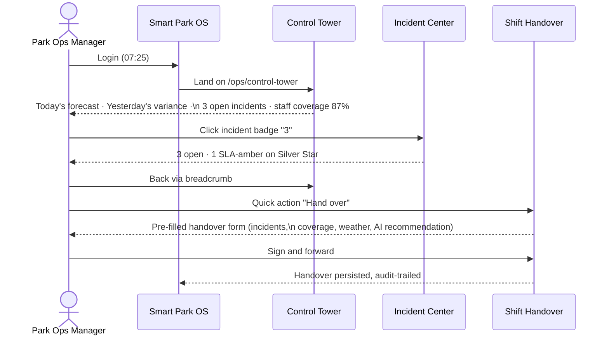
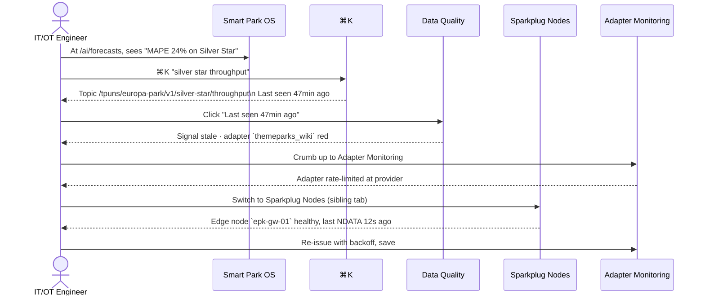
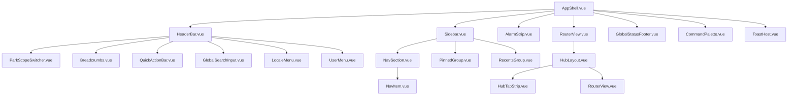
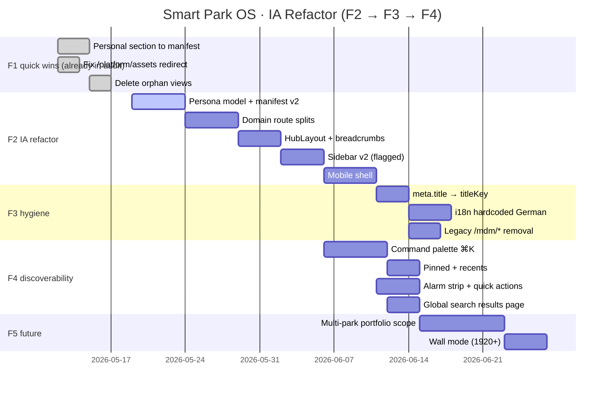
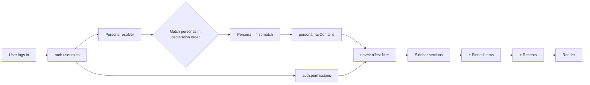

# Smart Park OS — Information Architecture & Navigation Redesign (F2)

> **Purpose.** This document is the F2-track design proposal that follows the
> [`frontend-ia-audit.md`](frontend-ia-audit.md) (F0) findings. It defines a
> process-oriented, operator-centric navigation for Smart Park OS and the
> concrete Vue 3 / Vue Router 4 / Pinia / Tailwind refactor required to ship it.
>
> **Audience.** Platform engineering, UX, product, and the operations
> stakeholders who run the day-to-day of partner parks.
>
> **Status.** Proposal — no code changes are landed by this document.
>
> **Stack assumptions.** Vue 3 (Composition API), Vue Router 4, Pinia,
> Tailwind, vue-i18n (en/de/fr/es), Socket.IO, MQTT/Sparkplug B,
> RBAC mirrored from `shared/rbac.json`.

---

## Table of contents

1. [Executive UX assessment](#1-executive-ux-assessment)
2. [Problems in the current navigation](#2-problems-in-the-current-navigation)
3. [Proposed information architecture](#3-proposed-information-architecture)
4. [New sidebar structure](#4-new-sidebar-structure)
5. [Role-based navigation matrix](#5-role-based-navigation-matrix)
6. [User journey examples](#6-user-journey-examples)
7. [Wireframe ideas (ASCII)](#7-wireframe-ideas-ascii)
8. [Vue Router refactoring proposal](#8-vue-router-refactoring-proposal)
9. [Suggested component structure](#9-suggested-component-structure)
10. [Migration strategy](#10-migration-strategy)
11. [Future scalability recommendations](#11-future-scalability-recommendations)

---

## 1. Executive UX assessment

Smart Park OS today is — by the *evidence in the codebase* — a credible
enterprise platform: ~80 routed views, four locales, RBAC enforced both
in the route guard and the nav filter, a real Unified Namespace, a real
adapter framework, a real AI surface with forecast accuracy tracking, a
real shift-handover and SQDC story.

The **product is ahead of its information architecture.** The sidebar is
organised the way the platform was *built* — by the engineering subsystem
that produced each page (`/uns/*`, `/iot-ot/*`, `/platform/*`, `/mdm/*`,
`/admin/*`) — not the way an operator *uses* the platform during a shift.

The headline symptoms (each backed by the F0 audit):

| Symptom | Evidence |
|---|---|
| Half the routed surface is invisible to the sidebar | F0 §3.2 — ~28 hub-only routes vs ~28 sidebar items |
| Nine top-level sections, five with ≤2 items | F0 §F0-8 |
| The sidebar links a redirect → wrong active highlight | F0 §F0-2 (`/platform/assets`) |
| Two parallel "ride MDM" stacks live in production | F0 §F0-3 (`/admin/master-data` vs `/mdm`) |
| Hub pages render hardcoded German | F0 §F0-5 (`PlatformHubView`, `ItOtSettingsHubView`) |
| No global search, no breadcrumbs, no command palette | F0 §F0-13 |
| Personal section is injected client-side, off-manifest | F0 §F0-15 |
| `rides.read` is the de-facto "operator" gate, not a domain gate | F0 §F0-7 |
| Path hierarchy ≠ menu hierarchy on `/ai-insights/*` | F0 §F0-10 |

The platform reads as **engineer-built and engineer-organised**. A Park
Operations Manager landing on the home screen at 07:30 should see the
shift, the forecast, and the open incidents — not "UNS Explorer", "MQTT
topics" and "Adapter marketplace" three rules above their daily work.

> **One-line recommendation.** Replace the current 9-section, subsystem-named
> sidebar with a **7-domain, process-named** sidebar; promote a **Control
> Tower** as the operator's home; demote MQTT/UNS/Sparkplug into a
> **Realtime data plane** that engineers visit, not operators; add a **`⌘K`
> command palette** to recover the missing 50% of routed surface; and make
> every hub a real parent route with sibling tabs and a breadcrumb.

This document specifies how.

---

## 2. Problems in the current navigation

The F0 audit catalogues 15 specific findings. For the F2 design we
**collapse them into seven IA-level problem clusters** that map 1:1 to
the redesign decisions in §3.

### P1. Engineering taxonomy on a business product

Sidebar group names today: *Executive · Operations · Engineering · AI ·
Platform · IT-OT Settings · Governance · Personal*. Five of those names
are **subsystem labels** (Engineering, IT-OT, Platform, Governance) —
they tell an operator *which team owns the page*, not *which job the
page does*. Compare to Datadog ("APM, Logs, RUM, Synthetics"), Ignition
("Designer, Vision, Perspective"), AWS IoT SiteWise ("Models, Assets,
Monitor, Edge") — every one of them names the *artifact* or the *job*,
not the team.

### P2. Hub-only sub-trees & redirect-linked nav

`/iot-ot`, `/uns`, `/platform`, `/ai-insights`, `/admin/master-data`,
`/incidents`, `/agent/*` are hub pages with 5–10 routed children, but
only **`/uns` renders sibling tabs** via a parent route + `<RouterView />`.
The other hubs are flat card grids; clicking a card replaces the route
and the operator has no breadcrumb home. The sidebar mitigates this with
`activePathPrefix` / `activeExcludePrefixes` strings — a tell that the
URL hierarchy and the IA hierarchy are not the same shape.

### P3. Duplicate / parallel stacks

Two MDM stacks (`/admin/master-data/*` vs `/mdm/*`), two SQDC entries
(`/analytics/sqdc` classic vs `/sqdc/*` hierarchical), two integration
labels ("Devices & Services" vs "Adapter marketplace" vs "Integrations"),
two ways into asset detail (`/platform/rides/:id` vs `/mdm/rides/:id`).
Operators don't know which is authoritative; engineers add features to
*both* to be safe.

### P4. RBAC permission shape ≠ persona shape

`shared/rbac.json` has nine roles but the sidebar effectively gates on
**three permission codes** (`dashboard.read`, `rides.read`,
`iotOt.settings.read`). `rides.read` is overloaded as the "operations
user" gate, so HR can't see hotel-guest planning, OEE landing pages
appear to anyone with ride access, and any future role split (Zone
Supervisor vs Ride Operator) requires re-shimming every route.

The user-facing personas the redesign targets are **not yet roles in
RBAC**: *Park Operations Manager, Zone Supervisor, Ride Operator,
Maintenance Technician, IT/OT Engineer, AI Analyst, Administrator*.

### P5. No global search, no breadcrumbs, no command palette

With ~75 view files and ~28 hub-only routes, the only orientation aids
are the sidebar (28 items) and the small `route.meta.titleKey` line in
the page header. There is no global search, no `⌘K`, no breadcrumb
component fed from `route.matched`, no recents, no favourites.

This is the **single biggest discoverability gap** — and also the
cheapest one to fix (item 13 of the F0 recommendations).

### P6. Naming drift & locale leaks

Same row, four labels: "Asset data" (menu) → "Platform MDM" (page H1)
→ "Ride MDM (older)" (warning) → `Asset-Daten` (German). 23 routes use
`meta.title` (English-only) so document titles are wrong outside
English. `PlatformHubView`, `ItOtSettingsHubView`, shift-handover
titles ship hardcoded German.

### P7. No realtime / SCADA UX primitives

For a platform whose value proposition is *"a real-time operations
control system"* (`PRODUCT.md`), the chrome lacks realtime UX
primitives a SCADA / control-room operator expects:

- No global **status footer** (broker connectivity, websocket health,
  number of active alarms, current shift, current park).
- No **alarm strip** at the top of every page.
- No **active-park / active-zone scope** beyond a header dropdown.
- No **quick-actions** row (raise incident, claim ride, hand-over shift).
- No **multi-park scope switch** (Operator Mode vs Portfolio Mode).
- No **PTZ-style "Live" indicator** on streaming widgets.

The IA must give these primitives a home before adding more pages.

---

## 3. Proposed information architecture

### 3.1 Design principles

1. **Process-first naming.** Group by *what an operator is trying to do*
   today. Subsystems get *destinations*, not *sections*.
2. **One destination per concept.** Every concept has exactly one
   sidebar URL; everything else is a deep link, a hub child, or a
   command-palette result. Redirects never appear in the sidebar.
3. **Hubs are real parent routes.** Every hub uses
   `/parent` → `<HubLayout />` → `<RouterView />` with a sibling tab
   strip and a breadcrumb. The `/uns` parent is the canonical example.
4. **RBAC is composed from personas, not from raw permissions.** The
   nav manifest declares `personas: ['ops_manager', 'zone_supervisor']`;
   personas resolve to permission sets via `shared/rbac.json`.
5. **Realtime first.** Global status footer, global alarm strip, global
   park/zone scope, global `⌘K`, global quick actions are present on
   every authenticated page.
6. **Mobile is a first-class shift tool.** Ride Operators and Zone
   Supervisors run Smart Park OS on a phone or tablet. The mobile shell
   is *not* the desktop sidebar reflowed; it's a 5-tab bottom bar
   driven by the same persona model.

### 3.2 Top-level taxonomy (7 domains)

```mermaid
graph TD
  A[Smart Park OS]
  A --> Ops[1. Operations]
  A --> RT[2. Realtime · UNS]
  A --> AI[3. AI & Intelligence]
  A --> PA[4. Parks & Assets]
  A --> INT[5. Integrations]
  A --> GOV[6. Governance]
  A --> PLAT[7. Platform]

  Ops --> Ops1[Park Control Tower]
  Ops --> Ops2[Zone Operations]
  Ops --> Ops3[Ride Operations]
  Ops --> Ops4[Live Map]
  Ops --> Ops5[Incident Center]
  Ops --> Ops6[Staffing]
  Ops --> Ops7[SQDC / SWDEC Boards]
  Ops --> Ops8[Shift Handover]

  RT --> RT1[UNS Explorer]
  RT --> RT2[MQTT Live Monitor]
  RT --> RT3[Signal Discovery]
  RT --> RT4[Topic Registry]
  RT --> RT5[Sparkplug Nodes]
  RT --> RT6[Data Quality]

  AI --> AI1[AI Insights]
  AI --> AI2[Forecasts]
  AI --> AI3[Recommendations]
  AI --> AI4[AI Studio]
  AI --> AI5[Feature Store]
  AI --> AI6[Digital Twin]

  PA --> PA1[Parks]
  PA --> PA2[Zones]
  PA --> PA3[Rides]
  PA --> PA4[Restaurants]
  PA --> PA5[Shows]
  PA --> PA6[Ride Master Data]
  PA --> PA7[Signal Configuration]

  INT --> INT1[Adapter Marketplace]
  INT --> INT2[Installed Adapters]
  INT --> INT3[Adapter Monitoring]
  INT --> INT4[API Connections]
  INT --> INT5[MQTT Brokers]

  GOV --> GOV1[Users & Roles]
  GOV --> GOV2[Audit Trail]
  GOV --> GOV3[AI Governance]
  GOV --> GOV4[Approval Workflows]
  GOV --> GOV5[Policies]

  PLAT --> PLAT1[API Explorer]
  PLAT --> PLAT2[Canonical Events]
  PLAT --> PLAT3[System Health]
  PLAT --> PLAT4[Logs]
  PLAT --> PLAT5[Feature Flags]
```



### 3.3 Domain rationale

| # | Domain | Owns the day of… | Anchor question it answers |
|---|---|---|---|
| 1 | **Operations** | Park Operations Manager, Zone Supervisor, Ride Operator, Security | *"How is the park running right now, and what needs my decision in the next 15 minutes?"* |
| 2 | **Realtime · UNS** | IT/OT Engineer, Adapter on-call | *"Is the data plane healthy? Is every signal arriving on the topic it should?"* |
| 3 | **AI & Intelligence** | AI Analyst, Park Manager (read-only) | *"What is the forecast for the next 4 hours and what does the model recommend I do?"* |
| 4 | **Parks & Assets** | Park Manager, Master Data Steward | *"What is the canonical truth about every park, zone, ride, restaurant, show?"* |
| 5 | **Integrations** | IT/OT Engineer, Adapter on-call | *"Which external feeds are connected, healthy, and authorised?"* |
| 6 | **Governance** | System Admin, Security Manager, Compliance | *"Who can do what, what did they do, and is the AI behaving inside policy?"* |
| 7 | **Platform** | System Admin, Platform Engineer | *"Is the system itself healthy? Where do I read the logs / feature flags / canonical event spec?"* |

### 3.4 Grouping rules

These are the **invariants** that every future page addition must
satisfy:

1. **One verb per domain.** Operations *runs*, Realtime *observes*,
   AI *predicts*, Parks & Assets *describes*, Integrations *connects*,
   Governance *controls*, Platform *operates the platform itself*.
2. **No subsystem proper nouns in the top level.** "MQTT", "Sparkplug",
   "UNS", "MDM", "OPC UA", "Sequelize" never appear as a top-level
   sidebar section. They live one level down, where the engineer is
   already in the right context.
3. **Every domain has a `/domain` route** that renders an *index*
   (a real overview page, not a card grid). The first-time user lands
   on the index; the returning user goes straight to a child via
   pinned/recent.
4. **Detail pages live under their list page.** `/operations/incidents/:id`
   not `/incidents/:id`. URL hierarchy = IA hierarchy.
5. **Settings live in two places only.** *Personal settings* under the
   user menu (theme, locale, notifications). *System settings* under
   `Governance` or `Platform`. There is no top-level "Settings" item.
6. **`Help` is a header icon, not a sidebar item.** Same for the user
   menu and the locale switcher.

### 3.5 Persona model

The nav manifest declares **personas**, not raw role codes. Personas
are composed of role codes inside `shared/rbac.json`. This decouples
the sidebar from the role catalogue and lets us add a role (e.g.
`MAINTENANCE_TECH`) without touching the manifest.

| Persona | Role-code mapping (proposed) | Primary domain | Default landing |
|---|---|---|---|
| **Park Operations Manager** | `OPERATIONS_MANAGER`, `PARK_MANAGER` | Operations | `/ops/control-tower` |
| **Zone Supervisor** | `OPERATOR` + `zones.read` ≥ assigned zone | Operations | `/ops/zones/:zoneId` |
| **Ride Operator** | `OPERATOR` (mobile shell) | Operations | `/ops/rides/:assignedRideId` |
| **Maintenance Technician** | `MAINTENANCE_TECH` *(new)* | Operations / Predictive | `/ops/maintenance` |
| **IT/OT Engineer** | `IT_OT_ENGINEER` *(new)* or `SYSTEM_ADMIN` | Realtime · UNS | `/realtime` |
| **AI Analyst** | `ANALYST` | AI & Intelligence | `/ai` |
| **Administrator** | `SYSTEM_ADMIN`, `ADMIN` | Governance / Platform | `/governance/users` |
| **Viewer** | `VIEWER` | Operations (read-only) | `/ops/control-tower` |

The two **new role codes** (`MAINTENANCE_TECH`, `IT_OT_ENGINEER`) are
called out in §10.4 of the migration plan.

---

## 4. New sidebar structure

### 4.1 Visible items — full-permissions user

```text
SMART PARK OS                                       Europa-Park ▾
─────────────────────────────────────────────────────────────────
OPERATIONS
  ⊙ Control Tower                          /ops/control-tower
  ◯ Live Map                               /ops/map
  ▦ Zone Operations                        /ops/zones
  ⚙ Ride Operations                        /ops/rides
  ! Incident Center                        /ops/incidents
  👥 Staffing & Shifts                      /ops/staffing
  ▣ SQDC / SWDEC                            /ops/sqdc
  ↻ Shift Handover                         /ops/handover

REALTIME · UNS                                       (engineer view)
  ⌘ UNS Explorer                            /realtime/uns
  ⏵ MQTT Live Monitor                       /realtime/mqtt
  ⌕ Signal Discovery                        /realtime/signals
  ≡ Topic Registry                         /realtime/topics
  ⚡ Sparkplug Nodes                         /realtime/sparkplug
  ✓ Data Quality                           /realtime/dq

AI & INTELLIGENCE
  ✦ AI Insights                            /ai
  ▴ Forecasts                              /ai/forecasts
  ☑ Recommendations                         /ai/recommendations
  ⚛ AI Studio                              /ai/studio
  ⛁ Feature Store                          /ai/features
  ⤬ Digital Twin                           /ai/twin

PARKS & ASSETS
  ⌂ Parks                                  /assets/parks
  ▭ Zones                                  /assets/zones
  ⛯ Rides                                  /assets/rides
  ⌥ Restaurants                            /assets/restaurants
  ★ Shows                                  /assets/shows
  ⊞ Ride Master Data                        /assets/ride-master
  ⌬ Signal Configuration                    /assets/signals

INTEGRATIONS                                         (engineer view)
  ⊞ Adapter Marketplace                     /integrations/marketplace
  ⊟ Installed Adapters                     /integrations/installed
  ⊡ Adapter Monitoring                      /integrations/monitoring
  ⌬ API Connections                         /integrations/apis
  ⊠ MQTT Brokers                            /integrations/brokers

GOVERNANCE                                           (admin view)
  ⚷ Users & Roles                           /governance/users
  ⌖ Audit Trail                             /governance/audit
  ⚖ AI Governance                           /governance/ai
  ✓ Approval Workflows                      /governance/approvals
  ⊘ Policies                                /governance/policies

PLATFORM                                             (admin view)
  ⌘ API Explorer                            /platform/api
  ⊜ Canonical Events                        /platform/events
  ♥ System Health                           /platform/health
  ❍ Logs                                   /platform/logs
  ⚑ Feature Flags                          /platform/flags
─────────────────────────────────────────────────────────────────
[ pinned views ]                          ⌘K  Search · Help · ⏻
```

(Icons are placeholders here; the real icon mapping uses
`lucide-vue-next` — see §9.4.)

### 4.2 Reduction summary

| Metric | Before | After |
|---|---|---|
| Top-level sidebar sections | 9 (incl. injected `Personal`) | **7** |
| Visible top-level items (full perms) | 28 | **40** *(but each is a *destination*, not a hub-card link)* |
| Sections with ≤2 items | 5 | **0** |
| Hub-only routes (no sidebar entry) | ~28 | **~5** *(detail pages only)* |
| Sidebar-linked redirects | 1 (`/platform/assets`) | **0** |
| `/admin/*` URL prefixes in sidebar | 2 | **0** |
| Hardcoded German strings in nav-reachable pages | 3 hubs + 2 `meta.title` | **0** *(F3 hygiene track)* |

The visible-item count goes *up* on purpose: the redesign **promotes
hub-only pages to first-class destinations** so 50% of the routed
surface stops being undiscoverable. The cognitive load goes *down*
because each section is now process-named, sized 5–8 items, and
permission-filtered tightly per persona — most users will see ~12–18
items in their actual sidebar (see §5).

### 4.3 Mobile behaviour

Mobile splits into three shells, persona-aware:

```text
┌─────────────────┐  ┌─────────────────┐  ┌─────────────────┐
│ MOBILE — Ride   │  │ MOBILE — Zone   │  │ MOBILE — Ops    │
│ Operator        │  │ Supervisor      │  │ Manager         │
│                 │  │                 │  │                 │
│ • Ride          │  │ • Zone          │  │ • Tower         │
│ • Queue         │  │ • Rides         │  │ • Map           │
│ • Handover      │  │ • Incidents     │  │ • Incidents     │
│ • Incidents     │  │ • Staff         │  │ • Forecasts     │
│ • Profile       │  │ • Profile       │  │ • Profile       │
│                 │  │                 │  │                 │
│ [bottom nav]    │  │ [bottom nav]    │  │ [bottom nav]    │
└─────────────────┘  └─────────────────┘  └─────────────────┘
```

- **5-tab bottom bar.** Per-persona, fixed, thumb-reachable.
- **Top bar.** Park scope · alarm count · `⌘K` · profile.
- **Drawer.** Full sidebar still available for power users; opens
  only when explicitly tapped (no swipe-from-edge, to avoid
  conflict with phone gestures during incident response).
- **Reduced surface.** No Realtime / Integrations / Governance /
  Platform domains on mobile by default — they expand only for
  IT/OT and Admin personas.
- **No hover.** All chip and gauge tooltips become tap-to-pin; long
  numbers render as compact (`2.4k` not `2,431`).

### 4.4 Responsive behaviour

| Breakpoint | Tailwind | Behaviour |
|---|---|---|
| `< 768px` | `<md` | Mobile bottom-tab shell, drawer-only sidebar |
| `768–1023px` | `md` | Compact sidebar (icons + label on hover/focus), hubs render as bottom-tab strip on the page |
| `1024–1439px` | `lg` | **Default** — fixed 240px sidebar, hub tabs as a top tab strip |
| `1440–1919px` | `xl` | Sidebar with section dividers and persona-suggested groups expanded |
| `≥ 1920px` | `2xl` | Wall mode — Control Tower can render two columns; multi-park roll-up enabled |

### 4.5 Breadcrumb strategy

Every page renders a 3-level breadcrumb fed from `route.matched` +
`meta.titleKey` + `params`:

```
Operations  ›  Ride Operations  ›  Silver Star
[domain]       [hub list]           [params.assetId resolved via store]
```

Rules:

- Level 1 = top-level domain (always one of the 7).
- Level 2 = hub list (the `/domain/list` route).
- Level 3 = current entity (resolved from `params` via a
  `useEntityLabel(params)` composable that hits Pinia caches first,
  falls back to a 1-call API resolver).
- Truncate left: `Operations › … › Silver Star` past 3 levels.
- Click level 1 = go to `/domain` index; click level 2 = go to list;
  level 3 is the active page.

### 4.6 Icon strategy

- **Single icon library.** `lucide-vue-next` is already in use — keep
  it as the only SVG source. Forbid `<svg>` literals in nav code.
- **Icon = identity, not decoration.** Each top-level domain has a
  distinct icon; each child icon must be visually distinct from its
  siblings. Reject any icon that requires the label to disambiguate.
- **Active state has a coloured "rail."** A 2px coloured bar on the
  left of the active item, brand-coloured per domain (Operations =
  amber, Realtime = cyan, AI = violet, Assets = emerald, Integrations =
  blue, Governance = slate, Platform = zinc). This gives operators a
  pre-attentive cue *which mode they're in* without reading.
- **Status-bearing icons.** Domains with active state show a small
  numeric badge: Operations (open incidents), Realtime (down brokers),
  Integrations (red adapters), Governance (pending approvals).

### 4.7 Pinned / favourites system

Every authenticated user gets:

- **Recent (last 5).** Auto-populated from `route.afterEach`, capped
  at 5, stored in `useUserNavStore`.
- **Pinned (up to 8).** Right-click any sidebar item or breadcrumb
  → "Pin to sidebar". Pinned items render in a "★ Pinned" group
  above the section list. Synced to backend via
  `PATCH /api/v1/me/settings { pinnedNav: [...] }`.
- **Favourite filter combos.** A pinned item can carry query params
  (`/ops/rides?status=down&zone=horror`), so an operator can pin
  *"Down rides in Horror zone"* once.

### 4.8 Quick-action system

Quick actions live in a **command bar** that floats on the top-right
of every operations page:

```
[ + Incident ]  [ ⤴ Hand over ]  [ ⏸ Pause ride ]  [ 📣 Broadcast ]  [ ⌘K ]
```

- Bound to **persona + current scope**. A Zone Supervisor on
  `/ops/zones/horror` sees actions scoped to their zone; a Ride
  Operator on `/ops/rides/silver-star` sees ride-scoped actions.
- All quick actions are also addressable through `⌘K` so keyboard-
  first users have parity.

### 4.9 Global command palette (`⌘K` / `Ctrl+K`)

Opens a center-screen modal with three result groups:

```
┌────────────────────────────────────────────────────────────┐
│  ⌕  silver star                                            │
├────────────────────────────────────────────────────────────┤
│  ASSETS                                                    │
│   • Silver Star · Ride · Zone Horror                  →    │
│  PAGES                                                     │
│   • Ride Operations · Silver Star detail              →    │
│   • Predictive Maintenance · Silver Star              →    │
│  ACTIONS                                                   │
│   • Pause Silver Star (requires confirm)              →    │
│   • Raise incident on Silver Star                     →    │
└────────────────────────────────────────────────────────────┘
```

- **Source 1 — nav manifest.** Every routed page (including the ~28
  hub-only pages) is in the index, permission-filtered.
- **Source 2 — entity index.** Parks · Zones · Rides · Restaurants ·
  Shows · Adapters · Edge nodes · UNS topics. Indexed client-side
  on first authenticated bootstrap; refreshed on park scope change.
- **Source 3 — quick actions.** Persona-scoped action verbs.
- **Keyboard-only.** `↑/↓` to move, `↵` to open, `⌘+↵` to open in a
  new tab, `Esc` to dismiss.
- **Recents.** Empty input = last 5 visited entities + last 5 actions.

This is the **single highest-leverage** UX change in the redesign:
it solves the "50% of routes are hub-only" problem without
restructuring the sidebar at all (F0 §F0-13).

### 4.10 Search-driven navigation

Search is the **same component** as `⌘K`, but rendered:

- in the header of every page (compact, 320px input),
- in the empty state of every list page ("Search rides…"),
- in the mobile drawer (full-screen overlay).

A search query in the header is *also* a URL: `/search?q=silver`. This
gives operators a shareable link to a specific search result that they
can paste in their radio-channel chat.

---

## 5. Role-based navigation matrix

Each cell answers: *Does this persona see this top-level domain in their
sidebar by default?* `●` = yes, primary; `○` = yes, secondary; `·` = no
(reachable only via `⌘K` or deep link, with a perms-check).

| Domain → | Park Ops Mgr | Zone Supervisor | Ride Operator | Maintenance | IT/OT Engineer | AI Analyst | Administrator |
|---|---|---|---|---|---|---|---|
| Operations | ● | ● | ● *(mobile)* | ● | ○ | ○ | ○ |
| Realtime · UNS | · | · | · | ○ *(read-only)* | ● | ○ *(read-only)* | ○ |
| AI & Intelligence | ● *(read)* | ○ *(read)* | · | · | · | ● | ○ |
| Parks & Assets | ○ *(read)* | ○ *(read)* | · | ○ *(rides only)* | · | ○ *(read)* | ● |
| Integrations | · | · | · | · | ● | · | ● |
| Governance | · | · | · | · | · | · | ● |
| Platform | · | · | · | · | ○ | · | ● |

### 5.1 Persona drilldown — Park Operations Manager

Default sidebar (12 items):

```
OPERATIONS
  ● Control Tower          ← landing
  ● Live Map
  ● Zone Operations
  ● Ride Operations
  ● Incident Center
  ● Staffing & Shifts
  ● SQDC / SWDEC
  ● Shift Handover

AI & INTELLIGENCE  (read)
  ● AI Insights
  ● Forecasts
  ● Recommendations

PARKS & ASSETS  (read)
  ● Parks
```

Quick actions: `+ Incident` · `⤴ Hand over` · `📣 Broadcast` · `⌘K`.

### 5.2 Persona drilldown — Zone Supervisor

Default sidebar (8 items, scoped to assigned zone):

```
OPERATIONS
  ● Zone (current)         ← landing, /ops/zones/:zoneId
  ● Rides in zone
  ● Incidents in zone
  ● Staffing in zone
  ● SQDC zone board
  ● Live Map (zoned)

AI & INTELLIGENCE  (read, zoned)
  ● Forecasts (zoned)
  ● Recommendations (zoned)
```

The "(zoned)" qualifier is enforced by a `zoneScopedRoute` route guard
that injects `?zoneId=…` automatically.

### 5.3 Persona drilldown — Ride Operator (mobile)

Mobile-only persona, 5-tab bottom bar:

```
[ My Ride ] [ Queue ] [ Handover ] [ Incidents ] [ Profile ]
```

Each tab is a single full-screen page; no nested navigation.
"My Ride" = `/ops/rides/:assignedRideId` (assignment from the staff
allocation board).

### 5.4 Persona drilldown — Maintenance Technician

Default sidebar (7 items):

```
OPERATIONS
  ● Predictive Maintenance     ← landing
  ● Incident Center (filtered to maintenance work-orders)
  ● Asset Health
  ● Shift Handover

REALTIME · UNS (read-only)
  ● UNS Explorer (filtered to assigned assets)
  ● Sparkplug Nodes

PARKS & ASSETS (rides only, read)
  ● Rides
```

### 5.5 Persona drilldown — IT/OT Engineer

Default sidebar (12 items):

```
REALTIME · UNS                ← landing /realtime
  ● UNS Explorer
  ● MQTT Live Monitor
  ● Signal Discovery
  ● Topic Registry
  ● Sparkplug Nodes
  ● Data Quality

INTEGRATIONS
  ● Adapter Marketplace
  ● Installed Adapters
  ● Adapter Monitoring
  ● API Connections
  ● MQTT Brokers

PLATFORM (read)
  ● System Health
```

### 5.6 Persona drilldown — AI Analyst

Default sidebar (10 items):

```
AI & INTELLIGENCE              ← landing /ai
  ● AI Insights
  ● Forecasts
  ● Recommendations
  ● AI Studio
  ● Feature Store
  ● Digital Twin

OPERATIONS (read)
  ● SQDC / SWDEC
  ● Control Tower

GOVERNANCE (read, AI scope)
  ● AI Governance
  ● Audit Trail (filtered to AI events)
```

### 5.7 Persona drilldown — Administrator

Sees all 7 domains, ~40 items, but the sidebar opens **collapsed by
default** below the operator domain. The Administrator persona is the
*only* persona that gets the "Admin Mode" toggle in the header that
expands every section.

### 5.8 RBAC manifest example (proposed `shared/rbac.json` excerpt)

```json
{
  "personas": {
    "OPS_MANAGER": {
      "labelKey": "persona.opsManager",
      "roles": ["OPERATIONS_MANAGER", "PARK_MANAGER"],
      "defaultRoute": "/ops/control-tower",
      "navDomains": ["operations", "ai", "assets"]
    },
    "ZONE_SUPERVISOR": {
      "labelKey": "persona.zoneSupervisor",
      "roles": ["OPERATOR"],
      "scopeRequired": "zoneId",
      "defaultRoute": "/ops/zones/:zoneId",
      "navDomains": ["operations", "ai"]
    },
    "RIDE_OPERATOR": {
      "labelKey": "persona.rideOperator",
      "roles": ["OPERATOR"],
      "shell": "mobile",
      "defaultRoute": "/ops/rides/:assignedRideId",
      "navDomains": ["operations"]
    },
    "MAINTENANCE_TECH": {
      "labelKey": "persona.maintenanceTech",
      "roles": ["MAINTENANCE_TECH"],
      "defaultRoute": "/ops/maintenance",
      "navDomains": ["operations", "realtime", "assets"]
    },
    "IT_OT_ENGINEER": {
      "labelKey": "persona.itOtEngineer",
      "roles": ["IT_OT_ENGINEER", "SYSTEM_ADMIN"],
      "defaultRoute": "/realtime",
      "navDomains": ["realtime", "integrations", "platform"]
    },
    "AI_ANALYST": {
      "labelKey": "persona.aiAnalyst",
      "roles": ["ANALYST"],
      "defaultRoute": "/ai",
      "navDomains": ["ai", "operations", "governance"]
    },
    "ADMINISTRATOR": {
      "labelKey": "persona.administrator",
      "roles": ["SYSTEM_ADMIN", "ADMIN"],
      "defaultRoute": "/governance/users",
      "navDomains": ["operations", "realtime", "ai", "assets", "integrations", "governance", "platform"]
    }
  },
  "navigation": {
    "domains": [
      {
        "id": "operations",
        "labelKey": "domain.operations",
        "icon": "operations",
        "indexRoute": "/ops",
        "items": [
          {
            "id": "control-tower",
            "labelKey": "ops.controlTower",
            "to": "/ops/control-tower",
            "icon": "tower",
            "permissionsAny": [
              { "resource": "dashboard", "action": "read" }
            ]
          },
          {
            "id": "incidents",
            "labelKey": "ops.incidents",
            "to": "/ops/incidents",
            "icon": "alert",
            "badge": "openIncidents",
            "permissionsAny": [
              { "resource": "incidents", "action": "read" }
            ]
          }
        ]
      }
    ]
  }
}
```

A `verify:rbac` extension in CI must check:

1. Every `personas[*].roles[*]` exists in `roles[]`.
2. Every `navigation.domains[*].items[*].permissionsAny[*]` exists in
   `permissions[]`.
3. Every persona has a `defaultRoute` that matches a real
   `router.hasRoute(...)`.
4. Every persona's `navDomains[*]` exists in `navigation.domains[].id`.

---

## 6. User journey examples

### 6.1 Park Operations Manager — morning shift open



### 6.2 Zone Supervisor — escalating a queue spike

```mermaid
sequenceDiagram
  actor ZS as Zone Supervisor (Horror zone)
  participant App as Smart Park OS
  participant Map as Live Map
  participant AI as Recommendations
  participant Inc as Incident Center

  ZS->>App: Mobile · Zone tab
  Map-->>ZS: Heatmap · Horror at 92%
  ZS->>AI: Tap "Why?"
  AI-->>ZS: Spike correlated with Silver Star down 11min;\n   recommendation: route 30% via Castle Path
  ZS->>Inc: Quick action "+ Incident"
  Inc-->>ZS: Pre-filled (zone=Horror, source=AI rec,\n   priority=P2)
  ZS->>Inc: Assign to Maintenance · save
  Inc-->>App: Incident open, push to Maintenance pager
```

### 6.3 IT/OT Engineer — a missing signal



### 6.4 AI Analyst — investigating model drift

```mermaid
sequenceDiagram
  actor AN as AI Analyst
  participant App as Smart Park OS
  participant Studio as AI Studio
  participant Feat as Feature Store
  participant Twin as Digital Twin

  AN->>App: Land /ai (Insights overview)
  App->>Studio: Click "Models drift > 5%" alert
  Studio-->>AN: 2 models drift; Silver-Star-1h at 8%
  AN->>Feat: "Inspect features" deep link
  Feat-->>AN: weather.openMeteo.temp_c lagging 2h
  AN->>Twin: Sibling tab "What-if"
  Twin-->>AN: Replay yesterday with corrected feature →\n   forecast MAPE drops 4.1pp
  AN->>Studio: Back · open governance request "retrain"
  Studio-->>App: Approval routed to Park Ops Manager
```

### 6.5 Maintenance Technician — predictive alert to work-order

A 3-tap journey on tablet, no command palette needed:

1. Tap notification "Asset *Silver Star — bearing #2* PdM score 0.81".
2. Lands on `/ops/maintenance/silver-star/bearing-2` with sparkline,
   threshold history, recommended action.
3. Tap **Create work-order** quick action → pre-filled, save.

### 6.6 Administrator — onboarding a new role

1. `/governance/users` → "Roles" tab.
2. Duplicate `OPERATOR` → rename to `RIDE_LEAD`.
3. Add permissions `incidents.assign`, `staff.update`.
4. Save → CI's `verify:rbac` runs server-side, audit-trailed.
5. Assign to a user; persona auto-resolves; sidebar updates on next
   login.

---

## 7. Wireframe ideas (ASCII)

### 7.1 Desktop shell — Operations · Control Tower

```text
╔══════════════════════════════════════════════════════════════════════════════╗
║ SMART PARK OS  ▾Europa-Park   ⚠ 3 open  ⚡ MQTT live  ⌕[silver star…]  ⌘K   👤▾║
╠═══════════════════════════════════════════════════════════════════════════════╣
║                                                                              ║
║ OPERATIONS  ›  Control Tower                              09:47 · Sun · 24°  ║
║                                                                              ║
║ ┌──────────────┐ ┌──────────────┐ ┌──────────────┐ ┌──────────────┐         ║
║ │  IN PARK     │ │  AVG WAIT    │ │  OPEN INC    │ │  STAFF COV   │         ║
║ │  18,420      │ │  31 min      │ │  3 (1 SLA-A) │ │  87%         │         ║
║ │  ↑ +4% vs F  │ │  ↑ +6 vs F   │ │  P1:0 P2:1   │ │  ↓ -3% vs F  │         ║
║ └──────────────┘ └──────────────┘ └──────────────┘ └──────────────┘         ║
║                                                                              ║
║ ┌────────────────────────────────────────────┐ ┌─────────────────────────┐  ║
║ │  PARK MAP — heatmap by zone                │ │ NEXT 4H FORECAST        │  ║
║ │                                            │ │ ┌─────────────────────┐ │  ║
║ │   [Adventure]  [Horror]  [Wonder]          │ │ │  ▁▃▅▇▆▅▃▂▃▅▇████▇▅ │ │  ║
║ │     low         HIGH      med               │ │ └─────────────────────┘ │  ║
║ │                                            │ │ Confidence band ±8%      │  ║
║ │   [Castle]    [Lake]    [Family]            │ │ MAPE-24h: 11%            │  ║
║ │     med        low       low                │ │                          │  ║
║ │                                            │ │ AI says: route 30% from  │  ║
║ │  • Spike risk: Horror @ 14:30 (84%)         │ │ Horror → Castle by 14h   │  ║
║ └────────────────────────────────────────────┘ └─────────────────────────┘  ║
║                                                                              ║
║ ┌──────────────────────────┐ ┌──────────────────────────────────────────┐   ║
║ │  TOP RIDES (live)        │ │  OPEN INCIDENTS                          │   ║
║ │  Silver Star  ↑ 42 min   │ │  P2 · Silver Star · bearing alert · 11m  │   ║
║ │  Voltron      ↑ 38 min   │ │  P3 · Castle entrance · litter · 32m     │   ║
║ │  Wodan        — 27 min   │ │  P3 · Family zone · stroller jam · 47m   │   ║
║ │  Blue Fire    ↓ 19 min   │ │                                          │   ║
║ └──────────────────────────┘ └──────────────────────────────────────────┘   ║
║                                                                              ║
╠══════════════════════════════════════════════════════════════════════════════╣
║ MQTT ●  Socket ●  Brokers 2/2  Adapters 7/8  Last canonical event 1.4s ago   ║
╚══════════════════════════════════════════════════════════════════════════════╝
```

### 7.2 Hub layout — Realtime · UNS

```text
╔══════════════════════════════════════════════════════════════════════════════╗
║ Realtime · UNS  ›  UNS Explorer                                              ║
║                                                                              ║
║  [ Explorer ] [ MQTT Live ] [ Signals ] [ Topics ] [ Sparkplug ] [ Data Q ]  ║
║  ─────────────                                                               ║
║                                                                              ║
║  tpuns/                                                                      ║
║   └ europa-park/                                                             ║
║      └ v1/                                                                   ║
║         ├ silver-star/                                                       ║
║         │   ├ wait_time         live  ●  3.2s ago        forecast: 32       ║
║         │   ├ status            live  ●  0.4s ago        OPEN               ║
║         │   ├ throughput        STALE ⚠  47min ago       last 1430/h        ║
║         │   └ ndata             live  ●  12s ago         from epk-gw-01     ║
║         ├ wodan/   …                                                         ║
║         └ blue-fire/   …                                                     ║
║                                                                              ║
║  Selected: silver-star/throughput                                            ║
║  ┌──────────────────────────────────────────────────────────────────────┐   ║
║  │ schema canonical.events.v1.RideThroughput                            │   ║
║  │ adapter themeparks_wiki  status RED 47min                            │   ║
║  │ subscribers AI/forecast (1) · OEE/cockpit (1) · Live ops (3)         │   ║
║  │ [ Inspect adapter ]  [ Replay last 1h ]  [ Open in DQ ]              │   ║
║  └──────────────────────────────────────────────────────────────────────┘   ║
╚══════════════════════════════════════════════════════════════════════════════╝
```

### 7.3 Mobile — Ride Operator "My Ride"

```text
┌──────────────────────────┐
│ ◀ Silver Star · OPEN     │
│                    ⚙ 1 ⚠ │
│──────────────────────────│
│ THROUGHPUT (live)        │
│  1432 / hr   ▁▃▅▇▆▅▃▂▃▅  │
│                          │
│ QUEUE                    │
│  42 min · 384 in queue   │
│                          │
│ NEXT INSPECTION           │
│  in 47 min · technician  │
│  Maria K.                │
│                          │
│ RECOMMENDATIONS          │
│ • Slow re-dispatch from  │
│   13:50 (storm in 90m)    │
│                          │
│ ┌──────────────────────┐ │
│ │  + INCIDENT          │ │
│ ├──────────────────────┤ │
│ │  ⏸ PAUSE RIDE        │ │
│ ├──────────────────────┤ │
│ │  ⤴ HAND OVER         │ │
│ └──────────────────────┘ │
│                          │
│ [Ride][Q][HO][Inc][👤]    │
└──────────────────────────┘
```

### 7.4 Command palette `⌘K`

```text
                ┌──────────────────────────────────────┐
                │  ⌕  silver star                      │
                ├──────────────────────────────────────┤
                │  ASSETS                              │
                │   ▸ Silver Star · Ride · Horror     │
                │   ▸ Silver Star Plaza · Restaurant  │
                │  PAGES                               │
                │   ▸ Ride Operations · Silver Star   │
                │   ▸ PdM · Silver Star (3 alerts)    │
                │   ▸ Forecast · Silver Star · 4h     │
                │  ACTIONS                             │
                │   ▸ Pause Silver Star (confirm)     │
                │   ▸ Raise incident on Silver Star   │
                │   ▸ Hand over Silver Star op        │
                │  SIGNALS                             │
                │   ▸ silver-star/wait_time · live    │
                │   ▸ silver-star/throughput · STALE  │
                ├──────────────────────────────────────┤
                │  ↑↓ navigate   ↵ open   ⌘↵ new tab   │
                └──────────────────────────────────────┘
```

---

## 8. Vue Router refactoring proposal

### 8.1 New folder layout

```
admin-dashboard/src/
├ router/
│  ├ index.ts                  ← thin aggregator (≤80 lines)
│  ├ guards/
│  │  ├ auth.guard.ts
│  │  ├ persona.guard.ts        ← NEW: enforces persona.navDomains
│  │  ├ scope.guard.ts          ← NEW: zone-scoped routes inject params
│  │  └ rbac.guard.ts
│  └ domains/
│     ├ ops.routes.ts           ← /ops/*  (Operations)
│     ├ realtime.routes.ts      ← /realtime/*  (UNS, MQTT, Sparkplug)
│     ├ ai.routes.ts            ← /ai/*
│     ├ assets.routes.ts        ← /assets/*
│     ├ integrations.routes.ts  ← /integrations/*
│     ├ governance.routes.ts    ← /governance/*
│     └ platform.routes.ts      ← /platform/*
├ layouts/
│  ├ AppShell.vue               ← desktop (sidebar + header + footer)
│  ├ MobileShell.vue            ← bottom-tab + drawer
│  ├ HubLayout.vue              ← parent route for any /domain/* hub
│  └ AuthLayout.vue             ← /login, /unauthorized
├ nav/
│  ├ navManifest.ts             ← reads shared/rbac.json
│  ├ navIconMap.ts              ← (existing)
│  ├ resolvePersonaSidebar.ts   ← NEW
│  └ commandPalette.ts          ← NEW: ⌘K registry
├ components/
│  ├ shell/
│  │  ├ Sidebar.vue
│  │  ├ HeaderBar.vue
│  │  ├ ParkScopeSwitcher.vue
│  │  ├ AlarmStrip.vue           ← NEW
│  │  ├ Breadcrumbs.vue          ← NEW
│  │  ├ QuickActionBar.vue       ← NEW
│  │  ├ CommandPalette.vue       ← NEW
│  │  └ GlobalStatusFooter.vue   ← (existing)
│  └ …
└ stores/
   ├ auth.ts
   ├ parkContext.ts
   ├ persona.ts                  ← NEW
   ├ userNav.ts                  ← NEW (pinned, recents)
   └ alarms.ts                   ← NEW (alarm strip feed)
```

### 8.2 Domain route file pattern

Each `domains/*.routes.ts` exports a single `RouteRecordRaw` whose
children are the hub's siblings, all rendered via `<HubLayout />`:

```ts
// router/domains/realtime.routes.ts
import type { RouteRecordRaw } from 'vue-router'
import { ROLE_CODES } from '@/constants/rbac'

export const realtimeRoutes: RouteRecordRaw = {
  path: '/realtime',
  component: () => import('@/layouts/HubLayout.vue'),
  redirect: { name: 'realtime-uns' },
  meta: {
    domain: 'realtime',
    titleKey: 'domain.realtime',
    permission: { resource: 'iotOt', action: 'settings.read' },
  },
  children: [
    {
      path: 'uns',
      name: 'realtime-uns',
      component: () => import('@/views/realtime/UnsExplorerView.vue'),
      meta: { titleKey: 'realtime.uns', icon: 'unsExplorer' },
    },
    {
      path: 'mqtt',
      name: 'realtime-mqtt',
      component: () => import('@/views/realtime/MqttLiveMonitorView.vue'),
      meta: { titleKey: 'realtime.mqtt', icon: 'mqttTopics' },
    },
    {
      path: 'signals',
      name: 'realtime-signals',
      component: () => import('@/views/realtime/SignalDiscoveryView.vue'),
      meta: { titleKey: 'realtime.signals', icon: 'unsExplorer' },
    },
    {
      path: 'topics',
      name: 'realtime-topics',
      component: () => import('@/views/realtime/TopicRegistryView.vue'),
      meta: { titleKey: 'realtime.topics', icon: 'registry' },
    },
    {
      path: 'sparkplug',
      name: 'realtime-sparkplug',
      component: () => import('@/views/realtime/SparkplugNodesView.vue'),
      meta: { titleKey: 'realtime.sparkplug', icon: 'sparkplugLive' },
    },
    {
      path: 'dq',
      name: 'realtime-dq',
      component: () => import('@/views/realtime/DataQualityView.vue'),
      meta: { titleKey: 'realtime.dq', icon: 'dataQuality' },
    },
  ],
}
```

### 8.3 Aggregator (`router/index.ts`)

```ts
import { createRouter, createWebHistory } from 'vue-router'
import { authGuard } from '@/router/guards/auth.guard'
import { personaGuard } from '@/router/guards/persona.guard'
import { scopeGuard } from '@/router/guards/scope.guard'
import { rbacGuard } from '@/router/guards/rbac.guard'

import { opsRoutes } from '@/router/domains/ops.routes'
import { realtimeRoutes } from '@/router/domains/realtime.routes'
import { aiRoutes } from '@/router/domains/ai.routes'
import { assetsRoutes } from '@/router/domains/assets.routes'
import { integrationsRoutes } from '@/router/domains/integrations.routes'
import { governanceRoutes } from '@/router/domains/governance.routes'
import { platformRoutes } from '@/router/domains/platform.routes'

const router = createRouter({
  history: createWebHistory(import.meta.env.BASE_URL),
  routes: [
    {
      path: '/login',
      component: () => import('@/layouts/AuthLayout.vue'),
      children: [
        { path: '', name: 'login', component: () => import('@/views/LoginView.vue'), meta: { public: true } },
      ],
    },
    {
      path: '/unauthorized',
      name: 'unauthorized',
      component: () => import('@/views/UnauthorizedView.vue'),
    },
    {
      path: '/',
      component: () => import('@/layouts/AppShell.vue'),
      redirect: { name: 'persona-home' },
      children: [
        { path: 'home', name: 'persona-home', component: () => import('@/views/PersonaHomeRedirect.vue') },
        opsRoutes,
        realtimeRoutes,
        aiRoutes,
        assetsRoutes,
        integrationsRoutes,
        governanceRoutes,
        platformRoutes,
      ],
    },
    { path: '/:pathMatch(.*)*', redirect: '/' },
  ],
})

router.beforeEach(authGuard)
router.beforeEach(personaGuard)
router.beforeEach(scopeGuard)
router.beforeEach(rbacGuard)

export default router
```

### 8.4 Guard pattern

```ts
// router/guards/persona.guard.ts
import type { NavigationGuard } from 'vue-router'
import { useAuthStore } from '@/stores/auth'
import { usePersonaStore } from '@/stores/persona'

export const personaGuard: NavigationGuard = async (to) => {
  const auth = useAuthStore()
  const persona = usePersonaStore()
  if (!auth.isAuthenticated) return true            // auth.guard handles
  if (!persona.resolved) await persona.resolve()    // pick by user.roles

  // Only allow domains the persona is permitted to see
  const domain = to.matched.find((r) => r.meta.domain)?.meta.domain as string | undefined
  if (domain && !persona.navDomains.includes(domain)) {
    return { name: 'unauthorized' }
  }
  return true
}
```

### 8.5 `meta` shape (single source of truth)

```ts
declare module 'vue-router' {
  interface RouteMeta {
    public?: boolean
    titleKey?: string
    icon?: string

    /** Top-level domain this route belongs to. */
    domain?: 'operations' | 'realtime' | 'ai' | 'assets'
              | 'integrations' | 'governance' | 'platform'

    /** Single permission (AND with permissionsAny is invalid; pick one). */
    permission?: { resource: string; action: string }

    /** Any-of permissions (OR). */
    permissionsAny?: { resource: string; action: string }[]

    /** Persona allow-list. Empty / undefined = inherit from domain. */
    personas?: string[]

    /** Scope requirement (zone, ride). */
    scopeRequired?: 'zoneId' | 'rideId' | 'parkId'

    /** Hide from sidebar even when permitted (e.g. detail pages). */
    hideFromSidebar?: boolean
  }
}
```

A lint rule (`scripts/verify-router-meta.js`) rejects:

- Routes that have `permission` AND `permissionsAny`.
- Routes that use `meta.title` (must be `titleKey`).
- Sidebar items pointing at `redirect`-only records.
- Routes with `domain` set but no parent under `/domain/`.

---

## 9. Suggested component structure

### 9.1 Shell composition



### 9.2 `Sidebar.vue` skeleton

```vue
<script setup lang="ts">
import { computed } from 'vue'
import { useAuthStore } from '@/stores/auth'
import { usePersonaStore } from '@/stores/persona'
import { useUserNavStore } from '@/stores/userNav'
import { resolvePersonaSidebar } from '@/nav/resolvePersonaSidebar'
import NavSection from '@/components/shell/NavSection.vue'
import PinnedGroup from '@/components/shell/PinnedGroup.vue'
import RecentsGroup from '@/components/shell/RecentsGroup.vue'

const auth = useAuthStore()
const persona = usePersonaStore()
const userNav = useUserNavStore()

const sections = computed(() =>
  resolvePersonaSidebar({
    persona: persona.current,
    permissions: auth.permissions,
    domains: persona.navDomains,
  })
)
</script>

<template>
  <aside class="hidden w-60 shrink-0 border-r border-slate-800 bg-slate-950/95 lg:flex lg:flex-col">
    <PinnedGroup v-if="userNav.pinned.length" :items="userNav.pinned" />
    <RecentsGroup v-if="userNav.recents.length" :items="userNav.recents" />

    <nav class="flex-1 overflow-y-auto py-4" aria-label="Main navigation">
      <NavSection
        v-for="section in sections"
        :key="section.id"
        :section="section"
      />
    </nav>
  </aside>
</template>
```

### 9.3 `HubLayout.vue` skeleton

```vue
<script setup lang="ts">
import { computed } from 'vue'
import { useRoute } from 'vue-router'
import HubTabStrip from '@/components/shell/HubTabStrip.vue'
import Breadcrumbs from '@/components/shell/Breadcrumbs.vue'

const route = useRoute()
const parent = computed(() => route.matched.find((r) => r.meta.domain))
const siblings = computed(() => parent.value?.children ?? [])
</script>

<template>
  <div class="flex h-full flex-col">
    <header class="border-b border-slate-800 bg-slate-950/70 px-6 py-3">
      <Breadcrumbs />
      <h1 class="mt-1 text-lg font-semibold text-white">
        {{ $t(parent?.meta.titleKey ?? '') }}
      </h1>
    </header>
    <HubTabStrip :tabs="siblings" />
    <main class="flex-1 overflow-auto px-6 py-4">
      <RouterView />
    </main>
  </div>
</template>
```

### 9.4 `CommandPalette.vue` contract

```vue
<script setup lang="ts">
import { computed, ref, watch } from 'vue'
import { useCommandPalette } from '@/composables/useCommandPalette'

const palette = useCommandPalette()
const q = ref('')
const results = computed(() => palette.search(q.value))

watch(palette.open, (o) => o && (q.value = ''))
</script>

<template>
  <Teleport to="body">
    <div v-if="palette.open" class="fixed inset-0 z-50 grid place-items-start pt-[15vh] bg-slate-950/70 backdrop-blur-sm">
      <div class="w-[640px] max-w-full rounded-xl border border-slate-700 bg-slate-900 shadow-2xl">
        <input
          v-model="q"
          autofocus
          class="w-full rounded-t-xl border-b border-slate-800 bg-transparent px-4 py-3 text-sm text-slate-100 outline-none"
          :placeholder="$t('cmdK.placeholder')"
        />
        <ul class="max-h-[60vh] overflow-y-auto py-1">
          <li
            v-for="r in results"
            :key="r.id"
            class="px-4 py-2 text-sm text-slate-200 hover:bg-slate-800"
            @click="palette.execute(r)"
          >
            <span class="text-xs uppercase tracking-wider text-slate-500">{{ r.group }}</span>
            <span class="ml-3">{{ r.label }}</span>
          </li>
        </ul>
      </div>
    </div>
  </Teleport>
</template>
```

### 9.5 Naming conventions

- **Views** = `*View.vue`, one per route, in `views/<domain>/`.
- **Hub layouts** = `HubLayout.vue`, single source.
- **Smart components** = `views/<domain>/<feature>/<Feature>Panel.vue`.
- **Dumb components** = `components/<feature>/*.vue`, no `view` knowledge.
- **No `views/` files imported as components.** A view is a route
  endpoint; importing it elsewhere means it should move under
  `components/`.
- **Nav manifest is the only consumer of i18n keys for menu labels.**
  The router uses `meta.titleKey` only for breadcrumb / `<title>`.

### 9.6 Pinia store boundaries

| Store | Owns | Exposes | Subscribes to |
|---|---|---|---|
| `auth` | session, permissions, user object | `isAuthenticated`, `hasPermission`, `canAny` | login event, logout event |
| `parkContext` | active park, available parks | `activeParkId`, `setActivePark`, `parks` | auth.login |
| `persona` *(new)* | resolved persona, allowed domains | `current`, `navDomains`, `defaultRoute` | auth.user.roles |
| `userNav` *(new)* | pinned, recents | `pinned`, `recents`, `pin`, `unpin` | route.afterEach |
| `alarms` *(new)* | global alarm count, latest alarms | `count`, `latest`, severity counts | MQTT `incidents/+` topic |
| `commandPalette` *(new)* | index of pages, entities, actions | `search`, `open`, `execute` | parkContext.activeParkId, persona.current |

---

## 10. Migration strategy

The redesign is **non-trivial but landable in 6 phases over ~6 sprints**.
Each phase is independently mergeable, behind a feature flag, and can be
rolled back without breaking existing bookmarks.



### 10.1 Phase F1 — quick wins (already specified in F0 §6.1)

Land before any IA refactor. These are the prerequisites:

1. Move the injected `personal` group into `shared/rbac.json` so the
   manifest is the single source of truth.
2. Change the sidebar entry that points at `/platform/assets` (a
   redirect) to point directly at the canonical `/assets/rides`
   path *(or its current equivalent `/admin/master-data/rides`)*.
3. Delete `AdapterPackagesView.vue`, `PlatformAssetExplorerView.vue`.
4. Move `MasterDataWizard.vue`, `RideSignalCapabilitiesPanel.vue`,
   `ProviderSelectDialog.vue` from `views/` to `components/`.

### 10.2 Phase F2 — IA refactor

This is **one PR per sub-phase**, all behind a single
`feature.iaV2` flag (read from `platformSettings`):

#### F2.1 Persona model

- Add `personas` block to `shared/rbac.json` as in §5.8.
- Add `MAINTENANCE_TECH`, `IT_OT_ENGINEER` to `roles[]`.
- Add `personas[*]` to `verify:rbac`.
- Implement `usePersonaStore`, `resolvePersonaSidebar`.
- Persona resolution rule: a user's persona = the **first**
  persona in declaration order whose role-set intersects the user's
  role-set. Multi-role users see all sections from all matching
  personas, deduplicated.

#### F2.2 Domain route splits

- Extract the current 80-line `router/index.ts` into 7 domain files
  per §8.2. Routes are **kept at their current URLs** in this PR —
  only the file layout changes. Behaviour is identical, diff is
  mechanical.

#### F2.3 New URL layout (under `feature.iaV2`)

- Add aliases for the new URLs side-by-side with the legacy ones:

  | Legacy URL (kept) | New URL (added) |
  |---|---|
  | `/` | `/ops/control-tower` |
  | `/incidents` | `/ops/incidents` |
  | `/staff-allocation` | `/ops/staffing` |
  | `/operations/predictive-maintenance` | `/ops/maintenance` |
  | `/platform/live-queue` | `/ops/queue` |
  | `/platform/oee` | `/ops/oee` |
  | `/platform/shift-handover` | `/ops/handover` |
  | `/uns/tree` | `/realtime/uns` |
  | `/uns/topics` | `/realtime/topics` |
  | `/uns/registry-mirror` | `/realtime/topics?view=registry` |
  | `/iot-ot/sparkplug-edges` | `/realtime/sparkplug` |
  | `/data-quality` | `/realtime/dq` |
  | `/ai-insights` | `/ai` |
  | `/ai-insights/studio` | `/ai/studio` |
  | `/ai-insights/ml-profiles` | `/ai/models` |
  | `/admin/master-data/parks` | `/assets/parks` |
  | `/admin/master-data/rides` | `/assets/rides` |
  | `/integrations` | `/integrations` (root unchanged) |
  | `/settings/devices-services` | `/integrations/installed` |
  | `/settings/adapter-pipeline-log` | `/integrations/monitoring` |
  | `/audit` | `/governance/audit` |
  | `/admin/platform-settings` | `/governance/policies` *(or `/platform/flags`)* |

- Both URLs render the same component while the flag is on; with the
  flag off, only the legacy URL is reachable from the sidebar. After
  one full release cycle the legacy URLs become 301s to the new ones.

#### F2.4 HubLayout & breadcrumbs

- Promote `/uns`, `/iot-ot`, `/ai-insights`, `/admin/master-data`,
  `/agent`, `/incidents` parents to use `HubLayout`. The `/uns`
  pattern (parent route + `<RouterView />`) is the reference.
- Add `Breadcrumbs.vue` to `AppShell` (always-on).
- Remove all `activePathPrefix` / `altActivePrefixes` workarounds:
  with hub layouts, active state is simply `route.matched.includes(item)`.

#### F2.5 Sidebar v2

- Replace `MainLayout.vue` sidebar with the `Sidebar.vue` of §9.2.
- Drive sections from `resolvePersonaSidebar`.
- Remove `nav.section.personal` injection — manifest owns it.
- Add the coloured rail per domain.

#### F2.6 Mobile shell

- New `MobileShell.vue` with bottom-tab nav.
- `AppShell` resolves `mobile|desktop` based on `useMatchMedia`
  AND the persona's `shell` field (e.g. `RIDE_OPERATOR.shell = 'mobile'`).

### 10.3 Phase F3 — hygiene (parallelisable with F2.4-6)

1. `meta.title` → `meta.titleKey` for all 23 offending routes.
2. Translate `PlatformHubView`, `ItOtSettingsHubView`, shift-handover
   titles. Add a `npm run i18n:lint` rule that rejects literal
   `'[a-zäöüß]{4,}'` in `<template>`.
3. Remove `/mdm/*` legacy routes after one release cycle. Until
   removed, replace the views with a single `<DeprecatedRedirect />`
   component pointing at the canonical `/assets/rides`.

### 10.4 Phase F4 — discoverability

1. **`⌘K` command palette.** §4.9 contract. The cheapest, highest-
   leverage UX win in the redesign. Three result groups, keyboard-
   only, sourced from the manifest + entity index + actions.
2. **Pinned + recents.** Per-user, persisted to
   `users.settings.pinnedNav`. UI in `Sidebar.vue`.
3. **Alarm strip.** `<AlarmStrip />` in `AppShell`, fed by
   `alarms` store, MQTT-driven, persona-filtered.
4. **Quick actions.** Per-page, per-persona, registered via
   `useQuickActions(['+incident', 'pause-ride'])` in each view's
   setup script.

### 10.5 Phase F5 — future scalability (see §11)

Multi-park portfolio scope, wall mode, white-label, OEM, plug-in
domains.

### 10.6 Backwards compatibility & risk

| Risk | Mitigation |
|---|---|
| External bookmarks to legacy URLs break | Keep redirects for ≥ 1 minor release; add server-log monitoring on the legacy paths |
| Operators retrained mid-shift | Roll out by park; opt-in per park via `parkSettings.iaV2` until 80% adoption |
| RBAC manifest drift between client and server | `verify:rbac` extension covers persona blocks; pre-commit hook |
| Increased visible item count overwhelms VIEWERs | Persona filter caps VIEWER to ~10 items by design |
| `⌘K` index size on big parks | Lazy-load entity index after first ⌘K open; cap at 5k entries; server-side search fallback |
| Mobile shell on a kiosk-class tablet | `useMatchMedia` is overridable via `?shell=desktop` query for kiosks |

---

## 11. Future scalability recommendations

### 11.1 Multi-park / portfolio scope

The current park scope is **single-park**: one `parkContext.activeParkId`
at a time. Once Smart Park OS hosts a portfolio operator (e.g. a
chain of resorts), the IA needs:

- A **scope dropdown** in the header that supports `Park · Region · Org`,
  with a "Compare 2 parks" multi-select.
- A **portfolio domain** (`/portfolio`) above all 7 today's domains, that
  shows portfolio-roll-ups (forecast accuracy by park, MTTA by park,
  staff-hour saving by park).
- **Cross-park entities** (`org/parks/europa-park/zones/horror`) routed
  with `parkSlug` as the first URL segment when `scope=multi`. URLs
  become `/p/europa-park/ops/control-tower`, defaultable to `/`
  when `scope=single`.

### 11.2 White-label / OEM

Today the brand string is `t('app.brand')` with one value. For OEM
deployments the IA needs:

- A **theme manifest** in `platformSettings` driving brand colour,
  logo, locale defaults, and the 7-domain colour rail.
- A **domain visibility toggle** (e.g. an OEM that doesn't ship UNS
  hides the entire Realtime domain at manifest level — not just at
  permission level).
- **Per-tenant feature flags** mapped to `feature.*` keys in the
  manifest.

### 11.3 Plug-in / external domains

To let a partner ship a new top-level domain (e.g. *F&B*) as a Vite
package without forking, define a **plug-in API**:

```ts
// 3rd-party-package "@partner/smart-park-fnb"
import type { DomainPlugin } from '@smart-park/sdk'

export default {
  id: 'fnb',
  labelKey: 'partner.fnb',
  icon: 'restaurant',
  permissionsAny: [{ resource: 'fnb', action: 'read' }],
  routes: import('./routes'),
} satisfies DomainPlugin
```

The host app loads `platformSettings.domainPlugins[]`, validates
permissions against `shared/rbac.json`, and injects the routes under
`/fnb/*` with a `HubLayout`. The sidebar treats it as a 1st-class
domain — same chrome, same breadcrumb, same `⌘K` integration.

### 11.4 Wall mode (control room, 1920+)

For a 24/7 control-room with multiple monitors:

- A **`/wall` mode** that hides the sidebar and renders 3-column
  panels (left: Live Map, centre: KPIs + Forecast, right: Incident
  feed).
- **Auto-rotation** between Tower / Map / Forecast pages every 60s
  (configurable).
- **No interactive chrome** beyond `⌘K`, alarm strip, and a single
  big "Acknowledge" button on alarm.
- **WebSocket-only** rendering, no fetch fallbacks (a control-room
  page that polls is broken).

### 11.5 Voice / radio integration (long-horizon)

The product positioning ("operate at sunlight, with a radio, in
noise") implies eventual voice integration. The IA should be ready:

- All quick-actions registered via `useQuickActions(['…'])` are
  *already* a voice-actionable list.
- `⌘K` is already a verb-noun grammar that maps cleanly to STT.
- The persona model already declares the user's scope, which is
  the disambiguator a voice prompt needs ("*pause my ride*" =
  pause `params.assignedRideId`).

### 11.6 Observability of the navigation itself

The IA is a product; treat it like one. Ship:

- A **nav telemetry event** on every `route.afterEach` carrying
  `{ from, to, persona, durationMs }`. Aggregate weekly to find
  pages that never get hit (deletion candidates) and pages that
  bounce in ≤2s (broken-or-misnamed candidates).
- A **`⌘K` query log** (anonymised) — the queries operators type
  into search are the strongest signal of what the sidebar should
  promote next.
- A **persona resolution log** — track how many users resolve to
  multiple personas; if the number grows, the persona model needs
  splitting.

### 11.7 IA governance

Ship a one-page contract in `docs/architecture/frontend-ia-contract.md`
that every PR touching nav has to pass:

```
[ ] Adds at most 1 sidebar item to an existing domain
[ ] Does not add a top-level domain (requires architecture review)
[ ] Uses meta.titleKey, never meta.title
[ ] Renders inside a HubLayout if it has siblings
[ ] Has a permissionsAny / persona gate
[ ] Is registered in the ⌘K index
[ ] Has en/de/fr/es i18n keys
[ ] No hardcoded language strings in <template>
[ ] Adds a nav-telemetry-friendly route name
```

---

## Appendix A — Mermaid: persona → sidebar resolution



## Appendix B — Mermaid: route lifecycle with new guards

```mermaid
flowchart TD
  A[Route change] --> B{authGuard}
  B -- not auth --> Lo[/login]
  B -- ok --> C{personaGuard}
  C -- domain not in persona --> Un[/unauthorized]
  C -- ok --> D{scopeGuard}
  D -- needs zoneId --> E[Inject persona.scope.zoneId]
  D -- ok --> F{rbacGuard}
  F -- no perm --> Un
  F -- ok --> G[Render]
  G --> H[afterEach: telemetry + recents]
```

## Appendix C — Domain × view mapping (current → target)

| Current view | Current path | Target domain | Target path |
|---|---|---|---|
| `OperationsDashboard.vue` | `/` | Operations | `/ops/control-tower` |
| `incidents/IncidentsListView.vue` | `/incidents` | Operations | `/ops/incidents` |
| `incidents/IncidentDetailView.vue` | `/incidents/:id` | Operations | `/ops/incidents/:id` |
| `agent/AgentInboxView.vue` | `/agent/inbox` | Operations | `/ops/incidents?source=agent&tab=inbox` |
| `agent/AgentRunsView.vue` | `/agent/runs` | Governance | `/governance/ai/runs` |
| `agent/AgentRunDetailView.vue` | `/agent/runs/:id` | Governance | `/governance/ai/runs/:id` |
| `StaffAllocationView.vue` | `/staff-allocation` | Operations | `/ops/staffing` |
| `operations/AddonBoardView.vue` | `/operations/addon-board` | Operations | `/ops/addons` |
| `operations/PredictiveMaintenanceView.vue` | `/operations/predictive-maintenance` | Operations | `/ops/maintenance` |
| `HotelGuestPlanningView.vue` | `/planning/hotel-guests` | Operations | `/ops/visit-planning` |
| `AiInsightsView.vue` | `/ai-insights` | AI | `/ai` |
| `AiForecastAccuracyView.vue` | `/ai-insights/accuracy` | AI | `/ai/forecasts/accuracy` |
| `AiRideTimeseriesView.vue` | `/ai-insights/timeseries` | AI | `/ai/forecasts/timeseries` |
| `AiRideWaitGridView.vue` | `/ai-insights/ride-waits` | AI | `/ai/forecasts/ride-waits` |
| `AiMlGlobalFactorsView.vue` | `/ai-insights/ml-global-factors` | AI | `/ai/models/global-factors` |
| `AiMlParkFactorsView.vue` | `/ai-insights/ml-park-factors` | AI | `/ai/models/park-factors` |
| `AiMlProfilesView.vue` | `/ai-insights/ml-profiles` | AI | `/ai/models` |
| `AiFeatureStoreMonitorView.vue` | `/ai-insights/feature-store-monitor` | AI | `/ai/features` |
| `AiFeatureDataQualityView.vue` | `/ai-insights/data-quality` | AI | `/ai/features/quality` |
| `AiStudioView.vue` | `/ai-insights/studio` | AI | `/ai/studio` |
| `analytics/SqdcBoardView.vue` | `/analytics/sqdc` | Operations | `/ops/sqdc` |
| `sqdc/ParkSqdcBoard.vue` | `/sqdc/parks/:parkId` | Operations | `/ops/sqdc/parks/:parkId` |
| `sqdc/AssetSqdcBoard.vue` | `/sqdc/parks/:parkId/assets/:assetId` | Operations | `/ops/sqdc/parks/:parkId/assets/:assetId` |
| `AuditLogsView.vue` | `/audit` | Governance | `/governance/audit` |
| `Wave2LiveView.vue` | `/live` | Realtime | `/realtime/mqtt?view=live` |
| `ImportView.vue` | `/import` | Assets | `/assets/import` |
| `DataQualityView.vue` | `/data-quality` | Realtime | `/realtime/dq` |
| `SimulatorView.vue` | `/simulator` | Platform | `/platform/simulator` |
| `iot-ot/ItOtSettingsHubView.vue` | `/iot-ot` | Realtime | `/realtime` *(landing)* |
| `iot-ot/SparkplugEdgeNodesView.vue` | `/iot-ot/sparkplug-edges` | Realtime | `/realtime/sparkplug` |
| `uns/UnsTreeBuilderView.vue` | `/uns/tree` | Realtime | `/realtime/uns` |
| `uns/UnsLiveStateView.vue` | `/uns/live` | Realtime | `/realtime/mqtt` |
| `uns/OeeMqttCockpitView.vue` | `/uns/oee-cockpit` | Operations | `/ops/oee/cockpit` |
| `uns/UnsTopicsView.vue` | `/uns/topics` | Realtime | `/realtime/topics` |
| `UnsRegistryMirrorView.vue` | `/uns/registry-mirror` | Realtime | `/realtime/topics?view=registry` |
| `UnsSpyInboxView.vue` | `/uns/spy-inbox` | Realtime | `/realtime/signals?tab=inbox` |
| `uns/UnsGovernanceConsoleView.vue` | `/uns/governance` | Governance | `/governance/realtime` |
| `uns/UnsSignalView.vue` | `/uns/signal-view` | Realtime | `/realtime/signals/:signalId` |
| `IntegrationSettingsView.vue` | `/integrations` | Integrations | `/integrations` |
| `settings/DevicesServicesView.vue` | `/settings/devices-services` | Integrations | `/integrations/installed` |
| `settings/IntegrationDetailView.vue` | `/settings/devices-services/integrations/:id` | Integrations | `/integrations/installed/:id` |
| `settings/AdapterPipelineLogView.vue` | `/settings/adapter-pipeline-log` | Integrations | `/integrations/monitoring` |
| `master-data/MasterDataEntityView.vue` | `/admin/master-data/:entityType` | Assets | `/assets/:entityType` |
| `platform/PlatformHubView.vue` | `/platform` | Assets | *(deleted — replaced by `/assets` index)* |
| `platform/PlatformParkExplorerView.vue` | `/platform/parks` | Assets | `/assets/parks/:parkId` |
| `platform/PlatformAssetMapView.vue` | `/platform/map` | Operations | `/ops/map` |
| `platform/PlatformVisitorFlowView.vue` | `/platform/visitor-flow` | Operations | `/ops/visitor-flow` |
| `platform/PlatformOeeView.vue` | `/platform/oee` | Operations | `/ops/oee` |
| `platform/PlatformShiftHandoverView.vue` | `/platform/shift-handover` | Operations | `/ops/handover` |
| `platform/PlatformShiftHandoverLogbookView.vue` | `/platform/shift-handover/logbook` | Operations | `/ops/handover/logbook` |
| `platform/PlatformLiveQueueView.vue` | `/platform/live-queue` | Operations | `/ops/queue` |
| `platform/PlatformRideMasterEditorView.vue` | `/platform/rides/:assetId` | Assets | `/assets/rides/:assetId` |
| `platform/PlatformTemplateManagementView.vue` | `/platform/templates` | Assets | `/assets/templates` |
| `mdm/Mdm*.vue` *(5 views)* | `/mdm/*` | — | **deleted** (F3 hygiene) |
| `admin/PlatformSettingsView.vue` | `/admin/platform-settings` | Platform | `/platform/flags` |
| `help/HelpHubView.vue` | `/help` | *(header icon)* | `/help` |
| `SettingsView.vue` | `/settings` | *(user menu)* | `/me/settings` |

---

## Appendix D — Sample i18n keys (en) for the new structure

```json
{
  "domain": {
    "operations": "Operations",
    "realtime": "Realtime · UNS",
    "ai": "AI & Intelligence",
    "assets": "Parks & Assets",
    "integrations": "Integrations",
    "governance": "Governance",
    "platform": "Platform"
  },
  "ops": {
    "controlTower": "Control Tower",
    "map": "Live Map",
    "zones": "Zone Operations",
    "rides": "Ride Operations",
    "incidents": "Incident Center",
    "staffing": "Staffing & Shifts",
    "sqdc": "SQDC / SWDEC",
    "handover": "Shift Handover",
    "maintenance": "Predictive Maintenance",
    "oee": "OEE & Downtime",
    "queue": "Live Queue",
    "addons": "Add-on Board",
    "visitPlanning": "Visit Planning"
  },
  "realtime": {
    "uns": "UNS Explorer",
    "mqtt": "MQTT Live Monitor",
    "signals": "Signal Discovery",
    "topics": "Topic Registry",
    "sparkplug": "Sparkplug Nodes",
    "dq": "Data Quality"
  },
  "ai": {
    "insights": "AI Insights",
    "forecasts": "Forecasts",
    "recommendations": "Recommendations",
    "studio": "AI Studio",
    "features": "Feature Store",
    "twin": "Digital Twin"
  },
  "assets": {
    "parks": "Parks",
    "zones": "Zones",
    "rides": "Rides",
    "restaurants": "Restaurants",
    "shows": "Shows",
    "rideMaster": "Ride Master Data",
    "signals": "Signal Configuration"
  },
  "persona": {
    "opsManager": "Park Operations Manager",
    "zoneSupervisor": "Zone Supervisor",
    "rideOperator": "Ride Operator",
    "maintenanceTech": "Maintenance Technician",
    "itOtEngineer": "IT/OT Engineer",
    "aiAnalyst": "AI Analyst",
    "administrator": "Administrator",
    "viewer": "Viewer"
  },
  "cmdK": {
    "placeholder": "Search anything · ⌘K",
    "groupAssets": "Assets",
    "groupPages": "Pages",
    "groupActions": "Actions",
    "groupSignals": "Signals"
  }
}
```

---

## Appendix E — Acceptance criteria (summary, by phase)

| Phase | Done when |
|---|---|
| **F2.1** | `personas` block exists in `shared/rbac.json`; `verify:rbac` extended; `usePersonaStore` resolves a persona for every test fixture user. |
| **F2.2** | `router/index.ts` ≤ 80 lines; 7 domain files exist; behaviour identical to before (snapshot test on `router.getRoutes()`). |
| **F2.3** | Every legacy URL has a new alias; both render the same view; integration tests cover both. |
| **F2.4** | Every hub renders breadcrumb + sibling tabs; `activePathPrefix` strings removed from `shared/rbac.json`. |
| **F2.5** | `Sidebar.vue` reads from `resolvePersonaSidebar`; no `nav.section.personal` injection in `MainLayout`; coloured rail visible per domain. |
| **F2.6** | Mobile shell rendered for `RIDE_OPERATOR` persona; bottom-tab nav present; sidebar drawer reachable. |
| **F3** | 0 `meta.title` (only `titleKey`); `npm run i18n:lint` passes; `/mdm/*` removed; `/platform/assets` removed. |
| **F4** | `⌘K` ships; pinned + recents persisted to `users.settings`; alarm strip in `AppShell`; quick actions present on every operations page. |
| **F5** | Multi-park scope switch in header; `/p/:parkSlug/...` URL pattern works; wall mode reachable via `?wall=1`. |

---

*This document is the F2 design proposal. It does not modify code; it
gates the F2/F3/F4 implementation PRs against the structure above.*
