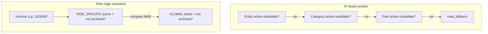
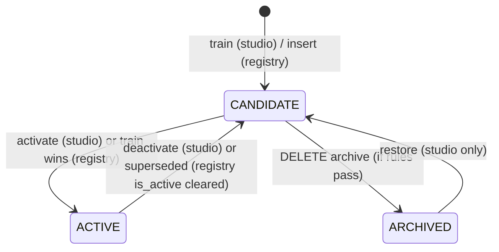

# ML model lifecycle — Smart Park OS (analysis)

This document clarifies **two parallel ML surfaces** in the codebase today: **AI Studio** (park-scoped catalog training + dry-run predict) and **ride ridge registry** (operational wait-time horizons used by the ride prediction path). It reflects the implementation as of the governance archival work (soft `archived_at` / `archived_by` on registry, studio rows, and ML metadata profiles).

## 1. What maps to which concept

| Concept | AI Studio (`ai_studio_models`) | Ride ridge registry (`ml_model_registry`) | ML metadata profiles (`ml_park_profiles`, `ml_ride_profiles`) |
| --- | --- | --- | --- |
| **Model definition** | Implicit: `(entityType, targetVariable)` + allowed features from catalog | Implicit: `(modelType, target, horizonMinutes)` + `model_id` string | `(profileName, profileVersion)` per park or per ride |
| **Model slot** | One slot = `(parkId, modelScope, entityType, entityId?, targetVariable)` — multiple **versions** share a slot | One slot = `(modelType, scopeType, scopeId?, horizonMinutes)` — multiple rows over time; **at most one active** (`is_active`) per slot after training | One row per `(parkId [, rideId], profileName, profileVersion)` |
| **Model version** | Integer `version` per slot (monotonic for non-archived rows) | Distinct row per training run; unique `model_id`; `trained_at` ordering | `profileVersion` string |
| **Active deployment** | `active_flag = true` — used by **`POST /api/v1/ai/studio/predict`** resolution only | `is_active = true` — used by **`ride-prediction.service`** via `findActiveModel` | `enabled = true` and `archived_at IS NULL` — used for **feature-weight trace resolution** only |
| **Training candidate** | New row from **`POST /api/v1/ai/studio/models/train`** with `active_flag = false` | New row from **`trainGlobalModel` / `trainRideModel`** (insert + deactivate peers) | **N/A** (profiles are edited, not “trained” here) |

**Ambiguity (prior gap):** “Active model” in the UI mixed **registry selection** (which version is highlighted) with **deployment** (`active_flag`). Governance copy now distinguishes **active registry deployment** vs **candidate / archived** versions.

## 2. Runtime model resolution

### AI Studio predict (`AiStudioService.predict`)

Order matches `getCatalog().predictionOrder`:

1. **entity** — `findActiveCandidate(..., 'entity', ..., canonicalAssetId, ...)`
2. **category** — `..., 'category', ..., null, ...`
3. **park** — `..., 'park', 'WHOLE_PARK', null, ...`
4. **rules_fallback** — heuristic `rulesFallback()` if no active candidate

Only rows with `active_flag` and **`archived_at IS NULL`** are candidates.

### Ride operational ridge (`ride-prediction.service` → `findActiveModel`)

Per-horizon competition between **`RIDE_SPECIFIC_MODEL`** (scope `ride`, `scope_id = rideId`) and **`GLOBAL_RIDE_MODEL`** (scope `global`). **Archived** registry rows (`archived_at` set) are **excluded** from `findActiveModel` and from trace coefficient lookup (`findModelRegistryRowForTrace`).

### ML metadata profiles

`loadResolvedWeightsForTrace` loads latest **`enabled`** park + ride profiles with **`archived_at IS NULL`** for optional manual feature weights (explainability path — not the ridge feature vector).

## 3. Activation

| Surface | Mechanism | API |
| --- | --- | --- |
| AI Studio | Transaction: deactivate others in **slot**, set one `active_flag` | `PATCH /api/v1/ai/studio/models/:id/activate` |
| Registry | Training sets new row `is_active: true` and `deactivateForScope` for previous actives | `POST /api/v1/ai/ml/train/wait-time/*` (internal) |

## 4. Storage summary

| Data | Table / store |
| --- | --- |
| Training metadata (studio) | `ai_studio_models` — `last_training_at`, `strategy`, `algorithm`, `dataset_snapshot_json` |
| Training metadata (ridge) | `ml_model_registry` — `trained_at`, `training_rows`, `metrics` JSON |
| Coefficients / weights | `model_payload` JSONB (`ai_studio_models`, `ml_model_registry`) |
| Metrics | `mae`, `rmse`, `r2` on studio row; `metrics` JSON on registry |
| Holdout (studio) | `eval_holdout_json` |
| Feature lists | `features_json` (studio), `feature_list` (registry) |
| Active flags | `active_flag` (studio), `is_active` (registry) |
| Archival | `archived_at`, `archived_by` (studio, registry, ML profiles) |

## 5. API categories

| Category | Examples |
| --- | --- |
| **Training** | `POST /api/v1/ai/studio/models/train`, `POST /api/v1/ai/ml/train/wait-time/global`, `POST /api/v1/ai/ml/train/wait-time/rides/:rideId` |
| **Registry / catalog** | `GET /api/v1/ai/studio/catalog`, `GET /api/v1/ai/studio/models`, `GET /api/v1/ai/studio/models/:id`, `PATCH .../activate`, `DELETE .../:id` (archive), `POST .../restore` |
| **Ridge registry governance** | `DELETE /api/v1/ai/ml/registry/entries/:id` (soft-archive PK row) |
| **ML metadata profiles** | `GET/POST/PUT/DELETE /api/v1/ai/ml/park-profiles`, same for `ride-profiles` (`DELETE` = archive, requires `enabled=false`) |
| **Prediction** | `POST /api/v1/ai/studio/predict`, `GET /api/v1/ai/ml/predict/rides/:rideId`, `GET /api/v1/ml/predict/rides/:rideId` (legacy alias) |

## 6. State transitions (governance)

**Studio archive rules (errors):**

- `MODEL_ACTIVE` — row still `active_flag`
- `MODEL_LAST_DEPLOYABLE_VERSION` — last non-archived row in slot
- `MODEL_ARCHIVED` — activation/deactivation forbidden on archived row

**Registry archive rules:**

- `MODEL_ACTIVE` — `is_active` still true (operational deployment)
- `MODEL_LAST_DEPLOYABLE_VERSION` — no other non-archived row in same `(modelType, scopeType, scopeId, horizonMinutes)`

## 7. Remaining gaps / ambiguities

- **MODEL_REFERENCED** (FKs from other tables to registry `model_id`) is not enforced yet; traces store `model_name` strings and may still display historical ids even if registry row is archived (read paths may return null for coefficients).
- **AI Studio** and **ridge registry** are **not** linked by a single foreign key; “one logical model” can exist in both systems independently.
- **Restore** is implemented for **studio** rows only; registry **archive** is intentionally one-way in API (no restore endpoint).
- **E2E audit table** in the UI remains client-local; server **`AuditLog`** records govern activate/deactivate/archive/restore and profile/registry archive.
