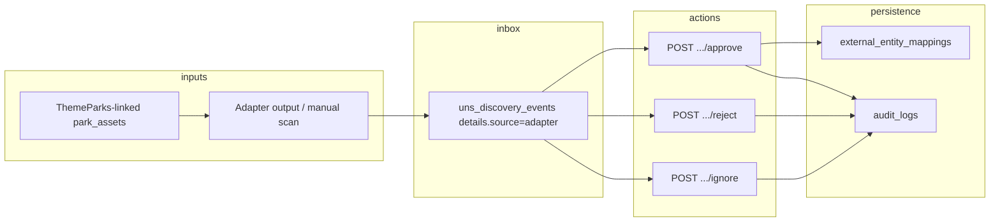

# Phase 12 — Adapter discovery approval (UNS Spy)

This document describes the **adapter-sourced discovery inbox** and the **approve / reject / ignore** HTTP flow. It is descriptive only; runtime code lives in the backend services and routes referenced below.

## Feature flags

| Env | Effect |
|-----|--------|
| `ADAPTER_DISCOVERY_SPY_ENABLED` | When `true`, manual discovery re-scan via API is allowed and related UI flags read as enabled. When `false`, `POST /api/v1/sync/themeparks/discovery/from-settings` returns **403** with `code: FEATURE_DISABLED`. |
| `MQTT_ENFORCE_CAPABILITIES` | Reserved / forward-looking; exposed read-only on `GET /api/v1/integrations/feature-flags` alongside the adapter flag. |

Boolean values for the admin UI are also returned from **`GET /api/v1/integrations/feature-flags`** (requires `integrations.read`).

## Endpoints (OpenAPI)

Canonical contract: `src/openapi/openapi.yaml` (server base path `/api/v1`).

| Method | Path | Permission |
|--------|------|--------------|
| GET | `/integrations/feature-flags` | `integrations.read` |
| POST | `/sync/themeparks/discovery/from-settings` | `integrations.manage`; plus env gate above |
| GET | `/uns-spy/events` | `integrations.read` **or** `rides.read`; query `eventSource=mqtt\|adapter\|all` |
| POST | `/uns-spy/events/{id}/approve` | `integrations.manage` **or** `rides.update` |
| POST | `/uns-spy/events/{id}/reject` | same |
| POST | `/uns-spy/events/{id}/ignore` | same |

## Flow (high level)



1. Discovery rows are stored as `uns_discovery_events` with `details.source = 'adapter'` (and related metadata such as `externalEntityId`, `reviewStatus`).
2. Operators list and filter via **`GET /uns-spy/events?eventSource=adapter`**.
3. **Approve** maps the external id to an existing ride `park_assets` row (`mapToExistingEntityId`), upserts **`external_entity_mappings`**, updates review state, and may prepare UNS registry topics — without writing **`uns_nodes`** from this path and without publishing MQTT from this handler (see safety below).
4. **Reject** / **ignore** update the event’s `details.reviewStatus` (and classification for ignore) and emit audit entries where configured.

## Safety constraints (Phase 12)

- **No `uns_nodes` writers** from the approve/reject/ignore handlers for this flow; integration tests assert table counts for `uns_nodes` and `uns_latest_states` unchanged across approve when no separate side-effect enlarges them.
- **No MQTT publish** from these HTTP handlers; do not expect outbound telemetry from approve in this phase.
- **ThemeParks full sync** (`POST /sync/themeparks/from-settings`, etc.) is unchanged by this documentation; discovery re-scan is a separate route: **`POST /sync/themeparks/discovery/from-settings`**.

## Manual validation

1. **Flags**: As an admin, `GET /api/v1/integrations/feature-flags` — confirm `adapterDiscoverySpyEnabled` matches env.
2. **List**: `GET /api/v1/uns-spy/events?eventSource=adapter&limit=50` — each row should show `details.source === "adapter"`.
3. **Scan** (optional): With `ADAPTER_DISCOVERY_SPY_ENABLED=true` and ThemeParks park selected in integration settings, `POST /api/v1/sync/themeparks/discovery/from-settings` — expect 200 with `created` / `updated` summary, or 422 if no park selected / 404 if internal park missing.
4. **Reject / ignore**: Call reject or ignore on a pending adapter row; reload list or fetch DB — `reviewStatus` should be `REJECTED` or `IGNORED`.
5. **Approve**: With a valid ride `asset_id`, POST approve with `mapToExistingEntityId` — event becomes `APPROVED`, mapping row exists for provider + external id, and UNS node counts stay flat if you snapshot before/after in SQL.
6. **RBAC**: A **VIEWER** should GET successfully but receive **403** on POST actions. A user with **no** `integrations.read` and **no** `rides.read` should get **403** on GET.

## Automated tests

Opt-in integration suite (Postgres + seeded admin user), same gate as other UNS integration tests:

```bash
set UNS_INTEGRATION_TESTS=1
npm run test:integration
```

Phase 12 cases live in `src/integration-tests/uns-spy/uns-spy-adapter-discovery.integration.test.js`.

## Error matrix (HTTP)

| Situation | Typical status | Notes |
|-----------|----------------|--------|
| Missing JWT | 401 | Standard auth |
| Missing permission | 403 | RBAC on each route |
| Discovery disabled | 403 | `FEATURE_DISABLED` on discovery scan |
| Unknown event id | 404 | Controller returns JSON `NOT_FOUND` |
| Approve when already `APPROVED` | 409 | `ALREADY_APPROVED` |
| Non-adapter event on write | 422 | `NOT_ADAPTER_EVENT` |
| Invalid body / unsupported `createEntity` | 422 | Joi or service validation |
