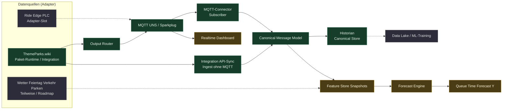

Ja, genau. ThemeParks.wiki wird dein Simulator / Proxy für echte Ride-Daten.

So bleibt das Konzept sauber:

Heute:
ThemeParks.wiki API
→ Adapter
→ Canonical Observation
→ Canonical-to-Sparkplug Publisher (`src/services/canonicalToSparkplugPublisher.js`)
→ MQTT Sparkplug B
→ Historian / Feature Store
→ Dashboard / ML

Später:
Ride Edge Rechner / PLC
→ Sparkplug MQTT direkt (ohne Publisher-Schicht)

Externe Quellen (Wiki, Wetter, …) weiterhin:
→ Adapter → Canonical → Canonical-to-Sparkplug Publisher → MQTT

Der zentrale Punkt: Die Datenquelle ändert sich, aber das Datenmodell bleibt gleich.

## Ziel-Architektur (Zeilenfluss, Mermaid)

**Legende**

| Kategorie | Bedeutung |
|-----------|-----------|
| **Implementiert** | Im Repo vorhanden; Standardpfad in Betrieb (Details z. B. in `docs/adapter-runtime.md`). |
| **Teilweise** | Vorhanden, aber abhängig von Konfiguration (`MQTT_ENABLED`, Polling, …) oder noch nicht alle Quellen angebunden. |
| **Geplant / Slot** | Architekturplatz; gleiches Beobachtungsmodell wie heute, anderer physikalischer Sender. |

**Wichtig:** Zum **Canonical Message Model** gibt es bei uns **zwei** typische Eingänge, die im einfachen Liniendiagramm oft zusammenfallen: (1) **MQTT** über den Subscriber und (2) **HTTP/API-Sync** (Integration Orchestrator → `ingest`), ohne vorheriges Publish auf den Bus.

- **Implementiert (grün):** ThemeParks-Pfad: Paket-Runtime weiterhin über Output Router (`uns_json`, `sparkplug_json`, …); Integration-API-Sync zusätzlich **Canonical-to-Sparkplug Publisher** → Sparkplug-MQTT; MQTT-Publish/Subscribe (`tpuns/…`, `spBv1.0/…`, `park/…`), Canonical-Ingest, Speicher der Canonical Messages.
- **Teilweise (amber):** Realtime-UI (Admin, UNS Live), Feature-Snapshots, Forecast-Bausteine — Umfang wächst mit Anbindungen und Jobs.
- **Geplant / Slot (grau):** dedizierter PLC-Edge-Adapter, weitere X-Faktoren-Adapter, ausgereifter „Data Lake“ jenseits Postgres/Export.

Entspricht im Kern deinem ursprünglichen `flowchart LR` (Simulator → Router → MQTT; Subscriber → Canonical → Historian/Features → Forecast), ergänzt um **S → G** und die Legende.

Richtige Architektur
ThemeParks.wiki als Simulator

Du nutzt die API als ob sie vom Fahrgeschäft kommt:

themeparks_wiki queue_time
→ tpuns/europa_park/v1/rides/euro_mir/queue_time (canonical UNS / TP-UNS)

Sparkplug B MQTT (technisch), z. B. DDATA — Metriken wie `queue_time` liegen im Payload, nicht im Topic:

spBv1.0/europa_park/DDATA/park_gateway/euro_mir

Damit kannst du heute schon testen:

MQTT Flow
UNS Live State
Dashboard
Historisierung
Feature Snapshots
Forecasting
ML Training

ohne echte PLC.

ML-Logik
Y = Zielwert

Beispiele:

queue_time_next_15_min
queue_time_next_30_min
queue_time_next_60_min
park_crowd_index_next_60_min
ride_closure_probability_next_60_min
X = Einflussfaktoren
current_queue_time
queue_time_trend_15min
ride_status
closed_rides_count
weather_temperature
rain_probability
holiday_pressure_index
school_vacation_de
school_vacation_fr
school_vacation_ch
traffic_pressure_index
parking_fill_rate
cars_per_5min
hotel_occupancy
hour_of_day
weekday
season
Wichtiges Datenprinzip

Du brauchst drei Speicherformen:

1. MQTT/UNS = Realtime
2. Canonical Historian = Roh- und Event-Historie
3. Feature Store / Data Lake = ML-Trainingsdaten
Feature Snapshot Beispiel

Alle 5 Minuten:

{
  "snapshotTime": "2026-04-26T10:00:00+02:00",
  "ride": "euro_mir",
  "features": {
    "current_queue_time": 35,
    "queue_time_trend_15min": 8,
    "ride_status": "OPEN",
    "weather_temperature": 22,
    "rain_probability": 15,
    "school_vacation_de": true,
    "traffic_pressure_index": 1.6,
    "parking_fill_rate": 72,
    "hour_of_day": 10,
    "weekday": 6
  },
  "targetLater": {
    "queue_time_next_30_min": null
  }
}

30 Minuten später wird daraus das Label:

{
  "snapshotTime": "2026-04-26T10:00:00+02:00",
  "labelTime": "2026-04-26T10:30:00+02:00",
  "target": "queue_time_next_30_min",
  "actualValue": 48
}
Nächster Cursor Prompt
@Codebase implement ThemeParks.wiki as a simulator feed for the UNS/ML pipeline.

Context:
ThemeParks.wiki is already integrated and provides queue times / ride status.
We want to use it as a simulator for future real ride edge data.
The goal is to route ThemeParks.wiki observations through the same pipeline that later PLC/Edge ride computers will use.

Goal:
Create a clean simulator mode:
ThemeParks.wiki Adapter
→ normalized observations
→ OutputRouter
→ MQTT UNS / Sparkplug JSON
→ Canonical Historian
→ Feature Snapshots
→ ML-ready labels later

Tasks:

1. Add simulator configuration:
.env.example:
THEMEPARKS_SIMULATOR_ENABLED=false
THEMEPARKS_SIMULATOR_PARK_ID=639738d3-9574-4f60-ab5b-4c392901320b
THEMEPARKS_SIMULATOR_PARK_SLUG=europapark
THEMEPARKS_SIMULATOR_INTERVAL_SECONDS=300
THEMEPARKS_SIMULATOR_OUTPUT_PROFILES=UNS_JSON,CANONICAL_HISTORIAN

2. Create service:
src/services/themeparks-simulator.service.js

Responsibilities:
- call existing ThemeParks.wiki integration/adapter logic
- convert queue times and ride status into normalized observations
- call OutputRouterService.emit()
- emit with profiles from env
- support emitMqtt true/false via config
- log summary:
  ridesProcessed
  queueTimeObservations
  statusObservations
  errors

3. Create job:
src/jobs/themeparks-simulator.job.js

Behavior:
- if THEMEPARKS_SIMULATOR_ENABLED=true
- run every THEMEPARKS_SIMULATOR_INTERVAL_SECONDS
- avoid overlapping runs
- never crash API on failure

4. Observation format:
Queue time:
{
  eventType: "QUEUE_TIME_OBSERVED",
  domain: "rides",
  assetSlug: "<slug>",
  metric: "queue_time",
  value: <waitTime>,
  unit: "min",
  eventTime: "<api timestamp or now>",
  quality: "GOOD",
  confidence: 0.9,
  source: "themeparks_wiki_simulator",
  provider: "ThemeParks.wiki",
  externalParkId: "...",
  externalEntityId: "...",
  rawPayload: {}
}

Status:
{
  eventType: "RIDE_STATUS_OBSERVED",
  domain: "rides",
  assetSlug: "<slug>",
  metric: "status",
  value: "OPEN|CLOSED",
  unit: null,
  eventTime: "...",
  quality: "GOOD",
  confidence: 0.9,
  source: "themeparks_wiki_simulator",
  provider: "ThemeParks.wiki",
  externalParkId: "...",
  externalEntityId: "...",
  rawPayload: {}
}

5. Add manual endpoint:
POST /api/v1/integrations/themeparks-simulator/run

Body:
{
  "emitMqtt": false,
  "profiles": ["UNS_JSON", "CANONICAL_HISTORIAN"]
}

Requires:
requirePermission('integrations','manage')

6. Add feature snapshot foundation:
Create or reuse feature snapshot service.
For now implement:
src/services/ml-feature-snapshot.service.js

Function:
buildRideFeatureSnapshots({ parkSlug })

It should read latest/canonical data if available and create a JSON snapshot structure for:
- ride assetSlug
- current_queue_time
- ride_status
- hour_of_day
- weekday
- source

Do not implement full ML training yet.

7. Add endpoint:
POST /api/v1/ml/feature-snapshots/build

Body:
{
  "parkSlug": "europapark"
}

8. Add docs:
docs/themeparks-simulator-ml-pipeline.md

Explain:
- ThemeParks.wiki is a simulator for future PLC/Edge ride data
- same normalized observation model
- same output router
- MQTT/UNS realtime
- historian/data lake for ML
- future enrichment with weather, traffic, holidays, parking

9. Add smoke test:
scripts/smoke-themeparks-simulator.js

It should:
- run simulator once with emitMqtt=false
- assert observations > 0
- assert encoded UNS topics exist
- assert canonical historian rows exist

Add package.json:
"smoke:themeparks-simulator": "node scripts/smoke-themeparks-simulator.js"

Important:
- Do not break existing ThemeParks.wiki integration settings.
- Do not replace provider sync yet.
- Simulator is additional path.
- Keep existing adapter package runtime intact.
- Keep server.js clean.
- Return files created/modified and test commands.