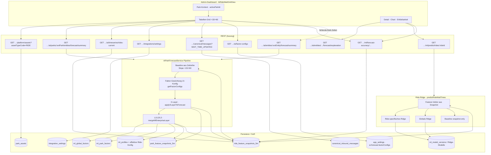
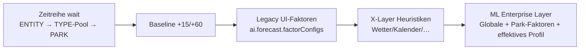
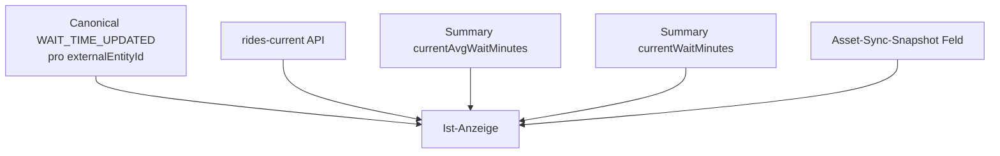

# Prognosen (Ride-Wartezeiten-Grid) — Datenfluss & Features

Zielgruppe: **„Wartezeiten — Ist & Prognose“** (`/ai-insights`, `AiRideWaitGridView.vue`). Architektur-Referenz: `docs/adr/0001-forecast-architecture.md`.

---

## 1. End-to-End (UI → API → Pipeline)

---

## 2. Reihenfolge im Forecast-Summary (ADR-konform)

---

## 3. „Aktuelle Wartezeit“ im Grid (Priorität)

Implementierung: `currentWaitForRow()` in `AiRideWaitGridView.vue`.

---

## 4. Realisierte Feature-/Signal-Gruppen (operativ im Flow)

### 4.1 Feature Store (5m-Snapshots) — Basis für Baseline & Ridge

Aus `ride_feature_snapshots_5m` / `park_feature_snapshots_5m` (Befüllung u. a. über `AiFeatureStoreService` aus Canonical + Park-Kontext), u. a.:

| Bereich | Beispiele (camel/snake im Code) |
|--------|-----------------------------------|
| Wartezeit | `waitTime`, Rollings, `currentWaitTimeMin` |
| Kapazität | `theoreticalCapacityPph` |
| Personal | `staffingGapNormal` |
| Qualität | `completenessScore`, `trainingEligible`, `forecastEligible`, `dataQualityReason` |
| Park-Kontext | `temperatureC`, `precipitationMm`, `rainProbabilityPercent`, `windSpeedKmh`, `weatherCondition` |
| Kalender | `isPublicHoliday`, `isSchoolHoliday`, `holidayName`, `isWeekend`, `month` |
| Betrieb | `withinScheduledOperatingHours`, `scheduledOperatingSnapshotAt` |
| Crowd | `parkCrowdIndex`, `trafficIndex` (optional / `not_configured`) |
| Profil-Sensitivität | `rainSensitive` (Rain-Bump Guard) |

X-Layer nutzt strukturiert u. a. Wetter, Kalender, Traffic, Öffnungszeiten, Saison, Staffing, Kapazität, Park-Crowd (`ai-forecast-x-adjustments.service.js`).

### 4.2 ML Enterprise Layer (L1/L2/L3) — globale / Park-Codes

Aus `mergeMlEnterpriseLayer` (`ml-forecast-layer.service.js`), typische **Factor-Codes** (wenn in DB aktiv und Snapshot-Kontext passt):

- `HOLIDAY_PRESSURE`, `SCHOOL_BREAK_PRESSURE`, `WEEKEND_UPLIFT`, `SUMMER_SEASON_FACTOR`
- `RAIN_DEMAND_SHIFT` (mit Profil `rainImpactScore` / Regen-mm)
- `MACRO_TOURISM_INDEX`
- `QUEUE_ELASTICITY` (Profil `queueElasticityScore`)
- `ML_CONFIG` (Warnhinweise aus effektiver Konfig)

Globale Faktoren: `ml_global_factors`. Park-Overrides: `ml_park_factors`. Effektives Ride-Profil: `resolveEffectiveMlConfig` → `ml_profiles` + Asset-Verhalten.

### 4.3 Legacy UI-Faktoren (zusätzliche Gewichtung)

`app_settings` · `ai.forecast.factorConfigs` (Fallback `DEFAULT_AI_FACTOR_CONFIGS`) — modifiziert **nach** reiner Slope-Baseline, **vor** X/ML-Layer in `buildFromSeries` / `applyFactorAdjustments`.

### 4.4 Ridge-Pfad (Detail „Ridge“)

`ride-prediction.service.js` + `ride-feature-vector.util` (`TRAINING_FEATURE_NAMES`): trainierte Gewichte aus `ml_model_versions` / Registry, sonst Global- oder Baseline-Zweig.

### 4.5 Settings / Integration

- **Integration settings**: u. a. gewählter **Provider** (`themeparks_wiki`) für Forecast- und Canonical-Calls.
- **Park**: `externalEntityId` (ThemeParks-Park-ID) zwingend für Bulk-Forecast `…/entities/forecast/summary`.

---

## 5. Kurzreferenz Dateien

| Teil | Datei |
|------|--------|
| UI | `admin-dashboard/src/views/AiRideWaitGridView.vue` |
| Bulk + Entity Summary | `src/services/ai-park-forecast.service.js` |
| X-Layer | `src/services/ai-forecast-x-adjustments.service.js` |
| ML-Faktoren-Layer | `src/services/ml-forecast-layer.service.js` |
| Snapshots schreiben | `src/services/ai-feature-store.service.js` |
| Ridge Predict | `src/services/ml/ride-prediction.service.js` |
